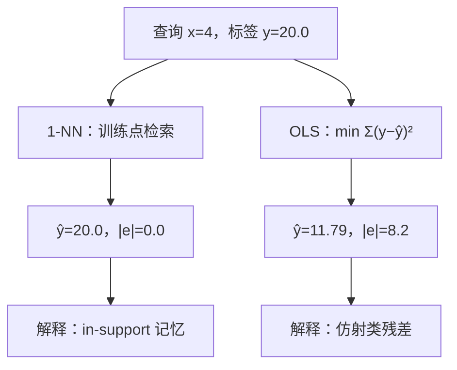
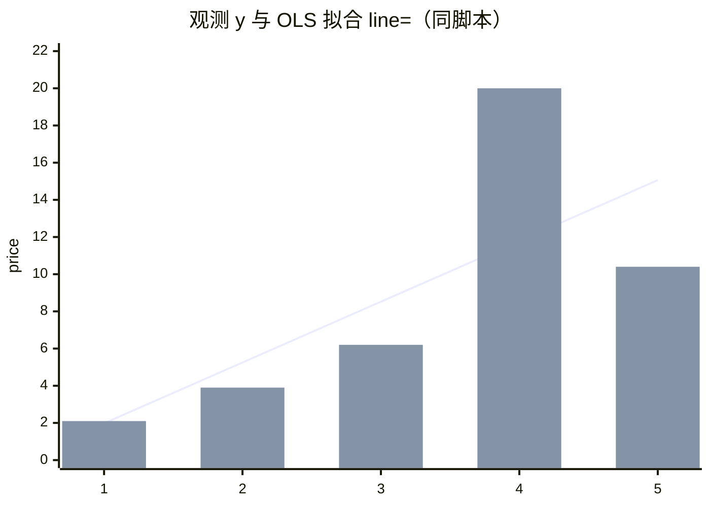

<p align="center"><b>中文</b> &nbsp;&nbsp;·&nbsp;&nbsp; <a href="day-01.en.md">English</a></p>

# 第 1 天 · 样本内最近邻与普通最小二乘

[第一阶段 · 模型](README.md) · [排版规范](LESSON_LAYOUT.md) · 可运行

今天的学习要点：查询点落在训练集内部时，最近邻残差为 0 只说明标签被检索到了；普通最小二乘的残差 8.2 是仿射函数类的近似误差。

## 费曼法讲解

> **结论先行**：在训练横坐标上查询且与某样本重合时，1-NN 的零残差是 **in-support 检索** 的定义结果，不是样本外预测能力；OLS 的 8.2 是 **仿射假设类** 在平方损失下的近似误差。

五个收盘价构成单行面板：2.1、3.9、6.2、20.0、10.4（横坐标为日序 1…5）。在 `x=4` 处评估：真实标签 20.0。**最近邻**取 `argmin_i |x_i−x|`，命中第四行，输出 20.0，残差 0.0。**OLS** 最小化 `‖y−Xβ‖²`，得 `y = 3.27x − 1.29`，在 `x=4` 处拟合值 11.79，绝对残差 8.2（脚本一位小数）。

二者不可比「谁更准」——比较的是 **估计器族** 与 **损失** 是否相同。零残差在这里等价于允许估计器在训练点上 **精确记忆**；8.2 则表明全局直线无法同时穿过五个点，第四日离拟合线最远（精确值 8.21，见 `train points` 段）。第四日对 RSS 的支配会在第 2–3 天用 L1/L2 份额量化；本日只固定 **同一查询、两种规则**。

查询落在凸包内且与训练点重合：既不是留出（第 7 天），也不是支撑外外推（第 6 天）。Gauss–Markov 框架下 OLS 为 BLUE；1-NN 在训练坐标上退化为 **查表**。Cover & Hart（1967）的一致收敛讨论针对样本外查询；**本日零误差不属于该渐近结论**。



回测与研究中，须先披露：**query 是否在训练支撑上**、**函数类名称**、**水平损失定义**。缺任一项，样本内误差不可审计。

**误用模式（研究笔记里应打红标）**：（1）把 0.0 写进「样本外 IC / 命中率」摘要；（2）用 8.2 论证「线性模型失效」却不给出函数类与查询集合；（3）在每一训练行重复 `x=x_i` 查询再平均 |e|，等价于对本日 `x=4` 的检索游戏做全表复制。正确做法是固定 **查询分布** 与 **假设类**，再报告损失。

**与后续课程的合同**：第 7 天起引入 **留出**；第 27 天固定 **时间切分**；第 51 天起重写为 **lag-5 面板 + hold-out 行**。本课五点是玩具几何，但 **估计器披露三件套**（query、class、loss）全季不变。写 commit message 或 research log 时，宁可少报一个 R²，也要写清三件套。

从实现角度，1-NN 在代码里常表现为 `y[i]` 或索引命中；OLS 为 `lstsq`。两者 **CPU 成本** 在此可忽略，但 **统计成本** 不同：OLS 用五个点估两个参数，残差自由度为 3；1-NN 在命中训练点时 **不消耗邻域平滑带宽**。这不是说 OLS「更省数据」，而是说 **有效参数个数** 不同，样本外方差阶不同（此处不做渐近展开，只建立直觉）。

若把问题改写成「预测 `y_4`  given 过去四天」，估计器与损失都要改；本课 **不做时间因果重述**，只固定横坐标为日序、查询为 4。读文献时看到「in-sample fit at training covariates」应自动联想到本图左支，而不是样本外泛化。

## 核心知识

### 脚本输出（与下方 `text` 块一致）

[`fit_line.py`](../../days/01-line-that-misses/fit_line.py)：

```text
train points
  x=1.0  y=2.1  line=1.98
  x=2.0  y=3.9  line=5.25
  x=3.0  y=6.2  line=8.52
  x=4.0  y=20.0  line=11.79
  x=5.0  y=10.4  line=15.06

line: y = 3.27 x + -1.29
ask x=4.0, the stored y is 20.0
memorized neighbor says 20.0, miss 0.0
fitted line says 11.79, miss 8.2
```

设计矩阵行 `[x_t, 1]`，响应 `y_t`。1-NN：`î=argmin_i|x_i−x|`，`ŷ=y_î`。OLS：`β̂=argmin_β‖y−Xβ‖²`，本课用 `numpy.linalg.lstsq`（`numpy==1.24.4`），报告系数 3.27、−1.29 以打印为准。



| 估计器 | x=4 输出 | |e| | 含义 |
|:---|---:|---:|:---|
| 1-NN | 20.0 | 0.0 | 查询点=训练点，输出=标签 |
| OLS | 11.79 | 8.2 | 仿射类平方损失最优 |

| | 本日 | 第 6 天 | 第 7 天 |
|:---|:---|:---|:---|
| 查询 | x=4，支撑内 | x=6，支撑外 | x=5，留出 |
| 标签用于评分 | 是 | 否（残差无定义） | 是，不进拟合 |
| 1-NN 行为 | 复制训练点 | 复制边界 10.4 | 复制 x=4 的 20.0 |

逐点残差（由 `train points` 行核对）：0.12、−1.35、−2.32、8.21、−4.66；第四日为唯一大幅正残差，OLS 为全局折中而非「忽略异常点」。

Gauss–Markov 定理前提在本玩具样本上 **未检验**：同方差、无自相关、外生 `X`。五点的异方差性已肉眼可见（第四日方差贡献大），故 **BLUE 陈述** 仅作「OLS 在线性无偏类中有效」的符号锚点，不作本表统计推断。推断进入第 7 天 hold-out 与第 58 天按年切分之后。开发侧读定理时，应默认问：**残差是否交换、`X` 是否含未来列**——本课两者都刻意保持最简单，以便只隔离估计器差异。

## 拓展领域

**检索 vs 参数化**在量化中常对应：k-NN / 相似日匹配（样本内易过拟合已见标签）与线性因子、风格回归（残差承载模型类误差）。Breiman（2001）的两种文化——数据模型与算法模型——本课以 1-NN 与 OLS 并排，为第 44 天起的 **树 / 分段** 模型预留同一面板上的对照。

文献锚点（非虚构）：Gauss–Markov / BLUE（Aitken, 1935; Markov, 1900; Lehmann & Casella, 1998）；1-NN 理论（Cover & Hart, 1967）；局部方法（Hastie, Tibshirani & Friedman, 2009, ESL §2）；无免费午餐（Wolpert, 1996）——训练集检索优势不能外推为任意分布最优。

全季衔接：第 2–3 天 L1/L2 分解；第 4 天端点弦（同仿射类、不同约束）；第 9 天行置换不变 `β̂`。工程上忌将 in-support 1-NN 平均误差写成样本外 alpha；忌单点 8.2 而不报其余四日残差符号与幅度。

**平方损失与 robustness 的前奏**：8.21 在 RSS 中权重为 67.4 量级，占五点和的约 70%（第 3 天会精确到 0.6997 份额）。若研究转向 L1 或 Huber，第四日仍可能主导，但 **排序** 会改变——这属于 **损失选择** 而非 **换 ticker**。量化开发在接数据管道前，应先问默认损失是 L2 还是业务损失（例如方向 hit、计费表），本季前 10 日系统回答这个问题。

**相似日 / 协变量匹配**：生产系统中的「找相似 K 线」若允许在 **含当日标签** 的特征空间里度量距离，in-sample 检索误差可接近零；若特征含 **未来字段**（第 28–29 天的 FORBIDDEN 行），则属于泄漏而非 1-NN 理论问题。区分 **估计器** 与 **特征工程** 是 senior 工程师 daily review 的基本项。

**数值与复现**：`line=` 列与 `y = 3.27 x + -1.29` 在五位打印下自洽；若读者用双精度重算斜率，末位可能与 3.27 差 0.01，但 **miss 8.2** 与脚本一致即可。全季以仓库 stdout 为 **单一真相源**，回归测试应对 `text` 块做 diff，而不是对 PDF 手抄数。

**横截面 vs 时间序列（预告）**：五个点既可读成「五个交易日」，也可读成「五个抽象索引」。第 21 天接入 `panel.csv` 后，索引变为真实日期；第 38 天会对 **信号滞后** 单独开一课。本课尚未引入日期类型，但 OLS 已假设 **行可交换**（第 9 天证明行置换不动 `β̂`），这对时间序列是 **错误默认**——后续用切分修正，而非在本日改 OLS 公式。

**Hat matrix 视角（五点的闭式直觉）**：OLS 拟合值 `ŷ = Hy`，在经典线性模型中 `H` 为对称幂等。对 **在训练坐标上评估** 的查询，1-NN 等价于 `H` 为置换矩阵的某行；OLS 的 `H` 为平滑矩阵，第四行对五个标签的权重 **全非零**，故 11.79 吸收了整个样本信息。理解 `H_ii`（杠杆）可解释为何某些交易日 in-sample 拟合「过贴」——第 5 天删点会改变斜率（第 5 课），即杠杆点的另一种表现。

**审计清单（本日可执行）**：打开 stdout → 确认 `ask x=4.0` 与 `stored y=20.0` → 核对 `memorized` 与 `fitted` 两行 → 用 `train points` 第四行验证 11.79 与 8.2 四舍五入关系 → 在 research log 写「1-NN vs OLS，in-support query，水平绝对误差，未做样本外」。五步完成即满足内部 quant dev 对 **day-1 实验** 的最低披露标准。

**与生产代码的映射**：回测框架里的 `predict()` 若在 `date` 已存在于训练索引时走 **cache lookup**，metrics 模块却报告 `mse_oos`，就属于本课左支误标为样本外。代码审查应 grep「merge_asof / reindex / loc 精确命中」与 metrics 命名是否一致。OLS 路径对应 `LinearRegression.fit` 全样本再 `predict` 同索引——右支。两路径 **可以共存**，但 report 必须分表，否则 PM 看到的 Sharpe 没有定义。

## 实战总结

```bash
python days/01-line-that-misses/fit_line.py
```

核对：`line: y = 3.27 x + -1.29`；`memorized neighbor … miss 0.0`；`fitted line … miss 8.2`。几何对照见 [`site`](../../site)（第四日竖直距离对应 8.2 量级）。

若做 CI：将本脚本 stdout 全文放入 golden file；改 `lstsq` 或数据路径时，diff 应只在预期 commit 出现。文档侧维护 **单一** `text` 块与终端一致，避免在正文重复粘贴第二份数字表，以免日后漂移。后续各课在 **同一 panel** 上叠加切分、因子与模型时，仍建议保留这种「终端即合同」的习惯，以便 code review 只盯一处输出。本课无交易、无费率、无持仓变量。
