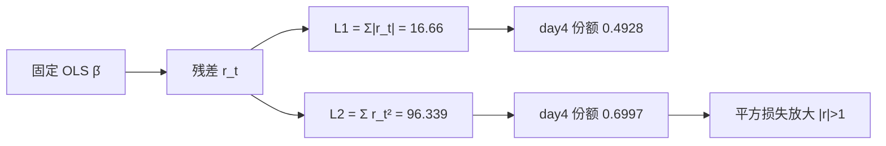
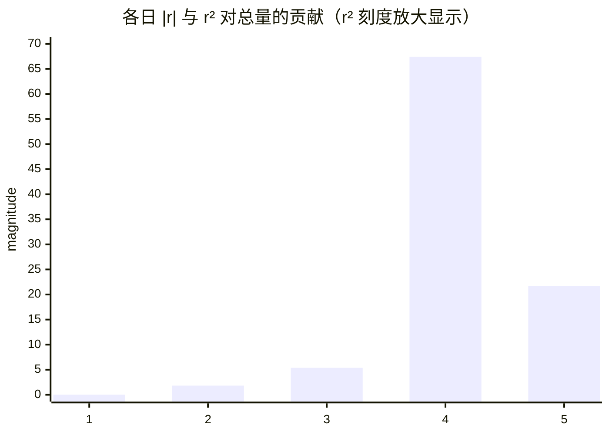

<p align="center"><b>中文</b> &nbsp;&nbsp;·&nbsp;&nbsp; <a href="day-02.en.md">English</a></p>

# 第 2 天 · 绝对误差与平方误差

[第一阶段 · 模型](README.md) · [排版规范](LESSON_LAYOUT.md) · 可运行

今天的学习要点：同一条直线、同一组残差，必须同时交绝对损失和平方损失。第四日占绝对损失的 0.4928，占平方损失的 0.6997。

## 费曼法讲解

> **结论先行**：\(\hat\beta\) 由 \(L_2\) 拟合得到并固定后，\(L_1=\sum|r_t|\) 与 \(L_2=\sum r_t^2\) 是对 **同一残差向量** 的两个评价泛函；第四日份额 0.4928 vs 0.6997 的差异来自 \(x\mapsto x^2\) 在 \(|x|>1\) 上的超线性，不是「第四天更重要」的叙事判断。

第 1 天直线 `y = 3.27x − 1.29` 不变。残差 \(r=(0.12,-1.35,-2.32,8.21,-4.66)\)。\(L_1=16.66\)，\(L_2=96.339\)。第四日 \(|r_4|=8.21\) 占 \(L_1\) 的 0.4928，\(r_4^2=67.4041\) 占 \(L_2\) 的 0.6997。第一日 0.12 在 \(L_2\) 中仅 0.0144，在 \(L_1\) 中仍可见——**小误差在 MSE 叙事里几乎消失**。

计量上：OLS 是 \(L_2\) 下仿射类的 ERM；\(L_1\) 最小化给出分位数回归在中位数的解（Koenker & Bassett, 1978），厚尾下更稳健。Huber（1964）说明 **估参数** 与 **报误差** 可分离：本课 \(\hat\beta\) 来自 \(L_2\)，\(L_1\) 是对固定 \(\hat\beta\) 的诊断。生产里默认 MSE 训练会把优化重心压向大 \(|r_t|\)；若 KPI 更接近典型日偏差，应并列 MAE 或 Huber。



Walk-forward 回测忌用 MSE 调参、却只写 Sharpe 而不链到大残差日是否可交易。本课无 P&L，只固定 **in-sample 份额代数**；写 risk memo 须注明 estimand 与窗口。

## 核心知识

### 脚本输出

[`two_losses.py`](../../days/02-two-losses/two_losses.py)：

```text
line: y = 3.27 x + -1.29
t  y  yhat  residual  absolute  squared
1  2.1  1.98  0.12  0.12  0.0144
2  3.9  5.25  -1.35  1.35  1.8225
3  6.2  8.52  -2.32  2.32  5.3824
4  20.0  11.79  8.21  8.21  67.4041
5  10.4  15.06  -4.66  4.66  21.7156
L1 = sum |r| = 16.66
L2 = sum r^2 = 96.339
day 4 share of L1 = 0.4928
day 4 share of L2 = 0.6997
```

| t | y | ŷ | r | \|r\| | r² |
|---:|---:|---:|---:|---:|---:|
| 1 | 2.1 | 1.98 | 0.12 | 0.12 | 0.0144 |
| 2 | 3.9 | 5.25 | −1.35 | 1.35 | 1.8225 |
| 3 | 6.2 | 8.52 | −2.32 | 2.32 | 5.3824 |
| 4 | 20.0 | 11.79 | 8.21 | 8.21 | 67.4041 |
| 5 | 10.4 | 15.06 | −4.66 | 4.66 | 21.7156 |



OLS：\(\hat\beta=\arg\min_\beta \sum(y_t-\beta_1 x_t-\beta_0)^2\)。同一 \(\hat\beta\) 下 \(L_1=16.66\) **一般不是** LAD 最优（LAD 需 LP/迭代 reweighting）。第 4 天端点弦可在 \(L_1\) 上 beat OLS、在 \(L_2\) 上必输——**换损失，类内最优可换人**。

| 读数 | 本日 | 第 3 天 | 第 4 天 |
|:---|:---|:---|:---|
| 标量 | \(L_1, L_2\) | RSS 份额 \(\pi_t\) | 两线各 \(L_1, L_2\) |
| 第四日 | 0.4928 / 0.6997 | \(\pi_4=0.6997\) | 弦 vs OLS 名次 |

未归一化 RSS 96.339；RMSE \(\sqrt{96.339/5}\approx 4.39\)，MAE \(16.66/5=3.332\)——并列报告比单报 RSS 更接近生产监控习惯。

## 拓展领域

GARCH 族多用 \(L_2\) 似然；稳健尺度估计靠近 \(L_1\)。只写「RMSE ↓20%」而不说是否由跳点驱动，读者无法区分整体改善与平方惩罚 dominate。Rousseeuw & Leroy（1987）强调 breakdown point：\(L_1\) 回归对离群更稳；第 5 天删第四日动 \(\hat\beta\) 是 **样本变**，本日份额是 **固定 \(\hat\beta\)** 下的集中度。

与第 9 天：行置换不改 \(r_t\)，故 \(L_1,L_2\) 不变。与 Lasso：系数 \(\ell_1\) 与本日残差 \(L_1\) **同名不同义**。\(L_2\) 在 \(r_t=0\) 可微；\(L_1\) 次梯度为 \(\mathrm{sign}(r_t)\)，8.21 与 4.66 边际惩罚同为 1，而 \(L_2\) 边际为 \(2r_t\)——稳健统计与 Gauss 似然分叉的初等图。

White（1980）异方差稳健 SE 不改点估计但改推断；Christoffersen & Diebold（1997）分水平与方向预测。线上若 RMSE 告警而 MAE 平稳，查 bad tick / 公司行动；Winsorize 第四日时 \(L_2\) 降幅常大于 \(L_1\)。Lehmann & Casella（1998）：估计量、损失、评分窗口三分开陈述；stdout 为合同，不得改小数。

**审计**：手算 \(0.12^2+\cdots+8.21^2=96.339\)，\(8.21/16.66\)，\(67.4041/96.339\)；斜率截距须来自第 1 天 `lstsq`，勿重估后仍用旧表。第 10 天起水平残差与方向分数双轨；本课只固定水平向量。

**生产映射**：tracking error 常用 RMSE；执行 slippage 常用 MAE 味指标。MSE 改善而 MAE 恶化可能意味着少数极端日幅度赌对——本课 0.4928 vs 0.6997 是五维上的最小反例。报告应并列 MAE/RMSE 并附最大 \(|r_t|\) 日事件说明。

**与第 3 天衔接**：\(\pi_4=0.6997\) 与本日 \(L_2\) 份额相同；前三日 RSS 份额合计约 0.0749，说明「单报 RMSE」掩盖多数日贡献平坦。LAD 五点解本课不重算，只报告 OLS 残差下 \(L_1=16.66\)。

**优化视角**：深度学习默认 MSE 等价于假设 homoscedastic Gaussian；换 MAE 损失会改变梯度在大 \(|r|\) 日的权重，与本课代数一致。AutoML 选 metric 时应与业务 estimand 对齐，而非默认 `neg_mean_squared_error`。

**组合与风险**：Brinson 看配置/选择；残差份额看「哪一日驱动 RSS」。因子回归监控中，RMSE 恶化而 IC 仍稳时，先查少数日是否主导 \(L_2\)，再决定是否 winsorize 或换 robust loss 重训。

**代码审查**：metrics 模块若只实现 `mean_squared_error`，dashboard 应显式加 `mean_absolute_error`；回测 summary 两行并列，避免 PM 只看见一个数。本脚本已打印两行 aggregate 与两行 day-4 share，文档 `text` 块应整段 golden。

**数值习惯**：96.339 是五点 **未除 n** 的平方和；写论文时注明。第四日 0.6997 意味着删去该日平方项可下降约七成——第 5 天删点实验将验证 **重估系数** 与 **固定系数只看份额** 是两件事。

**分位数回归接口**：若业务 estimand 是条件中位数而非条件均值，估计阶段应直接最小化绝对偏差并配合线性规划求解；本课刻意固定最小二乘估计量，只在报告阶段并列绝对损失总和，以免把「稳健估计」与「稳健评价」混为一谈。研究日志里应写清：点估计来自平方损失，诊断表来自绝对损失。

**异方差与加权**：当残差方差随水平或时间变化时，加权最小二乘会重配第四日这类大残差行的权重；本课假设同方差且样本仅五行，不做权重矩阵。进入面板段落后，若仍只报未加权均方误差而不报加权或稳健标准误，读者无法判断大残差日是 **结构性跳点** 还是 **方差膨胀**。

**回测指标对齐**：策略层常用年化波动与最大回撤，模型层常用样本内均方误差或平均绝对误差；两层指标不可直接比较数值大小，但 **对大误差日的敏感性** 可以对齐理解——本课第四日份额就是模型层的「单点 dominate 诊断」。若策略回测显示某几日贡献大部分盈亏，而模型层显示同一几日在均方误差份额中超过零点六，应优先做事件对齐而非盲目加特征。

**与第 3 天分工**：第 3 天把平方损失拆成逐日份额向量，便于画条形图；本日给出两个范数下的标量与第四日占比，是向量诊断的前置。交报告时建议同时附：本日两行份额、第 3 天完整份额表、以及第 1 天直线系数，三者构成最小可复现包。

**与第 4 天分工**：端点弦与最小二乘在绝对损失与平方损失下名次可能对调；本日已预告 **换损失则类内最优可换人**。读第 4 天时应带回本日表格，比较同一组观测下 **不同仿射估计规则** 而非不同损失泛函。

**实现细节**：脚本先打印直线方程再打印逐行残差，最后打印两个聚合与份额；流水线测试应对最后四行做断言。文档维护时禁止只改表格不改文本块，否则持续集成无法捕获漂移。

**英文键名**：终端使用 `L1`、`L2`、`day 4 share` 等键，与后续季节英文笔记对齐；中文正文引用份额时用四位小数零点四九二八与零点六九九七，与脚本一致，勿四舍五入到两位。

**风险披露**：本课无样本外、无交易费用、无方向命中率；任何将零点六九九七写成「第四日模型失效概率」的表述均属过度解读。合法表述是：在固定最小二乘拟合下，第四日贡献约七成未解释平方偏差。

## 实战总结

```bash
python days/02-two-losses/two_losses.py
```

核对：`L1 = sum |r| = 16.66`，`L2 = sum r^2 = 96.339`，`day 4 share of L1 = 0.4928`，`day 4 share of L2 = 0.6997`。说明 OLS 最小化的是 \(L_2\) 而非 \(L_1\)。第 3 天拆 RSS 向量；第 4 天端点弦在不同损失下改名次。
