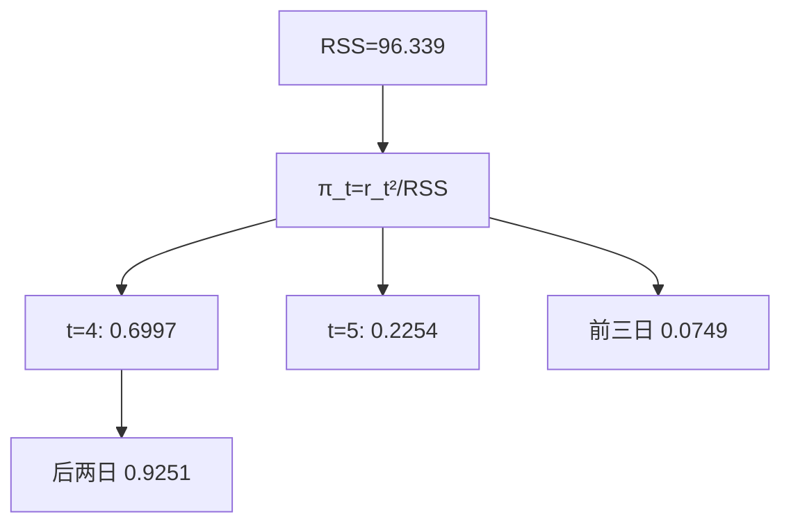
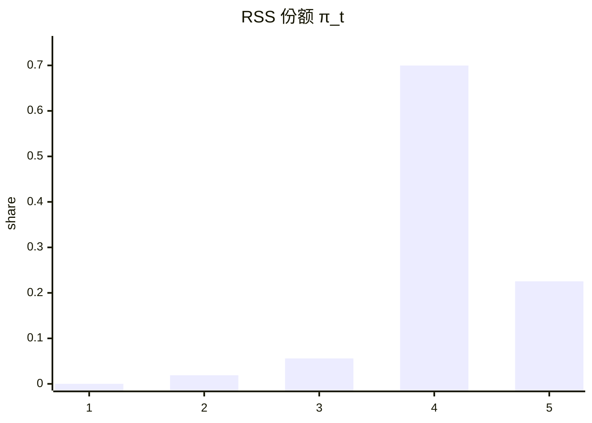

<p align="center"><b>中文</b> &nbsp;&nbsp;·&nbsp;&nbsp; <a href="day-03.en.md">English</a></p>

# 第 3 天 · 五天残差并排

[第一阶段 · 模型](README.md) · [排版规范](LESSON_LAYOUT.md) · 可运行

今天的学习要点：平方和 96.339 是一个标量。五天的平方份额是 0.0001、0.0189、0.0559、0.6997、0.2254。第四日与第五日合计 0.9251，前三日合计 0.0749。

## 费曼法讲解

> **结论先行**：固定 OLS 残差后，π_t=r_t²/RSS 把 RSS=96.339 分解为五维份额；第四日 0.6997 与第五日 0.2254 合计 0.9251，平方损失集中在尾部两日。



第 1–2 天直线 `y = 3.27 x + -1.29` 与残差已锁。本日 estimand：**固定 β̂ 下的 RSS 向量分解** \(\pi_t=r_t^2/96.339\)，不是删点、不是 refit、不是 hold-out。

π_4=0.6997 与第 2 天 `day 4 share of L2` 同数——标量 L2 与向量 π 是同一信息的两种报表。0.0001 必须四位保留；写成 0 会破坏 \(\sum\pi=1\)。第五日 0.2254 单独大于前三日合计 0.0749；只报「第四日最大」仍漏掉 >20% 的平方损失。

除 flowchart 外，脚本打印 `days 4 and 5 share of RSS = 0.9251` 与 `days 1 through 3 share of RSS = 0.0749` 是 **二元摘要**，不能替代五维表。Walk-forward 监控：RMSE 告警时先看 per-date squared error 是否被单日 dominate（本课第四日），再查 bad tick。

误用：（1）π 大即 winsorize；（2）用 RMSE 代替 π 向量；（3）把 0.0001 四舍五入为 0。第 5 天删点改 β̂ 后 π 全变——本课份额 **条件于 full-sample OLS**。

Hat 杠杆直觉：第四日 |r_4|=8.21 常伴高杠杆；Cook 距离是删点视角，本课是 fixed-β 视角。第 8 天窗口 RSS 定义在三天子样本，禁止与 96.339 跨域比大小。

## 核心知识

### 脚本输出（与下方 `text` 块一致）

[`residual_vector.py`](../../days/03-residual-vector/residual_vector.py)：

```text
line: y = 3.27 x + -1.29
RSS = 96.339
t  residual  squared  share of RSS
1  0.12  0.0144  0.0001
2  -1.35  1.8225  0.0189
3  -2.32  5.3824  0.0559
4  8.21  67.4041  0.6997
5  -4.66  21.7156  0.2254
largest squared residual at t=4
days 4 and 5 share of RSS = 0.9251
days 1 through 3 share of RSS = 0.0749
```



正文表与公式只解释 text 块；小数须与块内同行可对齐。

## 拓展领域

**因子回归**：除 RMSE 外存 per-date squared error 或 π 快照；IC 稳而 RMSE 恶时查 dominate 日。**执行 vs 研究**：slippage 常用 MAE，fit 常用 MSE——并列报告。

**稳健统计**：Huber/LAD 会改变 dominate 日排序；本课 π 专指 OLS 平方损失。**第 74 天** top-five errors 是 π 思想在高维的延伸。**Brinson** 与 fit π 正交：alpha 可独立于 in-sample RSS 形状。

**生产**：回测 summary 落库 `max_contribution_date`；dashboard 五块饼图数据来自 stdout 五 share。**合规**：对外 RMSE、对内 π 向量供 model risk。

**手算审计**：67.4041/96.339=0.6997；(0.0144+1.8225+5.3824)/96.339=0.0749。**CI**：text 块 golden diff。

**文献**：Lehmann & Casella 估计与评分分离；Hastie ESL 残差诊断；Rousseeuw 稳健回归——删点改 β̂，与本课 fixed β̂ 不同 estimand。

**深度学习**：batch MSE 对应 RSS；per-sample loss 长尾读法同 π 极端。**AutoML**：metric 须对齐业务 estimand。

**时间序列**：第 9 天行置换不变 π；第 21 天 panel 后 π 应对齐事件日。**反事实**：改 |r_5| 则 π_4 相对升——份额是相对度量。

**代码审查**：metrics 除 `mean_squared_error` 外 `groupby(date)` 存 squared error。**PM 沟通**：0.6997 是拟合质量事实，不是删点判决。

**Closing**：RSS 标量是压缩；π 向量是审计级披露。本课义务是把 96.339 拆回五日且可复现加总为 1。

**π 向量与标量 RSS.** 第 2 天报告 L2=96.339 与第四日份额 0.6997；本日把五维 π_t 完整打印。研究监控里，RMSE 恶化而 IC 稳定时，第一步应导出 per-date squared error 并核对是否单点 dominate——本课第四日 67.4041 占 RSS 近七成是最小反例。

**固定 β̂ 合同.** π_t 条件于 full-sample OLS；第 5 天删点改 β̂ 后全部 π 重算。memo 标题须写「diagnostic under fixed OLS」而非「样本外贡献度」。Cook 距离与 DFBETAS 是删点视角；本课是 **不删点、只看份额** 的 estimand。

**数值纪律.** 0.0001 来自 0.0144/96.339 的四舍五入；抹成 0 会破坏 Σπ=1 的审计。二元摘要 0.9251 与 0.0749 是脚本对后两日/前三日的聚合，不能替代五列表。

**生产映射.** 回测框架 `groupby(date).apply(squared_error)` 落库；dashboard 用 π 快照解释 RMSE 跳变。Model risk 对外 RMSE、对内 π 向量——与 Brinson 归因正交，alpha 可独立于 in-sample RSS 形状。

**与后续课.** 第 8 天窗口 RSS 0.0417/22.0417 不得与 96.339 排名；第 74 天 top-five errors 是 π 思想的高维版。第 20 天 in-sample RSS 下降须对照 hold-out，不能只看标量。

## 实战总结

```bash
python days/03-residual-vector/residual_vector.py
```

核对：`RSS = 96.339`、五份额、`0.9251`/`0.0749`、`largest squared residual at t=4`。