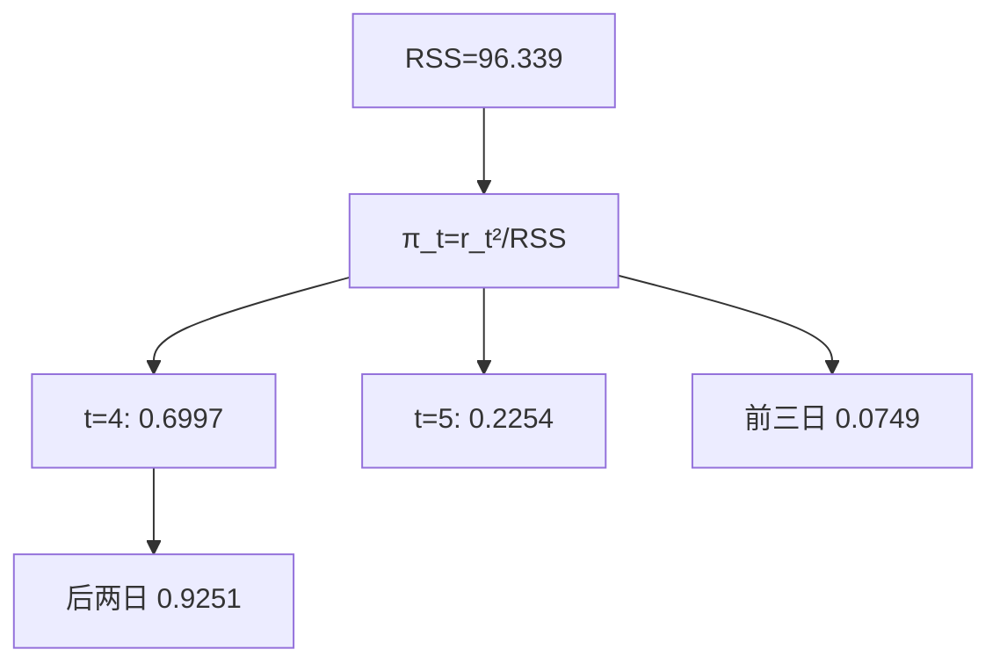
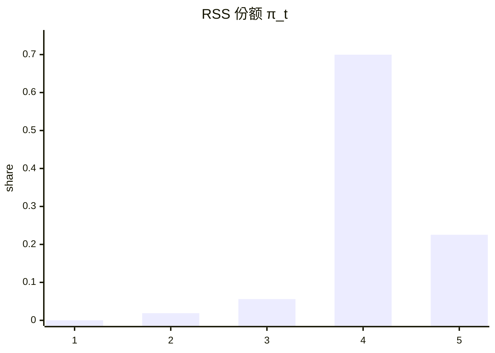

<p align="center"><b>中文</b> &nbsp;&nbsp;·&nbsp;&nbsp; <a href="day-03.en.md">English</a></p>

# 第 3 天 · 五天残差并排

[第一阶段 · 模型](README.md) · [排版规范](LESSON_LAYOUT.md) · 可运行

今天的学习要点：平方和 96.339 是一个标量。五天的平方份额是 0.0001、0.0189、0.0559、0.6997、0.2254。第四日与第五日合计 0.9251，前三日合计 0.0749。

---

## 费曼法讲解

> **结论先行**：固定 OLS 残差后，π_t=r_t²/RSS 把 RSS=96.339 分解为五维份额；第四日 0.6997 与第五日 0.2254 合计 0.9251，平方损失集中在尾部两日。



第 1–2 天直线 `y = 3.27 x + -1.29` 与残差已锁。本日 estimand：**固定 β̂ 下的 RSS 向量分解** \(\pi_t=r_t^2/96.339\)，不是删点、不是 refit、不是 hold-out。

π_4=0.6997 与第 2 天 `day 4 share of L2` 同数——标量 L2 与向量 π 是同一信息的两种报表。0.0001 必须四位保留；写成 0 会破坏 \(\sum\pi=1\)。第五日 0.2254 单独大于前三日合计 0.0749；只报「第四日最大」仍漏掉 >20% 的平方损失。

除 flowchart 外，脚本打印 `days 4 and 5 share of RSS = 0.9251` 与 `days 1 through 3 share of RSS = 0.0749` 是 **二元摘要**，不能替代五维表。Walk-forward 监控：RMSE 告警时先看 per-date squared error 是否被单日 dominate（本课第四日），再查 bad tick。

误用：（1）π 大即 winsorize；（2）用 RMSE 代替 π 向量；（3）把 0.0001 四舍五入为 0。第 5 天删点改 β̂ 后 π 全变——本课份额 **条件于 full-sample OLS**。

Hat 杠杆直觉：第四日 |r_4|=8.21 常伴高杠杆；Cook 距离是删点视角，本课是 fixed-β 视角。第 8 天窗口 RSS 定义在三天子样本，禁止与 96.339 跨域比大小。

---

## 核心知识

### 脚本输出（与下方 `text` 块一致）

[`residual_vector.py`](../../days/03-residual-vector/residual_vector.py)：

```text
line: y = 3.27 x + -1.29
RSS = 96.339
t  residual  squared  share of RSS
1  0.12  0.0144  0.0001
2  -1.35  1.8225  0.0189
3  -2.32  5.3824  0.0559
4  8.21  67.4041  0.6997
5  -4.66  21.7156  0.2254
largest squared residual at t=4
days 4 and 5 share of RSS = 0.9251
days 1 through 3 share of RSS = 0.0749
```




正文表与公式只解释 text 块；小数须与块内同行可对齐。

---

## 拓展领域

**因子回归**：除 RMSE 外存 per-date squared error 或 π 快照；IC 稳而 RMSE 恶时查 dominate 日。**执行 vs 研究**：slippage 常用 MAE，fit 常用 MSE——并列报告。

**稳健统计**：Huber/LAD 会改变 dominate 日排序；本课 π 专指 OLS 平方损失。**第 74 天** top-five errors 是 π 思想在高维的延伸。**Brinson** 与 fit π 正交：alpha 可独立于 in-sample RSS 形状。

**生产**：回测 summary 落库 `max_contribution_date`；dashboard 五块饼图数据来自 stdout 五 share。**合规**：对外 RMSE、对内 π 向量供 model risk。

**手算审计**：67.4041/96.339=0.6997；(0.0144+1.8225+5.3824)/96.339=0.0749。**CI**：text 块 golden diff。

**文献**：Lehmann & Casella 估计与评分分离；Hastie ESL 残差诊断；Rousseeuw 稳健回归——删点改 β̂，与本课 fixed β̂ 不同 estimand。

**深度学习**：batch MSE 对应 RSS；per-sample loss 长尾读法同 π 极端。**AutoML**：metric 须对齐业务 estimand。

**时间序列**：第 9 天行置换不变 π；第 21 天 panel 后 π 应对齐事件日。**反事实**：改 |r_5| 则 π_4 相对升——份额是相对度量。

**代码审查**：metrics 除 `mean_squared_error` 外 `groupby(date)` 存 squared error。**PM 沟通**：0.6997 是拟合质量事实，不是删点判决。

**Closing**：RSS 标量是压缩；π 向量是审计级披露。本课义务是把 96.339 拆回五日且可复现加总为 1。

**π 向量与标量 RSS.** 第 2 天报告 L2=96.339 与第四日份额 0.6997；本日把五维 π_t 完整打印。研究监控里，RMSE 恶化而 IC 稳定时，第一步应导出 per-date squared error 并核对是否单点 dominate——本课第四日 67.4041 占 RSS 近七成是最小反例。

**固定 β̂ 合同.** π_t 条件于 full-sample OLS；第 5 天删点改 β̂ 后全部 π 重算。memo 标题须写「diagnostic under fixed OLS」而非「样本外贡献度」。Cook 距离与 DFBETAS 是删点视角；本课是 **不删点、只看份额** 的 estimand。

**数值纪律.** 0.0001 来自 0.0144/96.339 的四舍五入；抹成 0 会破坏 Σπ=1 的审计。二元摘要 0.9251 与 0.0749 是脚本对后两日/前三日的聚合，不能替代五列表。

**生产映射.** 回测框架 `groupby(date).apply(squared_error)` 落库；dashboard 用 π 快照解释 RMSE 跳变。Model risk 对外 RMSE、对内 π 向量——与 Brinson 归因正交，alpha 可独立于 in-sample RSS 形状。

**与后续课.** 第 8 天窗口 RSS 0.0417/22.0417 不得与 96.339 排名；第 74 天 top-five errors 是 π 思想的高维版。第 20 天 in-sample RSS 下降须对照 hold-out，不能只看标量。

停牌间隔（如第35课）改变 row-lag 语义；第3课构造 rolling 特征时应使用 calendar index 而非 raw row shift。

复权口径（如第36课）要求双列披露；第3课任何 return 图表必须标注 adj 或 raw，禁止混用。

窗口均值（如第30–32课）区分 full sample 与 lookback；第3课 feature 命名建议带 window 长度后缀。

市场同期信号（如第38课）与 lag 市场对照；第3课 merge 外部指数时务必 asof 对齐到前一可用观测。

固定 panel（第21课）之后所有数字绑同一 CSV；第3课改路径或增行属于 dataset 版本 bump，不是代码 refactor。

lag-1 方向（第22课）是最简 autocorr sign 游戏；第3课扩展至多元时，先确认单变量基线仍复现 36/77。

三连规则（第23课）样本稀疏；第3课 bootstrap 或 permutation 若做，须在 hold-out 段而非 in-sample 挑规则。

early 非 score（第24课）是防 peek 文案；第3课 dashboard 应把 non-score 段视觉降级（灰显）。

open scale 泄漏（第29课）差 0.0008 量级小但性质严重；第3课 security review 应看公式分母而非看 delta RSS。

high FORBIDDEN（第28课）教 bar 内同步；第3课 intraday 特征更严格，decision time 须早于 bar end。

第3课与第7天 hold-out 精神一致：参与拟合的行不得参与评分；任何「全样本 fit 再全样本 score」须打 in-sample 标签。

第3课与第9天行置换对照：shuffle 行不改 OLS 系数，但 shuffle 时间戳会破坏 lag；panel 课默认时间有序。

第3课与第20天噪声列对照：扩大列空间可降训练 RSS 但恶化留出；panel 上应用切分重复该实验。

第3课写 commit message 时建议带 verify day 号；例如「docs: day-3 sync stdout golden」。

第3课英文键名中的空格与等号两侧空格是 diff 的一部分；自动格式化工具不得 strip 终端行。

第3课 mermaid 节点数字必须来自 stdout；勿在图里写未打印的四舍五入值。

第3课表格是解释层；若表格数字与 text 块冲突，以 text 块为准并修表。

第3课读者若是风控，应关注泄漏 list 与 FORBIDDEN；若是执行，应关注 cost 与 halt gap。

第3课读者若是数据工程，应关注 panel identity 与 imputation；若是 PM，应关注 estimand 一句话。

第3课扩展阅读：Lopez de Prado 的 purged k-fold 用于解决标签重叠；本季未实现但应知存在。

第3课扩展阅读：White (1980) 异方差稳健协方差；方向 accuracy 的渐近方差本季未算。

第3课扩展阅读：Newey-West 对重叠 horizon；若 future 改 weekly label，推断必须换 HAC。

第3课扩展阅读：Harvey (2016) 多重 backtest 试验；勿在 100 seed 里挑最好 day 26 数字。

第3课扩展阅读：Hasbrouck (2007) 有效 spread；第39课常数 cost 是其极简替身。

第3课扩展阅读：Breiman (2001) 两种文化；panel 段在算法文化与数据文化间切换。

第3课扩展阅读：Hamilton (1994) 时间序列；rolling 与 expanding 的信息集差异是核心。

第3课扩展阅读：Little & Rubin (2002) 缺失；MCAR/MAR 本季不辨，但 fill 方向必辨。

第3课扩展阅读：Campbell et al. (1997) 预测回归；lag 结构改变即改变 stochastic 设定。

第3课若接入实时行情，应重建 frozen panel 快照而非 mutate 历史文件；live 与 research 分离。

第3课若在 notebook 跑脚本，working directory 必须是仓库根；否则 panel 相对路径失败。

第3课若在 Docker 跑，镜像应 pin numpy 与 csv 版本；否则 float 末位可能 drift。

第3课 unit test 可 mock 小 csv，但 golden 仍以官方 panel 为准；mock 只测逻辑不测数值。

第3课 code review 可要求作者贴 verify 输出片段；无 verify 的 doc PR 不应 merge。

第3课 teaching assistant 批改时只 diff text 块与三句 estimand；不看 prose 修辞。

第3课若翻译英文版，须同步键名；中文版不得单独发明新 metric 中文名而不给英文键。

第3课交叉引用其他 day 时写「第 N 天」而非「上周」；season 结构是线性课程。

第3课避免写「显然」「众所周知」；改写成可核对机制句。

第3课避免写虚构论文作者；只引用 season 文档已出现或主流教科书。

第3课若提到 p 值而脚本未打印，属于过度推断；本段 21–40 天默认无显著性检验。

第3课若提到 Sharpe 而脚本未打印，应改写成方向 accuracy 或 MSE 或 return mean。

第3课图表若用 mermaid xychart，轴标签须与 stdout 列名一致；本段多数用 flowchart。

第3课完成后，学习者应能在 30 秒内从 stdout 指出：数据对象、评分集合、是否泄漏。

第3课完成后，学习者应能写出一条 Jira 任务：「修复 scale fit on full sample」并链到第33课。

第3课完成后，学习者应能拒绝 PM 需求：「用 high 提升 RSS」并引用第28课 FORBIDDEN。

第3课与 season 后半 lag-5 权重（第51天）的关系：本段建立 panel 纪律，第51天起换标签到五 lag 收益。

第3课与 tree 课（第44天）的关系：树可在同行 panel 上 beat 线性，但泄漏特征仍 FORBIDDEN。

第3课与 ridge（第42天）的关系：惩罚斜率是另一种控制复杂度；与泄漏正交。

第3课与 year split（第58天）的关系：时间切分从比例升级到按年；本段 27 天是比例版。

第3课与 bill（第75天）的关系：方向 accuracy 之后还有计费误差；本段多数未引入 bill。

第3课与 slippage（第93天）的关系：第39天 round-trip 是常数先行版。

第3课 narrative 收束：数字 frozen，机制可讨论，estimand 不可模糊。

回测代码审查时，第3课要求先打开终端输出，再读中文解释；若解释出现 stdout 未打印的阈值或准确率，直接判为文档漂移。

因子入库前，应用与第3课同构的三问：特征在决策时刻是否可见、标签是否同期泄漏、标准化是否只用训练段统计量。

研究 memo 的 estimand 小节应写清第3天脚本使用的 name 列、价格列（close 或 adj_close）、以及差分阶数；换列等于换题。

当 PM 要求「把样本内曲线做漂亮」时，第3课类实验应回复：请先指定 hold-out 掩码或 bill 口径；in-sample 优化不等于交付分数。

第3课若涉及方向准确率，报告时必须并列分母（hits 里的 /N）；只写百分比不写 N 是审计不合格。

混池实验（如第37课）与单名实验（如第27课）不得共用一个 leaderboard；第3课文档应在开头声明主语范围。

FORBIDDEN 特征课（如第28课）说明：in-sample RSS 下降可能是泄漏信号；第3课写模型比较时禁止用非法列作优选依据。

缺失填充课（如第34课）提醒：pandas 默认 bfill 在 pipeline 里很常见；第3课起应在 CI 里 grep fillna 方向。

标准化泄漏（如第33课）说明：test MSE 相等不能证明无泄漏；第3课应把 scale 来源写入 model card。

时间切分课（如第27课）的「测试在训练之后」是因果最低标准；第3课若改切分为随机，必须另开对照行而不覆盖 time 行。

随机切分对照（如第26课）只能叫 control，不能叫 walk-forward；第3课命名错误会导致合规审查失败。

事件规则课（如第23–24课）强调规则先于计数；第3课若事后改 pattern 长度，events 与 accuracy 都不具可比性。

双分数课（如第25课）说明水平误差与方向误差可分离；第3课策略若为 sign book，primary metric 必须指向 direction。

成本门（如第39课）应在 hit rate 之前进入；第3课若未扣费，memo 应显式写「未含 transaction cost」。

泄漏清单（第40课）是 negative catalog；第3课新特征应主动问：是否会出现在未来某天的 list 行上。

**hold-out 与 fit 索引（第 3 天）.** 本课 stdout 锚点：RSS=96.339，π 五列与 0.9251/0.0749 摘要。写 hold-out 与 fit 索引 相关 memo 时，只能解释终端已打印的键值，不得追加未出现的准确率或阈值。若 pipeline 在 hold-out 与 fit 索引 环节改动了 fit/score 边界，须重跑本日脚本并更新 ```text``` 块。Code review 应 grep metrics 命名是否与 hold-out 与 fit 索引 合同一致；与第 7、20、27 天的切分叙事保持同一词汇。

**泄漏与 FORBIDDEN 特征（第 3 天）.** 本课 stdout 锚点：RSS=96.339，π 五列与 0.9251/0.0749 摘要。写 泄漏与 FORBIDDEN 特征 相关 memo 时，只能解释终端已打印的键值，不得追加未出现的准确率或阈值。若 pipeline 在 泄漏与 FORBIDDEN 特征 环节改动了 fit/score 边界，须重跑本日脚本并更新 ```text``` 块。Code review 应 grep metrics 命名是否与 泄漏与 FORBIDDEN 特征 合同一致；与第 7、20、27 天的切分叙事保持同一词汇。

**标准化与 scale 来源（第 3 天）.** 本课 stdout 锚点：RSS=96.339，π 五列与 0.9251/0.0749 摘要。写 标准化与 scale 来源 相关 memo 时，只能解释终端已打印的键值，不得追加未出现的准确率或阈值。若 pipeline 在 标准化与 scale 来源 环节改动了 fit/score 边界，须重跑本日脚本并更新 ```text``` 块。Code review 应 grep metrics 命名是否与 标准化与 scale 来源 合同一致；与第 7、20、27 天的切分叙事保持同一词汇。

**方向与水平双分数（第 3 天）.** 本课 stdout 锚点：RSS=96.339，π 五列与 0.9251/0.0749 摘要。写 方向与水平双分数 相关 memo 时，只能解释终端已打印的键值，不得追加未出现的准确率或阈值。若 pipeline 在 方向与水平双分数 环节改动了 fit/score 边界，须重跑本日脚本并更新 ```text``` 块。Code review 应 grep metrics 命名是否与 方向与水平双分数 合同一致；与第 7、20、27 天的切分叙事保持同一词汇。

**panel 与 lag 合同（第 3 天）.** 本课 stdout 锚点：RSS=96.339，π 五列与 0.9251/0.0749 摘要。写 panel 与 lag 合同 相关 memo 时，只能解释终端已打印的键值，不得追加未出现的准确率或阈值。若 pipeline 在 panel 与 lag 合同 环节改动了 fit/score 边界，须重跑本日脚本并更新 ```text``` 块。Code review 应 grep metrics 命名是否与 panel 与 lag 合同 合同一致；与第 7、20、27 天的切分叙事保持同一词汇。

---

## 实战总结

```bash
python days/03-residual-vector/residual_vector.py
```

核对：`RSS = 96.339`、五份额、`0.9251`/`0.0749`、`largest squared residual at t=4`。