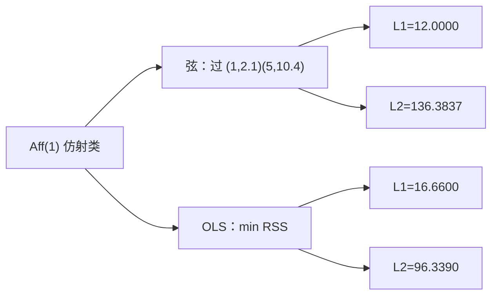
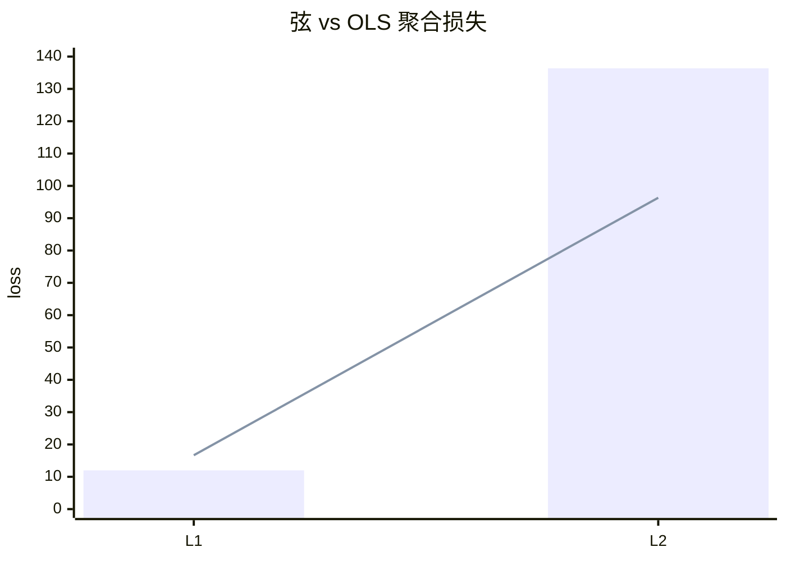

<p align="center"><b>中文</b> &nbsp;&nbsp;·&nbsp;&nbsp; <a href="day-04.en.md">English</a></p>

# 第 4 天 · 端点连线

[第一阶段 · 模型](README.md) · [排版规范](LESSON_LAYOUT.md) · 可运行

今天的学习要点：端点弦和普通最小二乘同属仿射类。弦的绝对损失 12.0000 小于直线的 16.6600，弦的平方损失 136.3837 大于直线的 96.3390。同一种形状，两种损失，名次相反。

## 费曼法讲解

> **结论先行**：端点弦与 OLS 同属仿射类 Aff(1)：弦 L1=12.0000 低于 OLS 16.6600，弦 L2=136.3837 高于 OLS 96.3390——**换损失则类内最优名次反转**，不是「换模型族」。



**端点弦** `y = 2.0750 x + 0.0250` 强制过第一、五交易日；**OLS** `y = 3.2700 x + -1.2900` 最小化平方和。二者都是直线——比较的是 **同一函数类、不同约束/目标** 下的残差与聚合损失。

弦在 t=1,5 残差 0（定义）；中间三日弦拟合值 4.1750、6.2500、8.3250。第四日 y=20.0，弦残差 11.6750，OLS 残差 8.2100——**水平误差弦更大**，但 L1 总和弦 12.0000 仍小于 OLS 16.6600，因 OLS 在 t=2,3,5 的 |r| 更大。

L2 叙事反转：弦 136.3837 > OLS 96.3390。第四日平方项 (11.6750)² 支配弦的 RSS；OLS 已在全局意义下折中第四日的 8.21。第 2–3 天：固定 OLS β̂ 看 L1/L2 份额；本日 **换估计器** 再看两种损失——名次可交换。

误用：用 L1 赢论证「弦样本外更好」（未做 hold-out）；用 L2 赢论证「OLS 处处更优」（忽略 L1 estimand）。正确：并列 L1/L2，指名 **chord vs OLS**，报 day-4 |r| 两值 11.6750 vs 8.2100。

第 4 天端点约束等价于 **仅锚定首尾** 的仿射子族；生产里类似「连接发行日与到期日」的折线报价，与 **全样本回归** 不同 estimand。

## 核心知识

### 脚本输出（与下方 `text` 块一致）

[`endpoint_chord.py`](../../days/04-endpoint-chord/endpoint_chord.py)：

```text
chord: y = 2.0750 x + 0.0250
t  yhat  residual
1  2.1000  0.0000
2  4.1750  -0.2750
3  6.2500  -0.0500
4  8.3250  11.6750
5  10.4000  0.0000
L1 = 12.0000
L2 = 136.3837
day 4 absolute residual = 11.6750

ols: y = 3.2700 x + -1.2900
t  yhat  residual
1  1.9800  0.1200
2  5.2500  -1.3500
3  8.5200  -2.3200
4  11.7900  8.2100
5  15.0600  -4.6600
L1 = 16.6600
L2 = 96.3390
day 4 absolute residual = 8.2100
```



正文表与公式只解释 text 块；小数须与块内同行可对齐。

## 拓展领域

**Koenker–Bassett**：L1 最小化给出中位数方向；弦非 LAD 最优，但 L1=12 展示 **非 OLS 解可在 L1 上更优**。**Huber**：估参数与报损失可分离（第 2 天）。

**量化映射**：连接价/隐含曲线端点插值 vs 全曲线最小二乘拟合——客户看到的误差指标可能是 MAE 而非 MSE。**风险**：若 KPI 接近 MAE，用 OLS 训练会把优化重心放在 MSE dominate 日。

**与第 5 天**：删第四日动 OLS 斜率；弦由端点唯一决定，删中间点不改端点则弦不变——**约束估计器对 leverage 点免疫** 与否取决于约束形式。

**数值**：text 块分 chord/ols 两段；审计时分别加总 |r| 与 r²。**Gauss–Markov** 只对 OLS 在 i.i.d. 线性模型下有意义；弦是 **确定性插值**。

**树/分段预告**：第 44 天起离开全局 Aff(1)；本课是 **同一类内两解** 的最后对照。**Ridge**（第 42 天）仍属 Aff(1) 但罚范数。

**代码审查**：若 strategy 用 `y[-1]-y[0]` 斜率却报告 MSE vs benchmark OLS，属 estimand 混用。**Walk-forward**：两种线在同一 hold-out 上各报 L1/L2——本课未做，但 memo 应预留。

**Breiman 两种文化**：弦接近 **数据自适应少参数** 插值；OLS 是 **全局参数** 解。本面板五点说明 **损失选择即文化选择** 的初等版。

**Closing**：12.0000 vs 16.6600 与 136.3837 vs 96.3390 必须 **同屏**；缺一读者会误以为存在统一「更好直线」。

**Aff(1) 内两解.** 弦过 (1,2.1) 与 (5,10.4)，OLS 最小化 RSS；同属直线族，比较的是 **约束与目标** 而非「线性 vs 非线性」。L1 弦赢 12.0000 vs 16.6600，L2 弦输 136.3837 vs 96.3390——第 2 天已说明 L2 放大 |r|>1；弦在 t=4 的 |r|=11.6750 大于 OLS 8.2100 仍可在 L1 总和上更优。

**端点插值与曲线拟合.** 量化里连接发行日/到期日的折线报价、隐含波动率端点锚定，常类似弦；全样本回归是另一 estimand。KPI 接近 MAE 时，用 OLS 训练会把优化重心放在 MSE dominate 日（第 3 天 π_4）。

**第四日双残差.** 11.6750 与 8.2100 须同屏：水平误差弦更大，但 L1 聚合仍可能更小——忌用单点论证「弦 everywhere 更差」。Gauss–Markov 只对 OLS 在经典线性模型下陈述；弦是确定性插值，无 BLUE 叙事。

**Walk-forward 预留.** 两种线应在同一 hold-out 上各报 L1/L2；本课 in-sample 只固定名次反转机制。代码审查：若 strategy 用首尾斜率却报告对 OLS 的 MSE benchmark，属 estimand 混用。

## 实战总结

```bash
python days/04-endpoint-chord/endpoint_chord.py
```

核对：弦/ols 各段 L1、L2；`day 4 absolute residual` 弦 11.6750、OLS 8.2100。