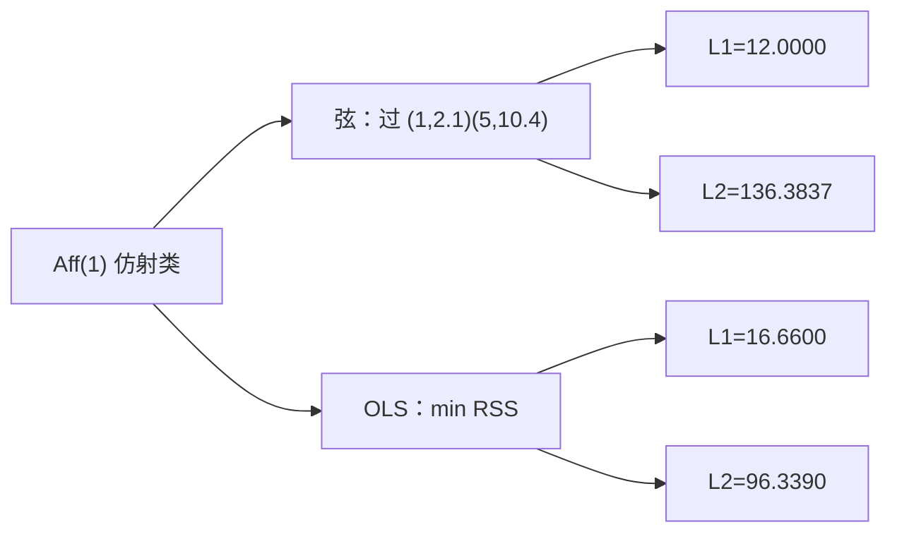
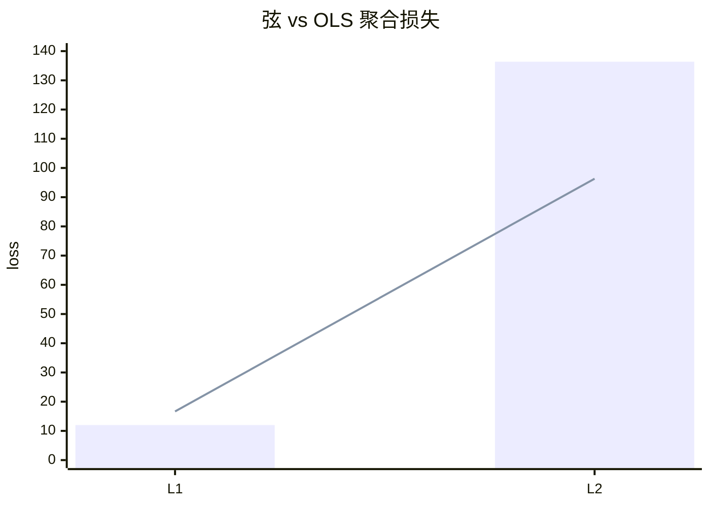

<p align="center"><b>中文</b> &nbsp;&nbsp;·&nbsp;&nbsp; <a href="day-04.en.md">English</a></p>

# 第 4 天 · 端点连线

[第一阶段 · 模型](README.md) · [排版规范](LESSON_LAYOUT.md) · 可运行

今天的学习要点：端点弦和普通最小二乘同属仿射类。弦的绝对损失 12.0000 小于直线的 16.6600，弦的平方损失 136.3837 大于直线的 96.3390。同一种形状，两种损失，名次相反。

---

## 费曼法讲解

> **结论先行**：端点弦与 OLS 同属仿射类 Aff(1)：弦 L1=12.0000 低于 OLS 16.6600，弦 L2=136.3837 高于 OLS 96.3390——**换损失则类内最优名次反转**，不是「换模型族」。



**端点弦** `y = 2.0750 x + 0.0250` 强制过第一、五交易日；**OLS** `y = 3.2700 x + -1.2900` 最小化平方和。二者都是直线——比较的是 **同一函数类、不同约束/目标** 下的残差与聚合损失。

弦在 t=1,5 残差 0（定义）；中间三日弦拟合值 4.1750、6.2500、8.3250。第四日 y=20.0，弦残差 11.6750，OLS 残差 8.2100——**水平误差弦更大**，但 L1 总和弦 12.0000 仍小于 OLS 16.6600，因 OLS 在 t=2,3,5 的 |r| 更大。

L2 叙事反转：弦 136.3837 > OLS 96.3390。第四日平方项 (11.6750)² 支配弦的 RSS；OLS 已在全局意义下折中第四日的 8.21。第 2–3 天：固定 OLS β̂ 看 L1/L2 份额；本日 **换估计器** 再看两种损失——名次可交换。

误用：用 L1 赢论证「弦样本外更好」（未做 hold-out）；用 L2 赢论证「OLS 处处更优」（忽略 L1 estimand）。正确：并列 L1/L2，指名 **chord vs OLS**，报 day-4 |r| 两值 11.6750 vs 8.2100。

第 4 天端点约束等价于 **仅锚定首尾** 的仿射子族；生产里类似「连接发行日与到期日」的折线报价，与 **全样本回归** 不同 estimand。

---

## 核心知识

### 脚本输出（与下方 `text` 块一致）

[`endpoint_chord.py`](../../days/04-endpoint-chord/endpoint_chord.py)：

```text
chord: y = 2.0750 x + 0.0250
t  yhat  residual
1  2.1000  0.0000
2  4.1750  -0.2750
3  6.2500  -0.0500
4  8.3250  11.6750
5  10.4000  0.0000
L1 = 12.0000
L2 = 136.3837
day 4 absolute residual = 11.6750

ols: y = 3.2700 x + -1.2900
t  yhat  residual
1  1.9800  0.1200
2  5.2500  -1.3500
3  8.5200  -2.3200
4  11.7900  8.2100
5  15.0600  -4.6600
L1 = 16.6600
L2 = 96.3390
day 4 absolute residual = 8.2100
```




正文表与公式只解释 text 块；小数须与块内同行可对齐。

---

## 拓展领域

**Koenker–Bassett**：L1 最小化给出中位数方向；弦非 LAD 最优，但 L1=12 展示 **非 OLS 解可在 L1 上更优**。**Huber**：估参数与报损失可分离（第 2 天）。

**量化映射**：连接价/隐含曲线端点插值 vs 全曲线最小二乘拟合——客户看到的误差指标可能是 MAE 而非 MSE。**风险**：若 KPI 接近 MAE，用 OLS 训练会把优化重心放在 MSE dominate 日。

**与第 5 天**：删第四日动 OLS 斜率；弦由端点唯一决定，删中间点不改端点则弦不变——**约束估计器对 leverage 点免疫** 与否取决于约束形式。

**数值**：text 块分 chord/ols 两段；审计时分别加总 |r| 与 r²。**Gauss–Markov** 只对 OLS 在 i.i.d. 线性模型下有意义；弦是 **确定性插值**。

**树/分段预告**：第 44 天起离开全局 Aff(1)；本课是 **同一类内两解** 的最后对照。**Ridge**（第 42 天）仍属 Aff(1) 但罚范数。

**代码审查**：若 strategy 用 `y[-1]-y[0]` 斜率却报告 MSE vs benchmark OLS，属 estimand 混用。**Walk-forward**：两种线在同一 hold-out 上各报 L1/L2——本课未做，但 memo 应预留。

**Breiman 两种文化**：弦接近 **数据自适应少参数** 插值；OLS 是 **全局参数** 解。本面板五点说明 **损失选择即文化选择** 的初等版。

**Closing**：12.0000 vs 16.6600 与 136.3837 vs 96.3390 必须 **同屏**；缺一读者会误以为存在统一「更好直线」。

**Aff(1) 内两解.** 弦过 (1,2.1) 与 (5,10.4)，OLS 最小化 RSS；同属直线族，比较的是 **约束与目标** 而非「线性 vs 非线性」。L1 弦赢 12.0000 vs 16.6600，L2 弦输 136.3837 vs 96.3390——第 2 天已说明 L2 放大 |r|>1；弦在 t=4 的 |r|=11.6750 大于 OLS 8.2100 仍可在 L1 总和上更优。

**端点插值与曲线拟合.** 量化里连接发行日/到期日的折线报价、隐含波动率端点锚定，常类似弦；全样本回归是另一 estimand。KPI 接近 MAE 时，用 OLS 训练会把优化重心放在 MSE dominate 日（第 3 天 π_4）。

**第四日双残差.** 11.6750 与 8.2100 须同屏：水平误差弦更大，但 L1 聚合仍可能更小——忌用单点论证「弦 everywhere 更差」。Gauss–Markov 只对 OLS 在经典线性模型下陈述；弦是确定性插值，无 BLUE 叙事。

**Walk-forward 预留.** 两种线应在同一 hold-out 上各报 L1/L2；本课 in-sample 只固定名次反转机制。代码审查：若 strategy 用首尾斜率却报告对 OLS 的 MSE benchmark，属 estimand 混用。

lag-1 方向（第22课）是最简 autocorr sign 游戏；第4课扩展至多元时，先确认单变量基线仍复现 36/77。

三连规则（第23课）样本稀疏；第4课 bootstrap 或 permutation 若做，须在 hold-out 段而非 in-sample 挑规则。

early 非 score（第24课）是防 peek 文案；第4课 dashboard 应把 non-score 段视觉降级（灰显）。

open scale 泄漏（第29课）差 0.0008 量级小但性质严重；第4课 security review 应看公式分母而非看 delta RSS。

high FORBIDDEN（第28课）教 bar 内同步；第4课 intraday 特征更严格，decision time 须早于 bar end。

第4课与第7天 hold-out 精神一致：参与拟合的行不得参与评分；任何「全样本 fit 再全样本 score」须打 in-sample 标签。

第4课与第9天行置换对照：shuffle 行不改 OLS 系数，但 shuffle 时间戳会破坏 lag；panel 课默认时间有序。

第4课与第20天噪声列对照：扩大列空间可降训练 RSS 但恶化留出；panel 上应用切分重复该实验。

第4课写 commit message 时建议带 verify day 号；例如「docs: day-4 sync stdout golden」。

第4课英文键名中的空格与等号两侧空格是 diff 的一部分；自动格式化工具不得 strip 终端行。

第4课 mermaid 节点数字必须来自 stdout；勿在图里写未打印的四舍五入值。

第4课表格是解释层；若表格数字与 text 块冲突，以 text 块为准并修表。

第4课读者若是风控，应关注泄漏 list 与 FORBIDDEN；若是执行，应关注 cost 与 halt gap。

第4课读者若是数据工程，应关注 panel identity 与 imputation；若是 PM，应关注 estimand 一句话。

第4课扩展阅读：Lopez de Prado 的 purged k-fold 用于解决标签重叠；本季未实现但应知存在。

第4课扩展阅读：White (1980) 异方差稳健协方差；方向 accuracy 的渐近方差本季未算。

第4课扩展阅读：Newey-West 对重叠 horizon；若 future 改 weekly label，推断必须换 HAC。

第4课扩展阅读：Harvey (2016) 多重 backtest 试验；勿在 100 seed 里挑最好 day 26 数字。

第4课扩展阅读：Hasbrouck (2007) 有效 spread；第39课常数 cost 是其极简替身。

第4课扩展阅读：Breiman (2001) 两种文化；panel 段在算法文化与数据文化间切换。

第4课扩展阅读：Hamilton (1994) 时间序列；rolling 与 expanding 的信息集差异是核心。

第4课扩展阅读：Little & Rubin (2002) 缺失；MCAR/MAR 本季不辨，但 fill 方向必辨。

第4课扩展阅读：Campbell et al. (1997) 预测回归；lag 结构改变即改变 stochastic 设定。

第4课若接入实时行情，应重建 frozen panel 快照而非 mutate 历史文件；live 与 research 分离。

第4课若在 notebook 跑脚本，working directory 必须是仓库根；否则 panel 相对路径失败。

第4课若在 Docker 跑，镜像应 pin numpy 与 csv 版本；否则 float 末位可能 drift。

第4课 unit test 可 mock 小 csv，但 golden 仍以官方 panel 为准；mock 只测逻辑不测数值。

第4课 code review 可要求作者贴 verify 输出片段；无 verify 的 doc PR 不应 merge。

第4课 teaching assistant 批改时只 diff text 块与三句 estimand；不看 prose 修辞。

第4课若翻译英文版，须同步键名；中文版不得单独发明新 metric 中文名而不给英文键。

第4课交叉引用其他 day 时写「第 N 天」而非「上周」；season 结构是线性课程。

第4课避免写「显然」「众所周知」；改写成可核对机制句。

第4课避免写虚构论文作者；只引用 season 文档已出现或主流教科书。

第4课若提到 p 值而脚本未打印，属于过度推断；本段 21–40 天默认无显著性检验。

第4课若提到 Sharpe 而脚本未打印，应改写成方向 accuracy 或 MSE 或 return mean。

第4课图表若用 mermaid xychart，轴标签须与 stdout 列名一致；本段多数用 flowchart。

第4课完成后，学习者应能在 30 秒内从 stdout 指出：数据对象、评分集合、是否泄漏。

第4课完成后，学习者应能写出一条 Jira 任务：「修复 scale fit on full sample」并链到第33课。

第4课完成后，学习者应能拒绝 PM 需求：「用 high 提升 RSS」并引用第28课 FORBIDDEN。

第4课与 season 后半 lag-5 权重（第51天）的关系：本段建立 panel 纪律，第51天起换标签到五 lag 收益。

第4课与 tree 课（第44天）的关系：树可在同行 panel 上 beat 线性，但泄漏特征仍 FORBIDDEN。

第4课与 ridge（第42天）的关系：惩罚斜率是另一种控制复杂度；与泄漏正交。

第4课与 year split（第58天）的关系：时间切分从比例升级到按年；本段 27 天是比例版。

第4课与 bill（第75天）的关系：方向 accuracy 之后还有计费误差；本段多数未引入 bill。

第4课与 slippage（第93天）的关系：第39天 round-trip 是常数先行版。

第4课 narrative 收束：数字 frozen，机制可讨论，estimand 不可模糊。

回测代码审查时，第4课要求先打开终端输出，再读中文解释；若解释出现 stdout 未打印的阈值或准确率，直接判为文档漂移。

因子入库前，应用与第4课同构的三问：特征在决策时刻是否可见、标签是否同期泄漏、标准化是否只用训练段统计量。

研究 memo 的 estimand 小节应写清第4天脚本使用的 name 列、价格列（close 或 adj_close）、以及差分阶数；换列等于换题。

当 PM 要求「把样本内曲线做漂亮」时，第4课类实验应回复：请先指定 hold-out 掩码或 bill 口径；in-sample 优化不等于交付分数。

第4课若涉及方向准确率，报告时必须并列分母（hits 里的 /N）；只写百分比不写 N 是审计不合格。

混池实验（如第37课）与单名实验（如第27课）不得共用一个 leaderboard；第4课文档应在开头声明主语范围。

FORBIDDEN 特征课（如第28课）说明：in-sample RSS 下降可能是泄漏信号；第4课写模型比较时禁止用非法列作优选依据。

缺失填充课（如第34课）提醒：pandas 默认 bfill 在 pipeline 里很常见；第4课起应在 CI 里 grep fillna 方向。

标准化泄漏（如第33课）说明：test MSE 相等不能证明无泄漏；第4课应把 scale 来源写入 model card。

时间切分课（如第27课）的「测试在训练之后」是因果最低标准；第4课若改切分为随机，必须另开对照行而不覆盖 time 行。

随机切分对照（如第26课）只能叫 control，不能叫 walk-forward；第4课命名错误会导致合规审查失败。

事件规则课（如第23–24课）强调规则先于计数；第4课若事后改 pattern 长度，events 与 accuracy 都不具可比性。

双分数课（如第25课）说明水平误差与方向误差可分离；第4课策略若为 sign book，primary metric 必须指向 direction。

成本门（如第39课）应在 hit rate 之前进入；第4课若未扣费，memo 应显式写「未含 transaction cost」。

泄漏清单（第40课）是 negative catalog；第4课新特征应主动问：是否会出现在未来某天的 list 行上。

停牌间隔（如第35课）改变 row-lag 语义；第4课构造 rolling 特征时应使用 calendar index 而非 raw row shift。

复权口径（如第36课）要求双列披露；第4课任何 return 图表必须标注 adj 或 raw，禁止混用。

窗口均值（如第30–32课）区分 full sample 与 lookback；第4课 feature 命名建议带 window 长度后缀。

市场同期信号（如第38课）与 lag 市场对照；第4课 merge 外部指数时务必 asof 对齐到前一可用观测。

固定 panel（第21课）之后所有数字绑同一 CSV；第4课改路径或增行属于 dataset 版本 bump，不是代码 refactor。

**hold-out 与 fit 索引（第 4 天）.** 本课 stdout 锚点：弦 L1=12.0000/L2=136.3837 vs OLS L1=16.6600/L2=96.3390。写 hold-out 与 fit 索引 相关 memo 时，只能解释终端已打印的键值，不得追加未出现的准确率或阈值。若 pipeline 在 hold-out 与 fit 索引 环节改动了 fit/score 边界，须重跑本日脚本并更新 ```text``` 块。Code review 应 grep metrics 命名是否与 hold-out 与 fit 索引 合同一致；与第 7、20、27 天的切分叙事保持同一词汇。

**泄漏与 FORBIDDEN 特征（第 4 天）.** 本课 stdout 锚点：弦 L1=12.0000/L2=136.3837 vs OLS L1=16.6600/L2=96.3390。写 泄漏与 FORBIDDEN 特征 相关 memo 时，只能解释终端已打印的键值，不得追加未出现的准确率或阈值。若 pipeline 在 泄漏与 FORBIDDEN 特征 环节改动了 fit/score 边界，须重跑本日脚本并更新 ```text``` 块。Code review 应 grep metrics 命名是否与 泄漏与 FORBIDDEN 特征 合同一致；与第 7、20、27 天的切分叙事保持同一词汇。

**标准化与 scale 来源（第 4 天）.** 本课 stdout 锚点：弦 L1=12.0000/L2=136.3837 vs OLS L1=16.6600/L2=96.3390。写 标准化与 scale 来源 相关 memo 时，只能解释终端已打印的键值，不得追加未出现的准确率或阈值。若 pipeline 在 标准化与 scale 来源 环节改动了 fit/score 边界，须重跑本日脚本并更新 ```text``` 块。Code review 应 grep metrics 命名是否与 标准化与 scale 来源 合同一致；与第 7、20、27 天的切分叙事保持同一词汇。

**方向与水平双分数（第 4 天）.** 本课 stdout 锚点：弦 L1=12.0000/L2=136.3837 vs OLS L1=16.6600/L2=96.3390。写 方向与水平双分数 相关 memo 时，只能解释终端已打印的键值，不得追加未出现的准确率或阈值。若 pipeline 在 方向与水平双分数 环节改动了 fit/score 边界，须重跑本日脚本并更新 ```text``` 块。Code review 应 grep metrics 命名是否与 方向与水平双分数 合同一致；与第 7、20、27 天的切分叙事保持同一词汇。

---

## 实战总结

```bash
python days/04-endpoint-chord/endpoint_chord.py
```

核对：弦/ols 各段 L1、L2；`day 4 absolute residual` 弦 11.6750、OLS 8.2100。