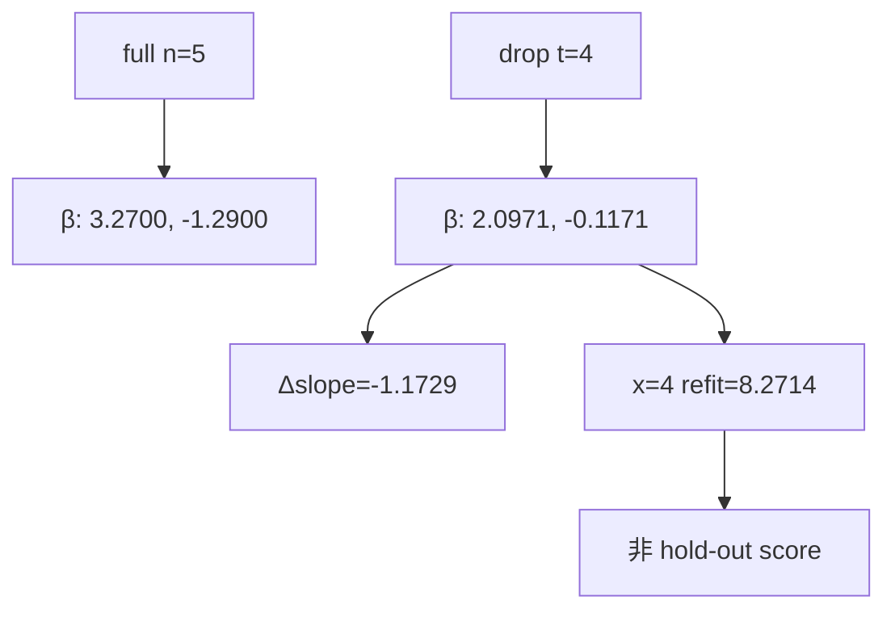
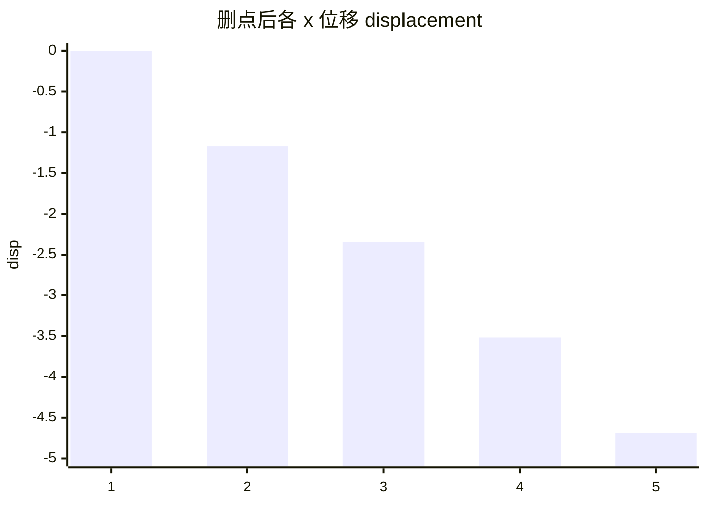

<p align="center"><b>中文</b> &nbsp;&nbsp;·&nbsp;&nbsp; <a href="day-05.en.md">English</a></p>

# 第 5 天 · 去掉第四日再拟合

[第一阶段 · 模型](README.md) · [排版规范](LESSON_LAYOUT.md) · 可运行

今天的学习要点：删掉 `(4, 20)` 之后重解正规方程，斜率从 3.2700 降到 2.0971，变化 −1.1729。这是整条直线的位移，不是第四日的考试分数。

## 费曼法讲解

> **结论先行**：删去 (4,20) 后 OLS 斜率从 3.2700 变为 2.0971，Δslope=−1.1729、Δintercept=+1.1729；`y_4−refit` 不是考试分数，而是 **重估 β̂ 后 in-support 对比**。



第 3 天 π_4=0.6997 说明第四日在 **固定 full β̂** 下 dominate RSS；本日 **删除标签 (4,20)** 并重解正规方程，估计器改变。斜率 3.2700→2.0971，变化 −1.1729；截距 −1.2900→−0.1171，变化 +1.1729——两点变化幅度相同，反映 **杠杆点拉动** 的几何。

`displacement` 列：full 拟合减 without 拟合。t=1 位移 0（删点不移动首点拟合值在本数据上的巧合需对 text 核对）；t=5 位移 −4.6914 最大，说明删第四日后 **远端点拟合线下移**。

`refit at x=4 = 8.2714` 与 `y_4=20.0` 差距 11.7286 不是第 7 天意义的 exam residual——脚本明示 **not a test score**。混淆删点 refit 与 hold-out 是常见 pipeline bug。

与第 5 天相关的 **influence**：删一点 ≡ 局部重估 β̂；与第 3 天 **fixed β̂ 份额** 是不同 estimand。memo 须分标题「diagnostic share」vs「refit after drop」。

Walk-forward：应用 **训练窗内** 删异常再 fit 会改变全部 OOS 预测路径——本课只展示五点代数。

## 核心知识

### 脚本输出（与下方 `text` 块一致）

[`without_day4.py`](../../days/05-without-day-4/without_day4.py)：

```text
full:    y = 3.2700 x + -1.2900
without: y = 2.0971 x + -0.1171
delta slope = -1.1729
delta intercept = 1.1729
t  full  without  displacement
1  1.9800  1.9800  0.0000
2  5.2500  4.0771  -1.1729
3  8.5200  6.1743  -2.3457
4  11.7900  8.2714  -3.5186
5  15.0600  10.3686  -4.6914
deleted label y_4 = 20.0
refit at x=4 = 8.2714
the gap y_4 - refit is not a test score
```



正文表与公式只解释 text 块；小数须与块内同行可对齐。

## 拓展领域

**Cook distance / leverage**：第四日高 |r| 与高杠杆常共存；删点实验是 **敏感性分析** 初等版。**稳健回归**：Downweight 第四日而非 hard delete—— estimand 再变。

**生产**：corporate action 修正后是否 refit 全历史？若 yes，位移列类似本课 without-full 差。**因子**：风格系数对样本窗敏感；删 2008 一周 vs 删一条 bad tick 机制不同。

**与第 7 天**：hold-out 第五日 **不进入 fit**；本日第四日 **从 fit 移除但 x=4 仍评估 refit**——索引角色不同。**k-NN** 不受删点改 β（无 β），但 support 变。

**数值审计**：delta slope 须由两段 `y =` 行手算一致。**CI**：改 TRAIN 数组应同时更新 without 段。

**PM 沟通**：−1.1729 是 **整条线旋转**，不是「第四日得分」。**文献**：Rousseeuw breakdown point；Hampel 影响函数。

**Closing**：删点改 β̂；份额看 fixed β̂——两句必须同时出现在 model risk 培训材料中。

**删点 vs 份额.** 第 3 天 π_4=0.6997 在 fixed β̂ 下描述第四日对 RSS 的支配；本日 **从 fit 集移除 (4,20)** 并重估，Δslope=−1.1729。这是 influence / sensitivity 的初等实验，不是 hold-out score。脚本 `the gap y_4 - refit is not a test score` 必须进 research log。

**displacement 列.** full 减 without 的逐点差；t=5 位移 −4.6914 最大，说明删第四日后远端拟合线下移。截距与斜率变化幅度同为 1.1729，反映杠杆点拉动几何。

**稳健替代.** Downweight 第四日（Huber）与 hard delete 是不同 estimand；Rousseeuw breakdown point 讨论 L1 回归对离群更稳。生产：corporate action 修正后是否 refit 全历史？位移列类似 without-full 差，但须声明 **数据版本**。

**与第 7 天.** hold-out 第五日不进 fit；本日第四日从 fit 移除但仍在 x=4 评估 refit——索引角色不同。k-NN 无 β，删点改 support 而非斜率。

## 实战总结

```bash
python days/05-without-day-4/without_day4.py
```

核对：`delta slope = -1.1729`；`refit at x=4 = 8.2714`；`the gap y_4 - refit is not a test score`。