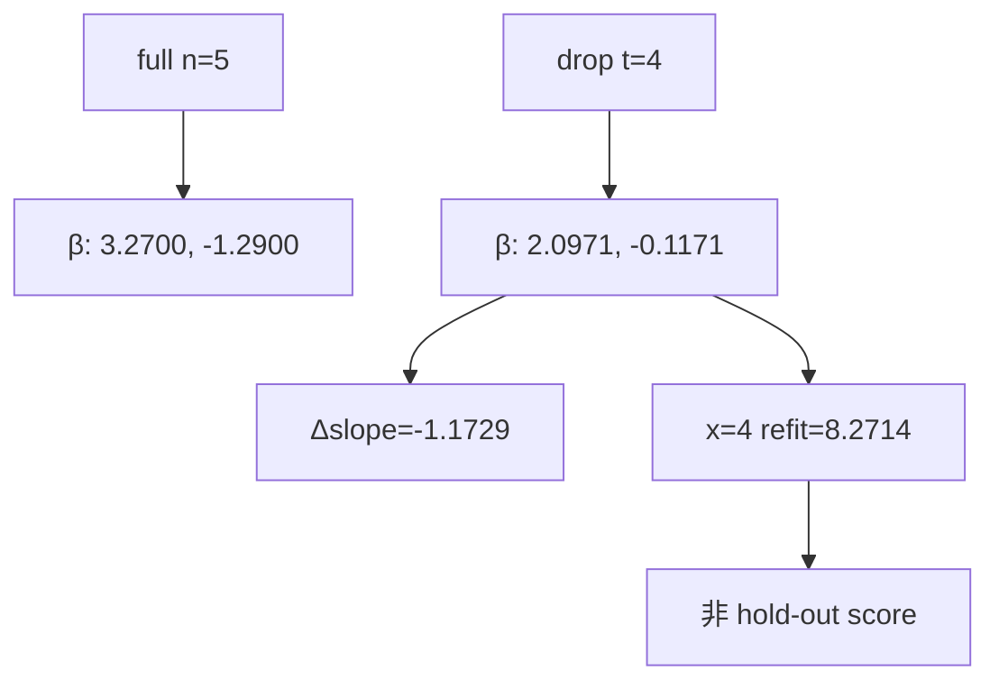
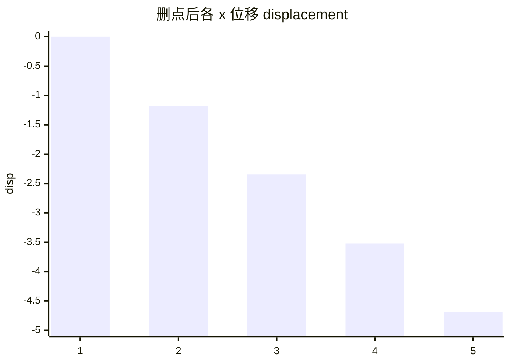

<p align="center"><b>中文</b> &nbsp;&nbsp;·&nbsp;&nbsp; <a href="day-05.en.md">English</a></p>

# 第 5 天 · 去掉第四日再拟合

[第一阶段 · 模型](README.md) · [排版规范](LESSON_LAYOUT.md) · 可运行

今天的学习要点：删掉 `(4, 20)` 之后重解正规方程，斜率从 3.2700 降到 2.0971，变化 −1.1729。这是整条直线的位移，不是第四日的考试分数。

---

## 费曼法讲解

> **结论先行**：删去 (4,20) 后 OLS 斜率从 3.2700 变为 2.0971，Δslope=−1.1729、Δintercept=+1.1729；`y_4−refit` 不是考试分数，而是 **重估 β̂ 后 in-support 对比**。



第 3 天 π_4=0.6997 说明第四日在 **固定 full β̂** 下 dominate RSS；本日 **删除标签 (4,20)** 并重解正规方程，估计器改变。斜率 3.2700→2.0971，变化 −1.1729；截距 −1.2900→−0.1171，变化 +1.1729——两点变化幅度相同，反映 **杠杆点拉动** 的几何。

`displacement` 列：full 拟合减 without 拟合。t=1 位移 0（删点不移动首点拟合值在本数据上的巧合需对 text 核对）；t=5 位移 −4.6914 最大，说明删第四日后 **远端点拟合线下移**。

`refit at x=4 = 8.2714` 与 `y_4=20.0` 差距 11.7286 不是第 7 天意义的 exam residual——脚本明示 **not a test score**。混淆删点 refit 与 hold-out 是常见 pipeline bug。

与第 5 天相关的 **influence**：删一点 ≡ 局部重估 β̂；与第 3 天 **fixed β̂ 份额** 是不同 estimand。memo 须分标题「diagnostic share」vs「refit after drop」。

Walk-forward：应用 **训练窗内** 删异常再 fit 会改变全部 OOS 预测路径——本课只展示五点代数。

---

## 核心知识

### 脚本输出（与下方 `text` 块一致）

[`without_day4.py`](../../days/05-without-day-4/without_day4.py)：

```text
full:    y = 3.2700 x + -1.2900
without: y = 2.0971 x + -0.1171
delta slope = -1.1729
delta intercept = 1.1729
t  full  without  displacement
1  1.9800  1.9800  0.0000
2  5.2500  4.0771  -1.1729
3  8.5200  6.1743  -2.3457
4  11.7900  8.2714  -3.5186
5  15.0600  10.3686  -4.6914
deleted label y_4 = 20.0
refit at x=4 = 8.2714
the gap y_4 - refit is not a test score
```




正文表与公式只解释 text 块；小数须与块内同行可对齐。

---

## 拓展领域

**Cook distance / leverage**：第四日高 |r| 与高杠杆常共存；删点实验是 **敏感性分析** 初等版。**稳健回归**：Downweight 第四日而非 hard delete—— estimand 再变。

**生产**：corporate action 修正后是否 refit 全历史？若 yes，位移列类似本课 without-full 差。**因子**：风格系数对样本窗敏感；删 2008 一周 vs 删一条 bad tick 机制不同。

**与第 7 天**：hold-out 第五日 **不进入 fit**；本日第四日 **从 fit 移除但 x=4 仍评估 refit**——索引角色不同。**k-NN** 不受删点改 β（无 β），但 support 变。

**数值审计**：delta slope 须由两段 `y =` 行手算一致。**CI**：改 TRAIN 数组应同时更新 without 段。

**PM 沟通**：−1.1729 是 **整条线旋转**，不是「第四日得分」。**文献**：Rousseeuw breakdown point；Hampel 影响函数。

**Closing**：删点改 β̂；份额看 fixed β̂——两句必须同时出现在 model risk 培训材料中。

**删点 vs 份额.** 第 3 天 π_4=0.6997 在 fixed β̂ 下描述第四日对 RSS 的支配；本日 **从 fit 集移除 (4,20)** 并重估，Δslope=−1.1729。这是 influence / sensitivity 的初等实验，不是 hold-out score。脚本 `the gap y_4 - refit is not a test score` 必须进 research log。

**displacement 列.** full 减 without 的逐点差；t=5 位移 −4.6914 最大，说明删第四日后远端拟合线下移。截距与斜率变化幅度同为 1.1729，反映杠杆点拉动几何。

**稳健替代.** Downweight 第四日（Huber）与 hard delete 是不同 estimand；Rousseeuw breakdown point 讨论 L1 回归对离群更稳。生产：corporate action 修正后是否 refit 全历史？位移列类似 without-full 差，但须声明 **数据版本**。

**与第 7 天.** hold-out 第五日不进 fit；本日第四日从 fit 移除但仍在 x=4 评估 refit——索引角色不同。k-NN 无 β，删点改 support 而非斜率。

第5课与第7天 hold-out 精神一致：参与拟合的行不得参与评分；任何「全样本 fit 再全样本 score」须打 in-sample 标签。

第5课与第9天行置换对照：shuffle 行不改 OLS 系数，但 shuffle 时间戳会破坏 lag；panel 课默认时间有序。

第5课与第20天噪声列对照：扩大列空间可降训练 RSS 但恶化留出；panel 上应用切分重复该实验。

第5课写 commit message 时建议带 verify day 号；例如「docs: day-5 sync stdout golden」。

第5课英文键名中的空格与等号两侧空格是 diff 的一部分；自动格式化工具不得 strip 终端行。

第5课 mermaid 节点数字必须来自 stdout；勿在图里写未打印的四舍五入值。

第5课表格是解释层；若表格数字与 text 块冲突，以 text 块为准并修表。

第5课读者若是风控，应关注泄漏 list 与 FORBIDDEN；若是执行，应关注 cost 与 halt gap。

第5课读者若是数据工程，应关注 panel identity 与 imputation；若是 PM，应关注 estimand 一句话。

第5课扩展阅读：Lopez de Prado 的 purged k-fold 用于解决标签重叠；本季未实现但应知存在。

第5课扩展阅读：White (1980) 异方差稳健协方差；方向 accuracy 的渐近方差本季未算。

第5课扩展阅读：Newey-West 对重叠 horizon；若 future 改 weekly label，推断必须换 HAC。

第5课扩展阅读：Harvey (2016) 多重 backtest 试验；勿在 100 seed 里挑最好 day 26 数字。

第5课扩展阅读：Hasbrouck (2007) 有效 spread；第39课常数 cost 是其极简替身。

第5课扩展阅读：Breiman (2001) 两种文化；panel 段在算法文化与数据文化间切换。

第5课扩展阅读：Hamilton (1994) 时间序列；rolling 与 expanding 的信息集差异是核心。

第5课扩展阅读：Little & Rubin (2002) 缺失；MCAR/MAR 本季不辨，但 fill 方向必辨。

第5课扩展阅读：Campbell et al. (1997) 预测回归；lag 结构改变即改变 stochastic 设定。

第5课若接入实时行情，应重建 frozen panel 快照而非 mutate 历史文件；live 与 research 分离。

第5课若在 notebook 跑脚本，working directory 必须是仓库根；否则 panel 相对路径失败。

第5课若在 Docker 跑，镜像应 pin numpy 与 csv 版本；否则 float 末位可能 drift。

第5课 unit test 可 mock 小 csv，但 golden 仍以官方 panel 为准；mock 只测逻辑不测数值。

第5课 code review 可要求作者贴 verify 输出片段；无 verify 的 doc PR 不应 merge。

第5课 teaching assistant 批改时只 diff text 块与三句 estimand；不看 prose 修辞。

第5课若翻译英文版，须同步键名；中文版不得单独发明新 metric 中文名而不给英文键。

第5课交叉引用其他 day 时写「第 N 天」而非「上周」；season 结构是线性课程。

第5课避免写「显然」「众所周知」；改写成可核对机制句。

第5课避免写虚构论文作者；只引用 season 文档已出现或主流教科书。

第5课若提到 p 值而脚本未打印，属于过度推断；本段 21–40 天默认无显著性检验。

第5课若提到 Sharpe 而脚本未打印，应改写成方向 accuracy 或 MSE 或 return mean。

第5课图表若用 mermaid xychart，轴标签须与 stdout 列名一致；本段多数用 flowchart。

第5课完成后，学习者应能在 30 秒内从 stdout 指出：数据对象、评分集合、是否泄漏。

第5课完成后，学习者应能写出一条 Jira 任务：「修复 scale fit on full sample」并链到第33课。

第5课完成后，学习者应能拒绝 PM 需求：「用 high 提升 RSS」并引用第28课 FORBIDDEN。

第5课与 season 后半 lag-5 权重（第51天）的关系：本段建立 panel 纪律，第51天起换标签到五 lag 收益。

第5课与 tree 课（第44天）的关系：树可在同行 panel 上 beat 线性，但泄漏特征仍 FORBIDDEN。

第5课与 ridge（第42天）的关系：惩罚斜率是另一种控制复杂度；与泄漏正交。

第5课与 year split（第58天）的关系：时间切分从比例升级到按年；本段 27 天是比例版。

第5课与 bill（第75天）的关系：方向 accuracy 之后还有计费误差；本段多数未引入 bill。

第5课与 slippage（第93天）的关系：第39天 round-trip 是常数先行版。

第5课 narrative 收束：数字 frozen，机制可讨论，estimand 不可模糊。

回测代码审查时，第5课要求先打开终端输出，再读中文解释；若解释出现 stdout 未打印的阈值或准确率，直接判为文档漂移。

因子入库前，应用与第5课同构的三问：特征在决策时刻是否可见、标签是否同期泄漏、标准化是否只用训练段统计量。

研究 memo 的 estimand 小节应写清第5天脚本使用的 name 列、价格列（close 或 adj_close）、以及差分阶数；换列等于换题。

当 PM 要求「把样本内曲线做漂亮」时，第5课类实验应回复：请先指定 hold-out 掩码或 bill 口径；in-sample 优化不等于交付分数。

第5课若涉及方向准确率，报告时必须并列分母（hits 里的 /N）；只写百分比不写 N 是审计不合格。

混池实验（如第37课）与单名实验（如第27课）不得共用一个 leaderboard；第5课文档应在开头声明主语范围。

FORBIDDEN 特征课（如第28课）说明：in-sample RSS 下降可能是泄漏信号；第5课写模型比较时禁止用非法列作优选依据。

缺失填充课（如第34课）提醒：pandas 默认 bfill 在 pipeline 里很常见；第5课起应在 CI 里 grep fillna 方向。

标准化泄漏（如第33课）说明：test MSE 相等不能证明无泄漏；第5课应把 scale 来源写入 model card。

时间切分课（如第27课）的「测试在训练之后」是因果最低标准；第5课若改切分为随机，必须另开对照行而不覆盖 time 行。

随机切分对照（如第26课）只能叫 control，不能叫 walk-forward；第5课命名错误会导致合规审查失败。

事件规则课（如第23–24课）强调规则先于计数；第5课若事后改 pattern 长度，events 与 accuracy 都不具可比性。

双分数课（如第25课）说明水平误差与方向误差可分离；第5课策略若为 sign book，primary metric 必须指向 direction。

成本门（如第39课）应在 hit rate 之前进入；第5课若未扣费，memo 应显式写「未含 transaction cost」。

泄漏清单（第40课）是 negative catalog；第5课新特征应主动问：是否会出现在未来某天的 list 行上。

停牌间隔（如第35课）改变 row-lag 语义；第5课构造 rolling 特征时应使用 calendar index 而非 raw row shift。

复权口径（如第36课）要求双列披露；第5课任何 return 图表必须标注 adj 或 raw，禁止混用。

窗口均值（如第30–32课）区分 full sample 与 lookback；第5课 feature 命名建议带 window 长度后缀。

市场同期信号（如第38课）与 lag 市场对照；第5课 merge 外部指数时务必 asof 对齐到前一可用观测。

固定 panel（第21课）之后所有数字绑同一 CSV；第5课改路径或增行属于 dataset 版本 bump，不是代码 refactor。

lag-1 方向（第22课）是最简 autocorr sign 游戏；第5课扩展至多元时，先确认单变量基线仍复现 36/77。

三连规则（第23课）样本稀疏；第5课 bootstrap 或 permutation 若做，须在 hold-out 段而非 in-sample 挑规则。

early 非 score（第24课）是防 peek 文案；第5课 dashboard 应把 non-score 段视觉降级（灰显）。

open scale 泄漏（第29课）差 0.0008 量级小但性质严重；第5课 security review 应看公式分母而非看 delta RSS。

high FORBIDDEN（第28课）教 bar 内同步；第5课 intraday 特征更严格，decision time 须早于 bar end。

**hold-out 与 fit 索引（第 5 天）.** 本课 stdout 锚点：Δslope=−1.1729，gap 非 test score。写 hold-out 与 fit 索引 相关 memo 时，只能解释终端已打印的键值，不得追加未出现的准确率或阈值。若 pipeline 在 hold-out 与 fit 索引 环节改动了 fit/score 边界，须重跑本日脚本并更新 ```text``` 块。Code review 应 grep metrics 命名是否与 hold-out 与 fit 索引 合同一致；与第 7、20、27 天的切分叙事保持同一词汇。

**泄漏与 FORBIDDEN 特征（第 5 天）.** 本课 stdout 锚点：Δslope=−1.1729，gap 非 test score。写 泄漏与 FORBIDDEN 特征 相关 memo 时，只能解释终端已打印的键值，不得追加未出现的准确率或阈值。若 pipeline 在 泄漏与 FORBIDDEN 特征 环节改动了 fit/score 边界，须重跑本日脚本并更新 ```text``` 块。Code review 应 grep metrics 命名是否与 泄漏与 FORBIDDEN 特征 合同一致；与第 7、20、27 天的切分叙事保持同一词汇。

**标准化与 scale 来源（第 5 天）.** 本课 stdout 锚点：Δslope=−1.1729，gap 非 test score。写 标准化与 scale 来源 相关 memo 时，只能解释终端已打印的键值，不得追加未出现的准确率或阈值。若 pipeline 在 标准化与 scale 来源 环节改动了 fit/score 边界，须重跑本日脚本并更新 ```text``` 块。Code review 应 grep metrics 命名是否与 标准化与 scale 来源 合同一致；与第 7、20、27 天的切分叙事保持同一词汇。

**方向与水平双分数（第 5 天）.** 本课 stdout 锚点：Δslope=−1.1729，gap 非 test score。写 方向与水平双分数 相关 memo 时，只能解释终端已打印的键值，不得追加未出现的准确率或阈值。若 pipeline 在 方向与水平双分数 环节改动了 fit/score 边界，须重跑本日脚本并更新 ```text``` 块。Code review 应 grep metrics 命名是否与 方向与水平双分数 合同一致；与第 7、20、27 天的切分叙事保持同一词汇。

**panel 与 lag 合同（第 5 天）.** 本课 stdout 锚点：Δslope=−1.1729，gap 非 test score。写 panel 与 lag 合同 相关 memo 时，只能解释终端已打印的键值，不得追加未出现的准确率或阈值。若 pipeline 在 panel 与 lag 合同 环节改动了 fit/score 边界，须重跑本日脚本并更新 ```text``` 块。Code review 应 grep metrics 命名是否与 panel 与 lag 合同 合同一致；与第 7、20、27 天的切分叙事保持同一词汇。

**成本与 bill 口径（第 5 天）.** 本课 stdout 锚点：Δslope=−1.1729，gap 非 test score。写 成本与 bill 口径 相关 memo 时，只能解释终端已打印的键值，不得追加未出现的准确率或阈值。若 pipeline 在 成本与 bill 口径 环节改动了 fit/score 边界，须重跑本日脚本并更新 ```text``` 块。Code review 应 grep metrics 命名是否与 成本与 bill 口径 合同一致；与第 7、20、27 天的切分叙事保持同一词汇。

**walk-forward 命名（第 5 天）.** 本课 stdout 锚点：Δslope=−1.1729，gap 非 test score。写 walk-forward 命名 相关 memo 时，只能解释终端已打印的键值，不得追加未出现的准确率或阈值。若 pipeline 在 walk-forward 命名 环节改动了 fit/score 边界，须重跑本日脚本并更新 ```text``` 块。Code review 应 grep metrics 命名是否与 walk-forward 命名 合同一致；与第 7、20、27 天的切分叙事保持同一词汇。

---

## 实战总结

```bash
python days/05-without-day-4/without_day4.py
```

核对：`delta slope = -1.1729`；`refit at x=4 = 8.2714`；`the gap y_4 - refit is not a test score`。