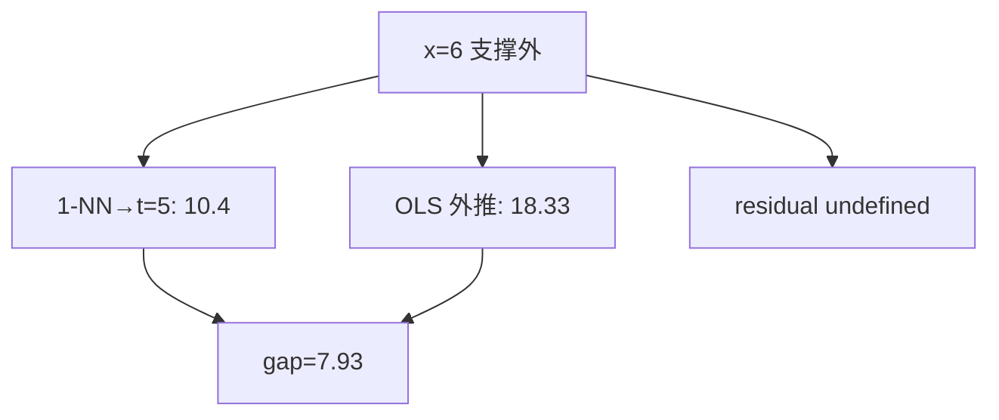

<p align="center"><b>中文</b> &nbsp;&nbsp;·&nbsp;&nbsp; <a href="day-06.en.md">English</a></p>

# 第 6 天 · 训练支撑外的查询

[第一阶段 · 模型](README.md) · [排版规范](LESSON_LAYOUT.md) · 可运行

今天的学习要点：查询 `x = 6` 落在训练支撑 `[1, 5]` 外面。最近邻复制第五日的 10.4，直线外推到 18.33，两者相差 7.93。没有第六日的收盘，残差没有定义。

---

## 费曼法讲解

> **结论先行**：查询 x=6 在训练支撑 [1,5] 外：1-NN 复制 t=5 得 10.4，OLS 外推 18.33，差距 7.93；**无 y_6 故残差无定义**——外推不是 in-support 检索。



第 1 天 x=4 in-support：1-NN 命中 20.0、残差可定义。本日 x=6 **超出** 训练横坐标凸包 [1,5]：最近邻取边界 t=5 标签 10.4（复制 **最后训练点**）；OLS 沿 `y=3.27x−1.29` 外推得 18.33。

两估计器差距 7.93 = |18.33−10.4|（脚本定义 gap）。**无第六日真实标签**，故 `residual is undefined`——不得写 |e|、不得报 MSE/MAE。外推误差需要 **未来标签或 proxy**，属第 7 天 hold-out 语境。

1-NN off-support 行为：**常数外推**（本课复制边界点）；OLS **线性外推** 可斜率发散。量化中类似 **样本外日期** 用最后观测填充 vs 线性趋势——estimator 披露必含 **外推规则**。

误用：对 x=6 编造 y 再算残差；把 7.93 写成「样本外 RMSE」。正确：报两预测、gap、声明 residual undefined。

与第 47 天 extrapolate 主题呼应；本课是五点几何最小例。

---

## 核心知识

### 脚本输出（与下方 `text` 块一致）

[`off_support.py`](../../days/06-off-support/off_support.py)：

```text
training support = [1, 5]
ask x=6
y_6 is not in the sample
nearest neighbor copies t=5, value 10.4
line: y = 3.27 x + -1.29
extrapolated value = 18.33
gap between the two estimates = 7.93
residual is undefined
```


正文表与公式只解释 text 块；小数须与块内同行可对齐。

---

## 拓展领域

**支撑集**：协变量凸包；高维需更一般 **support** 定义。**核回归 / 局部加权**：off-support 衰减为零 vs NN 平台——规则不同。

**生产**：predict 未来日期时，feature 超出训练 range 应 flag **extrapolation**；risk 限仓。**因子**：macro 变量创新高时 beta 外推不可靠。

**与第 1 天对照**：in-support query vs off-support query——披露三件套加 **query∈support?**。**第 7 天**：有 y_5 可算 residual。

**代码审查**：`predict` 未检查 `x` range；dashboard 未标 extrapolated rows。**文献**：Cover & Hart 1-NN 渐近针对 query 分布；边界行为需单独讨论。

**Closing**：7.93 是 **两规则分歧**，不是误差；undefined residual 是 **合同条款**。

**支撑外查询.** 训练横坐标支撑 [1,5]；x=6 无标签，残差 **未定义**。1-NN 复制 t=5 的 10.4；OLS 外推 18.33，差距 7.93。Cover & Hart 一致收敛讨论样本外 query；本课强调 **无 y_6 则不可报 |e|**。

**外推 vs 检索.** 左支边界复制；右支 Aff(1) 线性外推——两估计器在支撑外的行为分叉。生产：特征超出训练 range 时，NN 常 clip 到边界，线性模型 extrapolate——回测应披露 **query 是否在训练凸包内**。

**与第 1 天对照.** x=4 in-support 时 1-NN 零误差是检索；x=6 是支撑外，0 误差叙事不适用。第 7 天 hold-out 有标签但不在 fit 集——第三类 query 合同。

**误用.** 对 x=6 编造「预测误差」；用 7.93 论证 NN 更优而无 repeated query 分布。正确：打印 `y_6 is not in the sample` 与 `residual is undefined`。

第6课 mermaid 节点数字必须来自 stdout；勿在图里写未打印的四舍五入值。

第6课表格是解释层；若表格数字与 text 块冲突，以 text 块为准并修表。

第6课读者若是风控，应关注泄漏 list 与 FORBIDDEN；若是执行，应关注 cost 与 halt gap。

第6课读者若是数据工程，应关注 panel identity 与 imputation；若是 PM，应关注 estimand 一句话。

第6课扩展阅读：Lopez de Prado 的 purged k-fold 用于解决标签重叠；本季未实现但应知存在。

第6课扩展阅读：White (1980) 异方差稳健协方差；方向 accuracy 的渐近方差本季未算。

第6课扩展阅读：Newey-West 对重叠 horizon；若 future 改 weekly label，推断必须换 HAC。

第6课扩展阅读：Harvey (2016) 多重 backtest 试验；勿在 100 seed 里挑最好 day 26 数字。

第6课扩展阅读：Hasbrouck (2007) 有效 spread；第39课常数 cost 是其极简替身。

第6课扩展阅读：Breiman (2001) 两种文化；panel 段在算法文化与数据文化间切换。

第6课扩展阅读：Hamilton (1994) 时间序列；rolling 与 expanding 的信息集差异是核心。

第6课扩展阅读：Little & Rubin (2002) 缺失；MCAR/MAR 本季不辨，但 fill 方向必辨。

第6课扩展阅读：Campbell et al. (1997) 预测回归；lag 结构改变即改变 stochastic 设定。

第6课若接入实时行情，应重建 frozen panel 快照而非 mutate 历史文件；live 与 research 分离。

第6课若在 notebook 跑脚本，working directory 必须是仓库根；否则 panel 相对路径失败。

第6课若在 Docker 跑，镜像应 pin numpy 与 csv 版本；否则 float 末位可能 drift。

第6课 unit test 可 mock 小 csv，但 golden 仍以官方 panel 为准；mock 只测逻辑不测数值。

第6课 code review 可要求作者贴 verify 输出片段；无 verify 的 doc PR 不应 merge。

第6课 teaching assistant 批改时只 diff text 块与三句 estimand；不看 prose 修辞。

第6课若翻译英文版，须同步键名；中文版不得单独发明新 metric 中文名而不给英文键。

第6课交叉引用其他 day 时写「第 N 天」而非「上周」；season 结构是线性课程。

第6课避免写「显然」「众所周知」；改写成可核对机制句。

第6课避免写虚构论文作者；只引用 season 文档已出现或主流教科书。

第6课若提到 p 值而脚本未打印，属于过度推断；本段 21–40 天默认无显著性检验。

第6课若提到 Sharpe 而脚本未打印，应改写成方向 accuracy 或 MSE 或 return mean。

第6课图表若用 mermaid xychart，轴标签须与 stdout 列名一致；本段多数用 flowchart。

第6课完成后，学习者应能在 30 秒内从 stdout 指出：数据对象、评分集合、是否泄漏。

第6课完成后，学习者应能写出一条 Jira 任务：「修复 scale fit on full sample」并链到第33课。

第6课完成后，学习者应能拒绝 PM 需求：「用 high 提升 RSS」并引用第28课 FORBIDDEN。

第6课与 season 后半 lag-5 权重（第51天）的关系：本段建立 panel 纪律，第51天起换标签到五 lag 收益。

第6课与 tree 课（第44天）的关系：树可在同行 panel 上 beat 线性，但泄漏特征仍 FORBIDDEN。

第6课与 ridge（第42天）的关系：惩罚斜率是另一种控制复杂度；与泄漏正交。

第6课与 year split（第58天）的关系：时间切分从比例升级到按年；本段 27 天是比例版。

第6课与 bill（第75天）的关系：方向 accuracy 之后还有计费误差；本段多数未引入 bill。

第6课与 slippage（第93天）的关系：第39天 round-trip 是常数先行版。

第6课 narrative 收束：数字 frozen，机制可讨论，estimand 不可模糊。

回测代码审查时，第6课要求先打开终端输出，再读中文解释；若解释出现 stdout 未打印的阈值或准确率，直接判为文档漂移。

因子入库前，应用与第6课同构的三问：特征在决策时刻是否可见、标签是否同期泄漏、标准化是否只用训练段统计量。

研究 memo 的 estimand 小节应写清第6天脚本使用的 name 列、价格列（close 或 adj_close）、以及差分阶数；换列等于换题。

当 PM 要求「把样本内曲线做漂亮」时，第6课类实验应回复：请先指定 hold-out 掩码或 bill 口径；in-sample 优化不等于交付分数。

第6课若涉及方向准确率，报告时必须并列分母（hits 里的 /N）；只写百分比不写 N 是审计不合格。

混池实验（如第37课）与单名实验（如第27课）不得共用一个 leaderboard；第6课文档应在开头声明主语范围。

FORBIDDEN 特征课（如第28课）说明：in-sample RSS 下降可能是泄漏信号；第6课写模型比较时禁止用非法列作优选依据。

缺失填充课（如第34课）提醒：pandas 默认 bfill 在 pipeline 里很常见；第6课起应在 CI 里 grep fillna 方向。

标准化泄漏（如第33课）说明：test MSE 相等不能证明无泄漏；第6课应把 scale 来源写入 model card。

时间切分课（如第27课）的「测试在训练之后」是因果最低标准；第6课若改切分为随机，必须另开对照行而不覆盖 time 行。

随机切分对照（如第26课）只能叫 control，不能叫 walk-forward；第6课命名错误会导致合规审查失败。

事件规则课（如第23–24课）强调规则先于计数；第6课若事后改 pattern 长度，events 与 accuracy 都不具可比性。

双分数课（如第25课）说明水平误差与方向误差可分离；第6课策略若为 sign book，primary metric 必须指向 direction。

成本门（如第39课）应在 hit rate 之前进入；第6课若未扣费，memo 应显式写「未含 transaction cost」。

泄漏清单（第40课）是 negative catalog；第6课新特征应主动问：是否会出现在未来某天的 list 行上。

停牌间隔（如第35课）改变 row-lag 语义；第6课构造 rolling 特征时应使用 calendar index 而非 raw row shift。

复权口径（如第36课）要求双列披露；第6课任何 return 图表必须标注 adj 或 raw，禁止混用。

窗口均值（如第30–32课）区分 full sample 与 lookback；第6课 feature 命名建议带 window 长度后缀。

市场同期信号（如第38课）与 lag 市场对照；第6课 merge 外部指数时务必 asof 对齐到前一可用观测。

固定 panel（第21课）之后所有数字绑同一 CSV；第6课改路径或增行属于 dataset 版本 bump，不是代码 refactor。

lag-1 方向（第22课）是最简 autocorr sign 游戏；第6课扩展至多元时，先确认单变量基线仍复现 36/77。

三连规则（第23课）样本稀疏；第6课 bootstrap 或 permutation 若做，须在 hold-out 段而非 in-sample 挑规则。

early 非 score（第24课）是防 peek 文案；第6课 dashboard 应把 non-score 段视觉降级（灰显）。

open scale 泄漏（第29课）差 0.0008 量级小但性质严重；第6课 security review 应看公式分母而非看 delta RSS。

high FORBIDDEN（第28课）教 bar 内同步；第6课 intraday 特征更严格，decision time 须早于 bar end。

第6课与第7天 hold-out 精神一致：参与拟合的行不得参与评分；任何「全样本 fit 再全样本 score」须打 in-sample 标签。

第6课与第9天行置换对照：shuffle 行不改 OLS 系数，但 shuffle 时间戳会破坏 lag；panel 课默认时间有序。

第6课与第20天噪声列对照：扩大列空间可降训练 RSS 但恶化留出；panel 上应用切分重复该实验。

第6课写 commit message 时建议带 verify day 号；例如「docs: day-6 sync stdout golden」。

第6课英文键名中的空格与等号两侧空格是 diff 的一部分；自动格式化工具不得 strip 终端行。

**hold-out 与 fit 索引（第 6 天）.** 本课 stdout 锚点：x=6 支撑外，残差 undefined，gap=7.93。写 hold-out 与 fit 索引 相关 memo 时，只能解释终端已打印的键值，不得追加未出现的准确率或阈值。若 pipeline 在 hold-out 与 fit 索引 环节改动了 fit/score 边界，须重跑本日脚本并更新 ```text``` 块。Code review 应 grep metrics 命名是否与 hold-out 与 fit 索引 合同一致；与第 7、20、27 天的切分叙事保持同一词汇。

**泄漏与 FORBIDDEN 特征（第 6 天）.** 本课 stdout 锚点：x=6 支撑外，残差 undefined，gap=7.93。写 泄漏与 FORBIDDEN 特征 相关 memo 时，只能解释终端已打印的键值，不得追加未出现的准确率或阈值。若 pipeline 在 泄漏与 FORBIDDEN 特征 环节改动了 fit/score 边界，须重跑本日脚本并更新 ```text``` 块。Code review 应 grep metrics 命名是否与 泄漏与 FORBIDDEN 特征 合同一致；与第 7、20、27 天的切分叙事保持同一词汇。

**标准化与 scale 来源（第 6 天）.** 本课 stdout 锚点：x=6 支撑外，残差 undefined，gap=7.93。写 标准化与 scale 来源 相关 memo 时，只能解释终端已打印的键值，不得追加未出现的准确率或阈值。若 pipeline 在 标准化与 scale 来源 环节改动了 fit/score 边界，须重跑本日脚本并更新 ```text``` 块。Code review 应 grep metrics 命名是否与 标准化与 scale 来源 合同一致；与第 7、20、27 天的切分叙事保持同一词汇。

**方向与水平双分数（第 6 天）.** 本课 stdout 锚点：x=6 支撑外，残差 undefined，gap=7.93。写 方向与水平双分数 相关 memo 时，只能解释终端已打印的键值，不得追加未出现的准确率或阈值。若 pipeline 在 方向与水平双分数 环节改动了 fit/score 边界，须重跑本日脚本并更新 ```text``` 块。Code review 应 grep metrics 命名是否与 方向与水平双分数 合同一致；与第 7、20、27 天的切分叙事保持同一词汇。

**panel 与 lag 合同（第 6 天）.** 本课 stdout 锚点：x=6 支撑外，残差 undefined，gap=7.93。写 panel 与 lag 合同 相关 memo 时，只能解释终端已打印的键值，不得追加未出现的准确率或阈值。若 pipeline 在 panel 与 lag 合同 环节改动了 fit/score 边界，须重跑本日脚本并更新 ```text``` 块。Code review 应 grep metrics 命名是否与 panel 与 lag 合同 合同一致；与第 7、20、27 天的切分叙事保持同一词汇。

**成本与 bill 口径（第 6 天）.** 本课 stdout 锚点：x=6 支撑外，残差 undefined，gap=7.93。写 成本与 bill 口径 相关 memo 时，只能解释终端已打印的键值，不得追加未出现的准确率或阈值。若 pipeline 在 成本与 bill 口径 环节改动了 fit/score 边界，须重跑本日脚本并更新 ```text``` 块。Code review 应 grep metrics 命名是否与 成本与 bill 口径 合同一致；与第 7、20、27 天的切分叙事保持同一词汇。

**walk-forward 命名（第 6 天）.** 本课 stdout 锚点：x=6 支撑外，残差 undefined，gap=7.93。写 walk-forward 命名 相关 memo 时，只能解释终端已打印的键值，不得追加未出现的准确率或阈值。若 pipeline 在 walk-forward 命名 环节改动了 fit/score 边界，须重跑本日脚本并更新 ```text``` 块。Code review 应 grep metrics 命名是否与 walk-forward 命名 合同一致；与第 7、20、27 天的切分叙事保持同一词汇。

---

## 实战总结

```bash
python days/06-off-support/off_support.py
```

核对：`training support = [1, 5]`、`extrapolated value = 18.33`、`gap = 7.93`、`residual is undefined`。