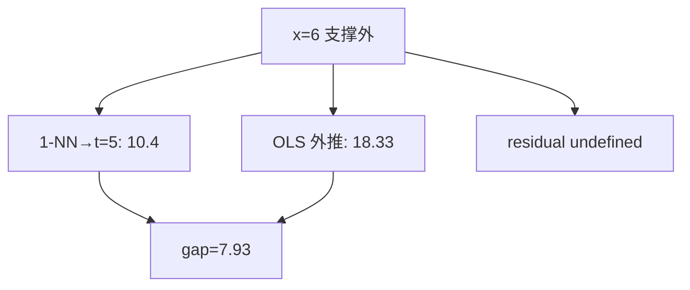

<p align="center"><b>中文</b> &nbsp;&nbsp;·&nbsp;&nbsp; <a href="day-06.en.md">English</a></p>

# 第 6 天 · 训练支撑外的查询

[第一阶段 · 模型](README.md) · [排版规范](LESSON_LAYOUT.md) · 可运行

今天的学习要点：查询 `x = 6` 落在训练支撑 `[1, 5]` 外面。最近邻复制第五日的 10.4，直线外推到 18.33，两者相差 7.93。没有第六日的收盘，残差没有定义。

## 费曼法讲解

> **结论先行**：查询 x=6 在训练支撑 [1,5] 外：1-NN 复制 t=5 得 10.4，OLS 外推 18.33，差距 7.93；**无 y_6 故残差无定义**——外推不是 in-support 检索。



第 1 天 x=4 in-support：1-NN 命中 20.0、残差可定义。本日 x=6 **超出** 训练横坐标凸包 [1,5]：最近邻取边界 t=5 标签 10.4（复制 **最后训练点**）；OLS 沿 `y=3.27x−1.29` 外推得 18.33。

两估计器差距 7.93 = |18.33−10.4|（脚本定义 gap）。**无第六日真实标签**，故 `residual is undefined`——不得写 |e|、不得报 MSE/MAE。外推误差需要 **未来标签或 proxy**，属第 7 天 hold-out 语境。

1-NN off-support 行为：**常数外推**（本课复制边界点）；OLS **线性外推** 可斜率发散。量化中类似 **样本外日期** 用最后观测填充 vs 线性趋势——estimator 披露必含 **外推规则**。

误用：对 x=6 编造 y 再算残差；把 7.93 写成「样本外 RMSE」。正确：报两预测、gap、声明 residual undefined。

与第 47 天 extrapolate 主题呼应；本课是五点几何最小例。

## 核心知识

### 脚本输出（与下方 `text` 块一致）

[`off_support.py`](../../days/06-off-support/off_support.py)：

```text
training support = [1, 5]
ask x=6
y_6 is not in the sample
nearest neighbor copies t=5, value 10.4
line: y = 3.27 x + -1.29
extrapolated value = 18.33
gap between the two estimates = 7.93
residual is undefined
```

正文表与公式只解释 text 块；小数须与块内同行可对齐。

## 拓展领域

**支撑集**：协变量凸包；高维需更一般 **support** 定义。**核回归 / 局部加权**：off-support 衰减为零 vs NN 平台——规则不同。

**生产**：predict 未来日期时，feature 超出训练 range 应 flag **extrapolation**；risk 限仓。**因子**：macro 变量创新高时 beta 外推不可靠。

**与第 1 天对照**：in-support query vs off-support query——披露三件套加 **query∈support?**。**第 7 天**：有 y_5 可算 residual。

**代码审查**：`predict` 未检查 `x` range；dashboard 未标 extrapolated rows。**文献**：Cover & Hart 1-NN 渐近针对 query 分布；边界行为需单独讨论。

**Closing**：7.93 是 **两规则分歧**，不是误差；undefined residual 是 **合同条款**。

**支撑外查询.** 训练横坐标支撑 [1,5]；x=6 无标签，残差 **未定义**。1-NN 复制 t=5 的 10.4；OLS 外推 18.33，差距 7.93。Cover & Hart 一致收敛讨论样本外 query；本课强调 **无 y_6 则不可报 |e|**。

**外推 vs 检索.** 左支边界复制；右支 Aff(1) 线性外推——两估计器在支撑外的行为分叉。生产：特征超出训练 range 时，NN 常 clip 到边界，线性模型 extrapolate——回测应披露 **query 是否在训练凸包内**。

**与第 1 天对照.** x=4 in-support 时 1-NN 零误差是检索；x=6 是支撑外，0 误差叙事不适用。第 7 天 hold-out 有标签但不在 fit 集——第三类 query 合同。

**误用.** 对 x=6 编造「预测误差」；用 7.93 论证 NN 更优而无 repeated query 分布。正确：打印 `y_6 is not in the sample` 与 `residual is undefined`。

## 实战总结

```bash
python days/06-off-support/off_support.py
```

核对：`training support = [1, 5]`、`extrapolated value = 18.33`、`gap = 7.93`、`residual is undefined`。