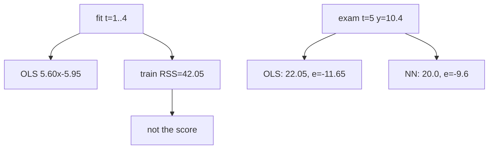

<p align="center"><b>中文</b> &nbsp;&nbsp;·&nbsp;&nbsp; <a href="day-07.en.md">English</a></p>

# 第 7 天 · 留出第五日

[第一阶段 · 模型](README.md) · [排版规范](LESSON_LAYOUT.md) · 可运行

今天的学习要点：只用前四日拟合。直线在第五日是 22.05，残差 −11.65。最近邻复制第四日的 20.0，残差 −9.6。训练残差平方和 42.05 可以打印，不作成绩。

## 费曼法讲解

> **结论先行**：fit t=1..4 得 y=5.60x−5.95，training RSS=42.05 **不作成绩**；exam t=5：OLS 22.05 残差 −11.65，1-NN 复制 20.0 残差 −9.6——**留出标签进评分、不进拟合**。



**Hold-out 一行**：前四日拟合，第五日 `(5,10.4)` 仅评分。斜率 5.60 截距 −5.95 与 full-sample 3.27/−1.29 不同——**训练窗改变 estimand**。training RSS=42.05 脚本声明 **不是 score**；忌把 train loss 当 walk-forward 成绩。

Exam：OLS 预测 22.05，真值 10.4，残差 −11.65（过冲）。1-NN 复制 t=4 的 20.0，残差 −9.6——**in-support 检索仍可用**，但 query 是 t=5 不在 fit 集（标签未用于 fit，特征 x=5 在 fit 横坐标内）。

比较 −11.65 vs −9.6：NN 在绝对误差上更小，但不意味着 NN 更优估计器——**单点 hold-out** 方差极大。第 27 天 time split 将系统化此逻辑。

误用：把 42.05 写入「模型 RMSE」；用 full-sample 线评 t=5。正确：分 train diagnostic vs exam row。

## 核心知识

### 脚本输出（与下方 `text` 块一致）

[`holdout_day5.py`](../../days/07-holdout-day-5/holdout_day5.py)：

```text
fit on t=1..4: y = 5.60 x + -5.95
training RSS = 42.05
training RSS is not the score
exam t=5  y=10.4
ols says 22.05, residual -11.65
nearest neighbor copies t=4, value 20.0, residual -9.6
```

正文表与公式只解释 text 块；小数须与块内同行可对齐。

## 拓展领域

**Walk-forward**：滚动 fit、单步 ahead score——本课单点版。**Purging/embargo**（金融 ML）尚未引入；第 27 天先 time split。

**生产**：backtest `fit_end_date` 与 `score_date` 分离；grep 未来标签进 fit。**k-NN vs OLS**：OOS 单点比较需多期分布（第 56–57 天）。

**数值**：−11.65 与 −9.6 符号同为负——两法都高估 y_5。**杠杆**：fit 集含 t=4 的 20.0，斜率 5.60 仍陡峭。

**Closing**：training RSS 与 exam residual 分表——CI 应用两条 assert 字符串 golden。

**Hold-out 一行.** fit t=1..4 得 y=5.60x−5.95；training RSS=42.05 **不是 score**（脚本英文句为合同）。exam t=5：OLS 22.05 残差 −11.65，1-NN 复制 20.0 残差 −9.6。第五日标签进评分、不进拟合——与第 1 天 in-support 检索不同。

**训练窗改变 estimand.** 斜率 5.60 与 full-sample 3.27 不同；忌用全样本线评 t=5。单点 hold-out 方差极大；−9.6 vs −11.65 只说明 **此 exam 行** NN 绝对误差更小。

**Walk-forward 雏形.** 第 27 天时间切分系统化；第 20 天同结构加噪声列。生产：grep `fit_end_date` 与 `score_date`；metrics 名含 oos 须真 hold-out。

**Purging/embargo.** 金融 ML 标签重叠时的扩展；本课无重叠标签，只建立 **train diagnostic vs exam row** 分表习惯。

## 实战总结

```bash
python days/07-holdout-day-5/holdout_day5.py
```

核对：`training RSS is not the score`；exam 两行 residual −11.65 / −9.6。