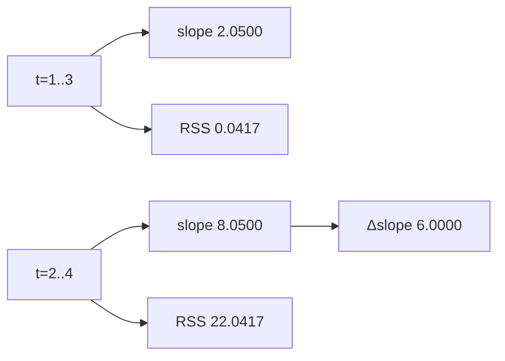
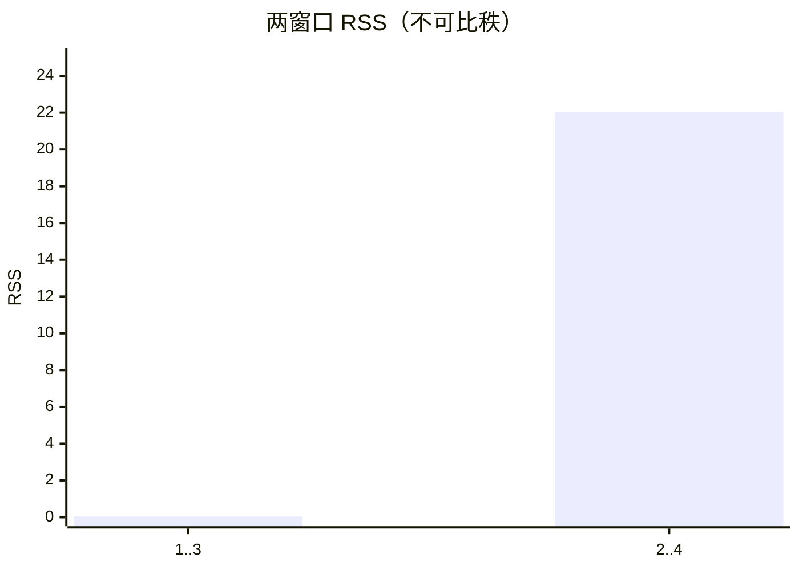

<p align="center"><b>中文</b> &nbsp;&nbsp;·&nbsp;&nbsp; <a href="day-08.en.md">English</a></p>

# 第 8 天 · 三日窗口

[第一阶段 · 模型](README.md) · [排版规范](LESSON_LAYOUT.md) · 可运行

今天的学习要点：窗口从 `{1, 2, 3}` 滑到 `{2, 3, 4}`，斜率从 2.0500 变成 8.0500，增加 6.0000。两个窗口的平方和 0.0417 和 22.0417 不能拿来跨窗口排名。

## 费曼法讲解

> **结论先行**：窗口 {1,2,3} 斜率 2.0500、RSS=0.0417；滑至 {2,3,4} 斜率 8.0500、RSS=22.0417，Δslope=6.0000——**RSS 不可跨窗口排名**，信息集变更。



**滚动窗口 OLS**：第一窗 t=1..3 得 `y=2.0500x−0.0333`，RSS=0.0417——三日几乎共线，残差极小。第二窗 t=2..4 得斜率 8.0500、RSS=22.0417；第四日 20.0 进入信息集，斜率跳变 Δ=6.0000。

脚本：`day 1 is no longer in the information set`；`day 4 has entered`。RSS 从 0.0417→22.0417 **不是模型变差**，而是 **损失定义域与样本不同**——禁止写「RSS 恶化 500 倍」而不声明窗口。

Walk-forward 实盘：每步 refit 窗宽固定时，斜率路径可极不稳定（本课 6.0 跳变）。监控应报 **window spec** 与 **coefficient path**，而非单窗 RSS 排名。

与第 3 天 full-sample RSS=96.339 无关；与第 60 天 rolling baseline 精神同构。

## 核心知识

### 脚本输出（与下方 `text` 块一致）

[`three_day_window.py`](../../days/08-three-day-window/three_day_window.py)：

```text
window: y = 2.0500 x + -0.0333
rows t=1..3
RSS = 0.0417

slid: y = 8.0500 x + -14.1167
rows t=2..4
RSS = 22.0417

delta slope = 6.0000
day 1 is no longer in the information set
day 4 has entered
```



正文表与公式只解释 text 块；小数须与块内同行可对齐。

## 拓展领域

**时间序列 OLS**：行不可交换（第 9 天证 batch 可交换是玩具）；真实日历必须用窗口。**结构断点**：第四日进入等价于 **regime 变化** 初等符号。

**生产**：rolling beta 报表写清 lookback=3 vs 60（第 32 天）。**风险**：短窗 RSS 小不代表 forecast 好。

**数值**：0.0417 与 22.0417 均来自各自窗内平方和——分母天数同为 3 但 **样本不同**。**Closing**：Δslope=6.0000 是 **信息集效应**，不是超参 tune 结果。

**滑动窗口 OLS.** 窗 {1,2,3} 斜率 2.0500，RSS=0.0417；窗 {2,3,4} 斜率 8.0500，RSS=22.0417，Δslope=6.0000。第四日 20.0 进入第二窗——杠杆点 **改变局部斜率** 是机制，不是「模型变好」。

**跨窗 RSS 禁止排名.** 0.0417 与 22.0417 定义在不同三点子样本，不是同一损失域上的比较。第 3 天 96.339 是五点 full OLS；三者不可混标题。

**信息集.** `day 1 is no longer in the information set` / `day 4 has entered` 描述窗口滑动。生产 rolling beta 须写清 **window length** 与 **是否含 t**（第 30–32 天展开）。

**时间序列默认.** 第 9 天证明 OLS 对行序不变，但 **不等价于忽略时间**；本课窗口滑动才是时序思维入口。

## 实战总结

```bash
python days/08-three-day-window/three_day_window.py
```

核对：`delta slope = 6.0000`；两窗口 RSS 行；`day 4 has entered`。