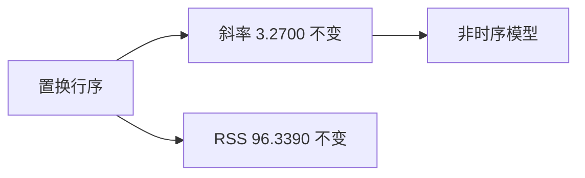

<p align="center"><b>中文</b> &nbsp;&nbsp;·&nbsp;&nbsp; <a href="day-09.en.md">English</a></p>

# 第 9 天 · 打乱日期

[第一阶段 · 模型](README.md) · [排版规范](LESSON_LAYOUT.md) · 可运行

今天的学习要点：五个配对原样保留，只把行序改成 `[2, 4, 3, 0, 1]`。斜率和残差平方和不变，仍是 `3.2700x − 1.2900` 和 96.3390。这是批量最小二乘对行序的不变性，不是模型忽略了时间。

## 费曼法讲解

> **结论先行**：行序置换 [2,4,3,0,1] 后 OLS 仍为 3.2700x−1.2900，RSS=96.3390，Δslope≈1.33e−15——**批量最小二乘对行序不变**，不是「时间被忽略」。



设计矩阵 `X` 与响应 `y` **成对置换** 不改变 `X'X` 与 `X'y` 的求和顺序——故 β̂ 与 RSS 不变。脚本 `pairs kept intact` 强调 **不可拆散 (x,y)**；只洗 x 或只洗 y 是不同实验（泄漏/bug）。

Δslope、ΔRSS 为浮点零——数值上验证不变性。这 **不** 证明「日期无关」；只证明 **i.i.d. 批量 OLS 目标对索引置换不变**。第 27 天 time split 修正 **训练分布**，不是改 OLS 公式。

误用：用本课论证「shuffle 训练集无害于时间序列」——错误。正确：陈述 **估计器对称性** 与 **数据生成过程** 分离。

与第 8 天对比：换窗口 **改变** 行集合；置换 **不改变**  multiset。

## 核心知识

### 脚本输出（与下方 `text` 块一致）

[`row_order.py`](../../days/09-row-order/row_order.py)：

```text
original: y = 3.2700 x + -1.2900
RSS = 96.3390
row order = [2, 4, 3, 0, 1]
pairs kept intact
permuted: y = 3.2700 x + -1.2900
RSS = 96.3390
delta slope = 1.332e-15
delta RSS = 1.421e-14
```

正文表与公式只解释 text 块；小数须与块内同行可对齐。

## 拓展领域

**数值线性代数**：`lstsq` 与求和顺序无关（有限精度末位差异）。**SGD** 若 shuffle batch 会改变路径但 full-batch 解同。

**生产**：time series CV 禁止 random shuffle rows；cross-section 可以 shuffle **若行独立**。**因子面板**：截面回归每日常独立 shuffle 与日频序列 shuffle 不同。

**Closing**：不变性是 **代数性质**；因果时间结构需 **split 设计** 另课处理。

**行置换不变性.** 行序 [2,4,3,0,1]，配对 intact；β 仍为 3.2700/−1.2900，RSS=96.3390，delta 为 1e−14 级浮噪。批量 OLS 只依赖 Gram 矩阵 X′X 与 X′y—— **shuffle 行不改解**。

**非「忽略时间」.** 若 x 是日历且 shuffle，lag 特征会错；本课 x 为抽象索引 1…5，只隔离 **代数不变性**。第 27 天动 train/test 掩码，不是同行 shuffle。

**数值 CI.** delta slope/RSS 应视为零；若显著非零，查 lstsq 或数据是否改。第 3 天 π 在行置换下不变（同一残差向量）。

**Panel 预告.** 第 21 天起行有日期；shuffle 行破坏 lag—— **禁止** 对 panel 做 naive shuffle 声称 robustness。

## 实战总结

```bash
python days/09-row-order/row_order.py
```

核对：`row order = [2, 4, 3, 0, 1]`、`delta slope = 1.332e-15`、`pairs kept intact`。