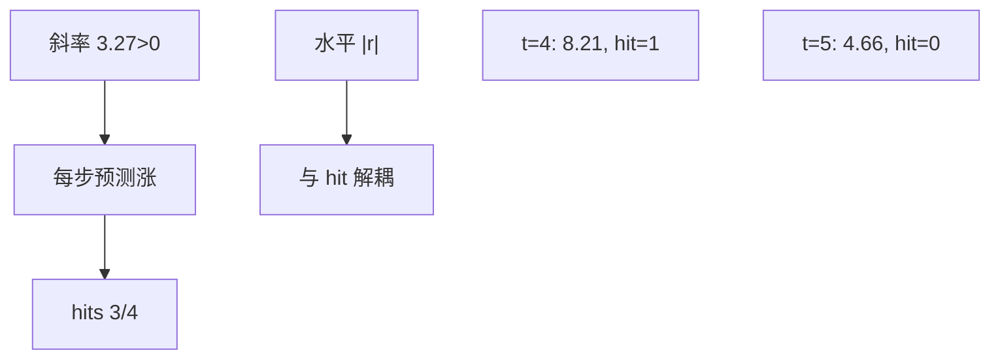

<p align="center"><b>中文</b> &nbsp;&nbsp;·&nbsp;&nbsp; <a href="day-10.en.md">English</a></p>

# 第 10 天 · 涨跌方向

[第一阶段 · 模型](README.md) · [排版规范](LESSON_LAYOUT.md) · 可运行

今天的学习要点：同一条直线的一日差分恒为 3.27，四步方向命中 3/4。第四日绝对残差 8.21 且方向命中，第五日绝对残差 4.66 且方向不中。因为斜率大于 0，这 3/4 就是「每一步都猜涨」。

## 费曼法讲解

> **结论先行**：固定 OLS 直线，一步预测 Δŷ=3.27 恒定；四步方向命中 3/4——斜率>0 故等价于 **逐步猜涨**；day4 |r|=8.21 仍 hit=1，day5 |r|=4.66 hit=0。



水平残差来自同一 `y=3.27x−1.29`；**方向**来自 `sign(Δy)` vs `sign(Δŷ)`。仿射直线等距网格上 Δŷ=3.27 常数，故 **方向规则退化为常数分类器「涨」**。

第四日 Δy=13.8 大正，hit=1 但 |r|=8.21 仍大——**方向对不保证水平准**。第五日 Δy=−9.6，常数猜涨错，hit=0，|r|=4.66 小于第四日但方向失败。

Christoffersen–Diebold：水平与方向可 **分解评分**；本课固定水平线，方向 3/4 **信息量低**——须报 baseline（第 14 天）与 threshold 标签（第 12 天）。

误用：用 8.21 论证「方向模型强」；只报 3/4 不说明 **恒涨策略**。

## 核心知识

### 脚本输出（与下方 `text` 块一致）

[`direction.py`](../../days/10-direction/direction.py)：

```text
line: y = 3.27 x + -1.29
fitted one-day move = 3.27 on every step
t  y  yhat  residual  dy  dyhat  hit
2  3.9  5.25  -1.35  1.8  3.27  1
3  6.2  8.52  -2.32  2.3  3.27  1
4  20.0  11.79  8.21  13.8  3.27  1
5  10.4  15.06  -4.66  -9.6  3.27  0
direction hits = 3 / 4
day 4 |residual| = 8.21, hit = 1
day 5 |residual| = 4.66, hit = 0
```

正文表与公式只解释 text 块；小数须与块内同行可对齐。

## 拓展领域

**分类 vs 回归**：同一 β̂ 双轨指标。**执行**：side 可能对但 size 错。

**生产**：alpha 信号常先 direction 后 sizing；metrics 模块分列。**第 11 天**：显式声明 score 非 |r|。

**Closing**：3/4 在 slope>0 下是 **结构结果**，非 empirical miracle。

**方向 vs 水平.** 固定直线，Δŷ=3.27 恒定；hits 3/4。第四日 |r|=8.21 且 hit=1；第五日 |r|=4.66 hit=0—— **方向对不保证水平准**。Christoffersen & Diebold 分解水平与方向评分。

**常数分类器.** 斜率>0 ⇒ 每步预测涨；3/4 等价于 **逐步猜涨** 在四点 Δy 上的结果。第四日 Δy=13.8 大正仍 hit；第五日 Δy=−9.6 猜涨错。

**与第 11 天.** 分数是 direction hits，8.21 不是 score。报告须 baseline（第 14 天）与 threshold 标签（第 12 天）。

**策略含义.** sign book 应看 direction accuracy；单报 |r| 会误选水平拟合好的日。

## 实战总结

```bash
python days/10-direction/direction.py
```

核对：`direction hits = 3 / 4`；day4/day5 的 |residual| 与 hit 行。