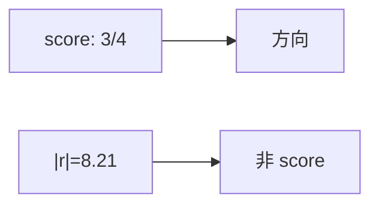

<p align="center"><b>中文</b> &nbsp;&nbsp;·&nbsp;&nbsp; <a href="day-11.en.md">English</a></p>

# 第 11 天 · 涨跌标签

[第一阶段 · 模型](README.md) · [排版规范](LESSON_LAYOUT.md) · 可运行

今天的学习要点：分数是方向命中 3/4，第四日绝对价格残差 8.21 不是这个分数，第五日绝对残差 4.66 方向不中，斜率大于 0，因而这 3/4 等于每一步都猜涨。

## 费曼法讲解

> **结论先行**：score=`direction hits 3/4`；`day 4 absolute price residual = 8.21` **不是 score**——水平与方向 estimand 必须分句披露。



本课脚本是 **meta-lesson**：重复第 10 天方向 3/4，同时打印第四日绝对价格残差 8.21，并声明 **that residual is not the score**。

Research dashboard 常见 bug：展示 RMSE 卡片读者误以为与 **hit rate** 同一对象。Engineering 须在 API/schema 层分字段 `direction_accuracy` vs `level_mae`。

第五日 |r|=4.66 方向不中（第 10 天表）——本脚本不重复打印，但学习要点已含。斜率>0 ⇒ 3/4=恒涨。

**合同**：任何「score」字符串须附 **定义句**（hit on Δy, constant-up implicit）。

## 核心知识

### 脚本输出（与下方 `text` 块一致）

[`labels.py`](../../days/11-direction-labels/labels.py)：

```text
score = direction hits 3/4
day 4 absolute price residual = 8.21
that residual is not the score
```

正文表与公式只解释 text 块；小数须与块内同行可对齐。

## 拓展领域

**API 设计**：score 字段加 `estimand` enum。**PM 报告**：两页——direction page vs level page。

**Closing**：8.21 是水平诊断；3/4 是方向计数——不可加权合成单 KPI。

**Estimand 分离.** `score = direction hits 3/4`；`day 4 absolute price residual = 8.21` 与 `that residual is not the score` 三行锁定 **水平残差不得进方向榜**。

**PM 沟通.** 8.21 可进 risk memo 水平段，不可替换 3/4 方向摘要。第五日 4.66 方向失败但 |r| 小于第四日—— **排序与 score 无关**。

**双轨 metrics.** 第 25 天 panel 上 MAE 与 direction 并列；本课五点建立 vocabulary。代码审查：dashboard 是否混排 price error 与 hit rate？

**斜率>0 与 3/4.** 与第 10 天同构；本日强调 **命名** 而非新算法。

## 实战总结

```bash
python days/11-direction-labels/labels.py
```

核对：三行 stdout；`that residual is not the score`。