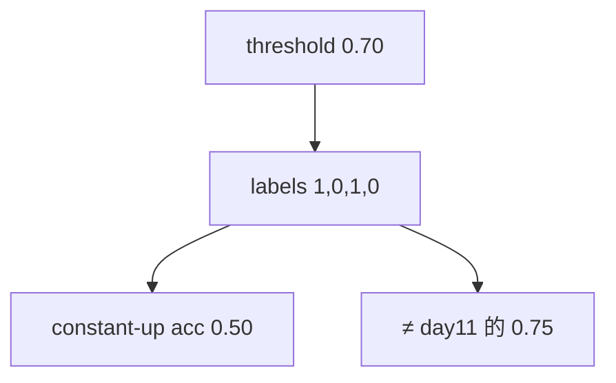

<p align="center"><b>中文</b> &nbsp;&nbsp;·&nbsp;&nbsp; <a href="day-12.en.md">English</a></p>

# 第 12 天 · 阈值

[第一阶段 · 模型](README.md) · [排版规范](LESSON_LAYOUT.md) · 可运行

今天的学习要点：四步收益 0.8571、0.5897、2.2258、−0.4800 在阈值 0.70 上得到标签 1 0 1 0，同一条永远猜涨的准确率是 0.50，而它在第 11 天的符号标签上是 0.75，这条切分属于标签的定义。

## 费曼法讲解

> **结论先行**：returns=0.8571,0.5897,2.2258,−0.4800；threshold=0.70 得标签 1,0,1,0；constant-up accuracy=0.50——**标签定义随阈值变**，与第 11 天符号标签 0.75 不可直接比。



四步 **return**（脚本打印）经阈值 0.70 二值化：≥0.70→1，否则 0，得 1,0,1,0。**恒涨** 分类器 accuracy=0.50——两步对两步错。

第 11 天 **符号标签**（涨/跌）上恒涨 accuracy=0.75——**同一恒涨策略、不同 label 函数**，准确率不可比。必须披露 `threshold` 与 label 构造。

2.2258>0.70 为 1；−0.4800 为 0——阈值在 **幅度空间** 切分，非单纯 sign。生产里类似「大涨才算 up event」。

误用：写「模型 50% 不如 75%」而不说 label 变。

## 核心知识

### 脚本输出（与下方 `text` 块一致）

[`threshold.py`](../../days/12-threshold/threshold.py)：

```text
threshold = 0.70
returns = 0.8571 0.5897 2.2258 -0.4800
label up = 1 0 1 0
constant-up accuracy = 0.50
```

正文表与公式只解释 text 块；小数须与块内同行可对齐。

## 拓展领域

**事件定义**：量化因子常定义「显著正收益」；threshold 是 **业务参数**。**第 13 天**：threshold 扫描 0.50/0.70/0.90。

**Closing**：0.50 是 **label+classifier 联合结果**；不是价格噪声 alone。

**阈值标签函数.** returns 0.8571、0.5897、2.2258、−0.4800；threshold=0.70 ⇒ labels 1,0,1,0。`constant-up accuracy = 0.50`—— **同策略在不同 label 定义下分数变**（第 11 天符号标签上恒涨为 0.75）。

**标签是函数.** 改 threshold 改分母分子定义；只报 accuracy 不披露 threshold 是审计缺陷。第 13 天扫描 0.50/0.70/0.90。

**收益单位.** 四步 return 来自同一五点面板差分；与第 22 天 panel 收益尺度不同，本课只教 **切分依赖**。

**基准并列.** 第 14 天 always-up/down；本课 0.50 须与 label 定义同屏。

## 实战总结

```bash
python days/12-threshold/threshold.py
```

核对：`threshold = 0.70`、returns 行、`constant-up accuracy = 0.50`。