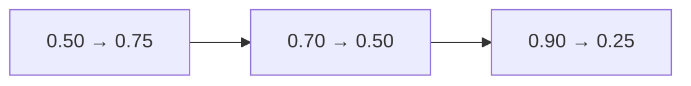
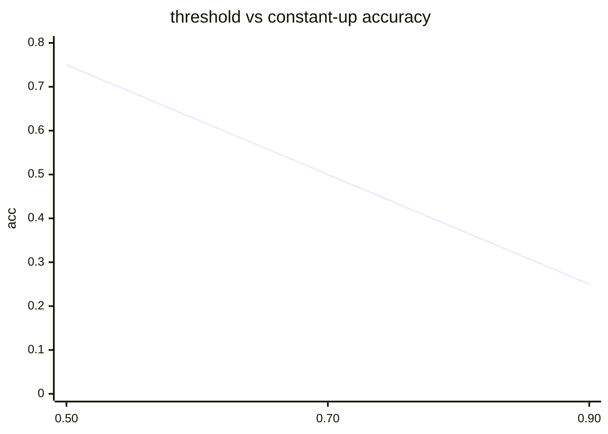

<p align="center"><b>中文</b> &nbsp;&nbsp;·&nbsp;&nbsp; <a href="day-13.en.md">English</a></p>

# 第 13 天 · 阈值灵敏度

[第一阶段 · 模型](README.md) · [排版规范](LESSON_LAYOUT.md) · 可运行

今天的学习要点：阈值 0.50、0.70、0.90 上，永远猜涨的准确率依次是 0.75、0.50、0.25，阈值上升 0.40，准确率下降 0.50，只报告一个准确率就藏起了它用的那条切分。

## 费曼法讲解

> **结论先行**：threshold 0.50→acc 0.75；0.70→0.50；0.90→0.25；阈值升 0.40、acc 降 0.50——**单点 accuracy 无意义**，须报曲线或表格。



**灵敏度表**：恒涨分类器在不同 label 阈值下的 accuracy。0.50 最宽松（三步涨标 1），0.90 最严（仅 2.2258 标 1），故 acc 单调降。

这不是「模型 tune 阈值」——classifier 固定 always-up；变的是 **ground truth 定义**。与 ROC 不同（ROC 变 score cutoff）；本课无 score 连续体。

Walk-forward：若 PM 改「大涨」定义，accuracy 序列应 **重算全历史**，不可只改未来。

## 核心知识

### 脚本输出（与下方 `text` 块一致）

[`sensitivity.py`](../../days/13-threshold-sensitivity/sensitivity.py)：

```text
threshold  accuracy
0.50  0.75
0.70  0.50
0.90  0.25
```



正文表与公式只解释 text 块；小数须与块内同行可对齐。

## 拓展领域

**校准**：threshold 选择应 pre-register；**第 14 天** baseline 并列。**生产**：config 存 threshold_version。

**Closing**：三行表是 **minimum disclosure**；只报 0.75 藏 0.50/0.90。

**阈值扫描.** 0.50→acc 0.75；0.70→0.50；0.90→0.25。阈值升 0.40，acc 降 0.50—— **单调性来自标签稀疏化**，不是模型退化。

**只报单点.** 隐藏 0.50/0.90 等于隐藏 estimand。研究若调 threshold 拟合 in-sample，须 hold-out 重扫（本课未做）。

**与第 12 天.** 0.70 行与 day-12 一致；本日表格是 **敏感性分析** 模板。生产：hyperparameter threshold 进 model card。

**分类校准.** 第 16–17 天 sigmoid 分数与频率对照；threshold 标签是硬切，另一路线。

## 实战总结

```bash
python days/13-threshold-sensitivity/sensitivity.py
```

核对：三行 threshold-accuracy 表。