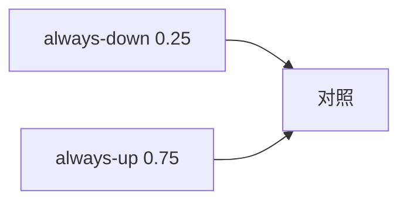

<p align="center"><b>中文</b> &nbsp;&nbsp;·&nbsp;&nbsp; <a href="day-14.en.md">English</a></p>

# 第 14 天 · 常数基准

[第一阶段 · 模型](README.md) · [排版规范](LESSON_LAYOUT.md) · 可运行

今天的学习要点：在符号标签上，永远猜跌的准确率是 0.25，永远猜涨的准确率是 0.75，基准不看价格，单独一个 0.75 旁边没有 0.25 就没有对照。

## 费曼法讲解

> **结论先行**：符号标签上 always-down acc=0.25、always-up acc=0.75——**baseline 不看价格**；单报 0.75 无对照即不可审计。



**零信息分类器**：不读特征，只输出常数方向。涨标签占 75% 样本（四步中三步 up under sign label），故 always-up 0.75= **类频率**；always-down 0.25。

任何「策略 accuracy」必须 **减 baseline** 或并列报告。脚本：`the baseline looks at no price`——强调 **未使用 covariate**。

误用：把 0.75 当 alpha；不报 0.25。

## 核心知识

### 脚本输出（与下方 `text` 块一致）

[`baseline.py`](../../days/14-constant-baseline/baseline.py)：

```text
always-down accuracy = 0.25
always-up accuracy = 0.75
the baseline looks at no price
```

正文表与公式只解释 text 块；小数须与块内同行可对齐。

## 拓展领域

**Brier / lift**：方向分类常用 lift over marginal。**生产**：dashboard 默认显示 baseline 线。

**Closing**：0.75 是 **先验**，不是模型；与第 10 天 3/4 比较须同 label 定义。

**无特征基准.** always-down 0.25，always-up 0.75；`the baseline looks at no price`——基准 **不看价格**，只数标签边际。

**0.75 无对照则无效.** 必须并列 0.25；否则读者不知标签偏斜。第 10 天 3/4 高于 always-up 0.75？四点子样本标签分布不同—— **分母须一致** 才可比。

**策略筛选.** 新模型 acc 0.76 仅比 0.75 高 0.01 时，须报 baseline 与 N。因子 IC 也有 null 分布；本课是分类版 null。

**代码.** sklearn `dummy` classifier 应作为 pipeline 第一行 benchmark。

## 实战总结

```bash
python days/14-constant-baseline/baseline.py
```

核对：两行 accuracy；`the baseline looks at no price`。