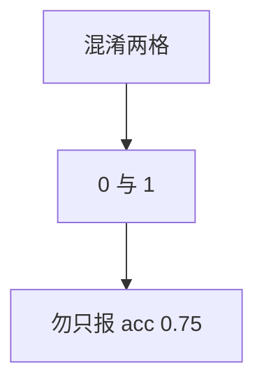

<p align="center"><b>中文</b> &nbsp;&nbsp;·&nbsp;&nbsp; <a href="day-15.en.md">English</a></p>

# 第 15 天 · 两类误分

[第一阶段 · 模型](README.md) · [排版规范](LESSON_LAYOUT.md) · 可运行

今天的学习要点：永远猜涨把「上涨判成下跌」记成 0、把「下跌判成上涨」记成 1，准确率 0.75 把这两格合成一个数，两格都要保留。

## 费曼法讲解

> **结论先行**：always-up：up-called-down=0，down-called-up=1——accuracy 0.75 掩盖 **非对称误分**；两格都必须保留。



**混淆矩阵压缩**：恒涨策略无「猜跌」故 up-called-down=0；一步真跌（第五日）被判涨 → down-called-up=1。

Accuracy=(3/4) 把 **两类错误代价相同** 编码；交易里 false positive 与 false negative 成本常不对称——须报两格而非单标量。

与第 14 天：0.75 是 marginal accuracy；本日 **分解错误类型**。

## 核心知识

### 脚本输出（与下方 `text` 块一致）

[`mistakes.py`](../../days/15-two-mistakes/mistakes.py)：

```text
up called down = 0
down called up = 1
```

正文表与公式只解释 text 块；小数须与块内同行可对齐。

## 拓展领域

**成本敏感学习**：误分加权不同。**执行**：short 受限时 down-called-up 更贵。

**Closing**：0 与 1 是 **minimum confusion disclosure**。

**混淆两格.** `up called down = 0`；`down called up = 1`——恒涨策略在四点上的错分 **只有假涨** 一格为 1。

**acc 0.75 分解.** 聚合 acc 隐藏 1 次 down→up 错误；风控要两格。第 14 天 baseline 与第 15 天混淆表 **同标签空间**。

**成本加权.** 第 39 天 cost 后 net return；方向错一格的 P&L 不对称本课未引入，但 **两格** 是前置。

**报告模板.** hits、baseline、confusion 三件套。

## 实战总结

```bash
python days/15-two-mistakes/mistakes.py
```

核对：`up called down = 0`、`down called up = 1`。