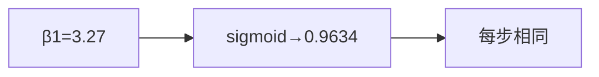

<p align="center"><b>中文</b> &nbsp;&nbsp;·&nbsp;&nbsp; <a href="day-16.en.md">English</a></p>

# 第 16 天 · 上涨程度

[第一阶段 · 模型](README.md) · [排版规范](LESSON_LAYOUT.md) · 可运行

今天的学习要点：斜率 3.27 送进 sigmoid 得到 0.9634，四步都贴这同一个分数，仿射直线的一日差分是常数，因此这个分数不能把四步按置信排出高下。

## 费曼法讲解

> **结论先行**：slope=3.27 → sigmoid 得 P(up)=0.9634，**四步同一分数**——仿射 Δŷ 常数，不能给各步排序置信。



将 **斜率标量** 过 sigmoid 映射到 (0,1)——非特征依赖的校准概率。3.27→0.9634；四步贴同一数，因 **没有步级 covariate 进入 sigmoid**。

误用：把 0.9634 当「第四步更确信」；当 calibrated P(up) 不上 **第 17 天频率检验**。

这是 **错误概率模型** 的演示：单调变换单参数不增加信息维度。

## 核心知识

### 脚本输出（与下方 `text` 块一致）

[`up_score.py`](../../days/16-up-score/up_score.py)：

```text
slope = 3.27
P(up) = sigmoid(slope) = 0.9634
the same score is attached to every step
```

正文表与公式只解释 text 块；小数须与块内同行可对齐。

## 拓展领域

**校准**：Platt scaling / isotonic 需 hold-out。**生产**：score 须带 feature vector 维数。

**Closing**：0.9634 是 **全局常数贴标**，非逐步置信。

**Sigmoid 贴分.** slope=3.27 ⇒ P(up)=sigmoid(3.27)=0.9634；四步 **同一分数**——仿射 Δŷ 常数，sigmoid 无法排序四步置信。

**非概率校准.** 0.9634 不是频率；第 17 天 gap=0.2134。不要把 sigmoid(slope) 当 calibrated P 上报 PM。

**与 threshold 路线对照.** 硬标签（第 12 天）vs 软分数；本课展示 **误用 sigmoid 作逐步置信** 的几何原因。

**深度学习.** 最后一层 sigmoid 需 calibration plot；本课无校准，只固定代数。

## 实战总结

```bash
python days/16-up-score/up_score.py
```

核对：`P(up) = sigmoid(slope) = 0.9634`；`the same score is attached to every step`。