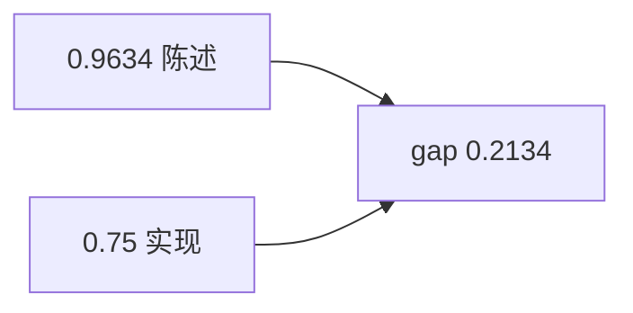

<p align="center"><b>中文</b> &nbsp;&nbsp;·&nbsp;&nbsp; <a href="day-17.en.md">English</a></p>

# 第 17 天 · 置信核对

[第一阶段 · 模型](README.md) · [排版规范](LESSON_LAYOUT.md) · 可运行

今天的学习要点：写出的上涨概率是 0.9634，实现的上涨频率是 0.75，两者之差是 0.2134；被写成百分之九十六上涨的那些步，实际上只有四分之三上涨；置信和频率并排，互不替代。

## 费曼法讲解

> **结论先行**：stated P(up)=0.9634 vs realized up frequency=0.75，gap=0.2134——**置信陈述与频率实现必须并排**，不可互相替代。



第 16 天贴出 0.9634；本日数 **实现频率** 0.75（四步中三步 up），gap=0.2134。

**校准误差**初等版：overconfident 常数。research 报告写「P(up)」须说明是 **模型输出** 还是 **样本频率**。

Brier score、reliability diagram 为后续工具；本课只 **代数 gap**。

## 核心知识

### 脚本输出（与下方 `text` 块一致）

[`confidence.py`](../../days/17-confidence-check/confidence.py)：

```text
stated P(up) = 0.9634
realized up frequency = 0.75
gap = 0.2134
```

正文表与公式只解释 text 块；小数须与块内同行可对齐。

## 拓展领域

**风险**：PM 按 96% 仓位 scaling 实际只有 75% 涨——gap 直接映射 **资本误配**。

**Closing**：0.2134 是 **审计键**；缺 realized 行则 stated 不可信。

**校准缺口.** stated P(up)=0.9634，realized up frequency=0.75，gap=0.2134—— **书面概率与频率可分离**；须并列，互不替代。

**Brier / reliability.** 扩展指标本课未算；memo 应写「未校准分数，仅作 rank 无效演示」。第四日大涨拉高 realized 0.75 仍低于 0.9634。

**与第 16 天.** 同一 0.9634；本日加 **频率合同**。生产：上线前 reliability diagram on hold-out。

**风控.** 用 96% 头寸 scaling 而真实涨频 75% 会 oversize risk。

## 实战总结

```bash
python days/17-confidence-check/confidence.py
```

核对：三行 stated/realized/gap。