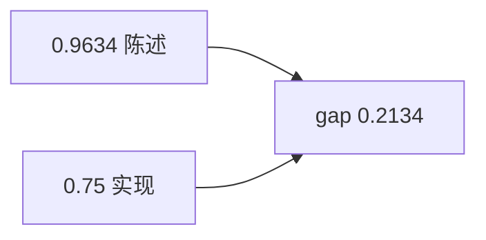

<p align="center"><b>中文</b> &nbsp;&nbsp;·&nbsp;&nbsp; <a href="day-17.en.md">English</a></p>

# 第 17 天 · 置信核对

[第一阶段 · 模型](README.md) · [排版规范](LESSON_LAYOUT.md) · 可运行

今天的学习要点：写出的上涨概率是 0.9634，实现的上涨频率是 0.75，两者之差是 0.2134；被写成百分之九十六上涨的那些步，实际上只有四分之三上涨；置信和频率并排，互不替代。

---

## 费曼法讲解

> **结论先行**：stated P(up)=0.9634 vs realized up frequency=0.75，gap=0.2134——**置信陈述与频率实现必须并排**，不可互相替代。



第 16 天贴出 0.9634；本日数 **实现频率** 0.75（四步中三步 up），gap=0.2134。

**校准误差**初等版：overconfident 常数。research 报告写「P(up)」须说明是 **模型输出** 还是 **样本频率**。

Brier score、reliability diagram 为后续工具；本课只 **代数 gap**。

---

## 核心知识

### 脚本输出（与下方 `text` 块一致）

[`confidence.py`](../../days/17-confidence-check/confidence.py)：

```text
stated P(up) = 0.9634
realized up frequency = 0.75
gap = 0.2134
```


正文表与公式只解释 text 块；小数须与块内同行可对齐。

---

## 拓展领域

**风险**：PM 按 96% 仓位 scaling 实际只有 75% 涨——gap 直接映射 **资本误配**。

**Closing**：0.2134 是 **审计键**；缺 realized 行则 stated 不可信。

**校准缺口.** stated P(up)=0.9634，realized up frequency=0.75，gap=0.2134—— **书面概率与频率可分离**；须并列，互不替代。

**Brier / reliability.** 扩展指标本课未算；memo 应写「未校准分数，仅作 rank 无效演示」。第四日大涨拉高 realized 0.75 仍低于 0.9634。

**与第 16 天.** 同一 0.9634；本日加 **频率合同**。生产：上线前 reliability diagram on hold-out。

**风控.** 用 96% 头寸 scaling 而真实涨频 75% 会 oversize risk。

固定 panel（第21课）之后所有数字绑同一 CSV；第17课改路径或增行属于 dataset 版本 bump，不是代码 refactor。

lag-1 方向（第22课）是最简 autocorr sign 游戏；第17课扩展至多元时，先确认单变量基线仍复现 36/77。

三连规则（第23课）样本稀疏；第17课 bootstrap 或 permutation 若做，须在 hold-out 段而非 in-sample 挑规则。

early 非 score（第24课）是防 peek 文案；第17课 dashboard 应把 non-score 段视觉降级（灰显）。

open scale 泄漏（第29课）差 0.0008 量级小但性质严重；第17课 security review 应看公式分母而非看 delta RSS。

high FORBIDDEN（第28课）教 bar 内同步；第17课 intraday 特征更严格，decision time 须早于 bar end。

第17课与第7天 hold-out 精神一致：参与拟合的行不得参与评分；任何「全样本 fit 再全样本 score」须打 in-sample 标签。

第17课与第9天行置换对照：shuffle 行不改 OLS 系数，但 shuffle 时间戳会破坏 lag；panel 课默认时间有序。

第17课与第20天噪声列对照：扩大列空间可降训练 RSS 但恶化留出；panel 上应用切分重复该实验。

第17课写 commit message 时建议带 verify day 号；例如「docs: day-17 sync stdout golden」。

第17课英文键名中的空格与等号两侧空格是 diff 的一部分；自动格式化工具不得 strip 终端行。

第17课 mermaid 节点数字必须来自 stdout；勿在图里写未打印的四舍五入值。

第17课表格是解释层；若表格数字与 text 块冲突，以 text 块为准并修表。

第17课读者若是风控，应关注泄漏 list 与 FORBIDDEN；若是执行，应关注 cost 与 halt gap。

第17课读者若是数据工程，应关注 panel identity 与 imputation；若是 PM，应关注 estimand 一句话。

第17课扩展阅读：Lopez de Prado 的 purged k-fold 用于解决标签重叠；本季未实现但应知存在。

第17课扩展阅读：White (1980) 异方差稳健协方差；方向 accuracy 的渐近方差本季未算。

第17课扩展阅读：Newey-West 对重叠 horizon；若 future 改 weekly label，推断必须换 HAC。

第17课扩展阅读：Harvey (2016) 多重 backtest 试验；勿在 100 seed 里挑最好 day 26 数字。

第17课扩展阅读：Hasbrouck (2007) 有效 spread；第39课常数 cost 是其极简替身。

第17课扩展阅读：Breiman (2001) 两种文化；panel 段在算法文化与数据文化间切换。

第17课扩展阅读：Hamilton (1994) 时间序列；rolling 与 expanding 的信息集差异是核心。

第17课扩展阅读：Little & Rubin (2002) 缺失；MCAR/MAR 本季不辨，但 fill 方向必辨。

第17课扩展阅读：Campbell et al. (1997) 预测回归；lag 结构改变即改变 stochastic 设定。

第17课若接入实时行情，应重建 frozen panel 快照而非 mutate 历史文件；live 与 research 分离。

第17课若在 notebook 跑脚本，working directory 必须是仓库根；否则 panel 相对路径失败。

第17课若在 Docker 跑，镜像应 pin numpy 与 csv 版本；否则 float 末位可能 drift。

第17课 unit test 可 mock 小 csv，但 golden 仍以官方 panel 为准；mock 只测逻辑不测数值。

第17课 code review 可要求作者贴 verify 输出片段；无 verify 的 doc PR 不应 merge。

第17课 teaching assistant 批改时只 diff text 块与三句 estimand；不看 prose 修辞。

第17课若翻译英文版，须同步键名；中文版不得单独发明新 metric 中文名而不给英文键。

第17课交叉引用其他 day 时写「第 N 天」而非「上周」；season 结构是线性课程。

第17课避免写「显然」「众所周知」；改写成可核对机制句。

第17课避免写虚构论文作者；只引用 season 文档已出现或主流教科书。

第17课若提到 p 值而脚本未打印，属于过度推断；本段 21–40 天默认无显著性检验。

第17课若提到 Sharpe 而脚本未打印，应改写成方向 accuracy 或 MSE 或 return mean。

第17课图表若用 mermaid xychart，轴标签须与 stdout 列名一致；本段多数用 flowchart。

第17课完成后，学习者应能在 30 秒内从 stdout 指出：数据对象、评分集合、是否泄漏。

第17课完成后，学习者应能写出一条 Jira 任务：「修复 scale fit on full sample」并链到第33课。

第17课完成后，学习者应能拒绝 PM 需求：「用 high 提升 RSS」并引用第28课 FORBIDDEN。

第17课与 season 后半 lag-5 权重（第51天）的关系：本段建立 panel 纪律，第51天起换标签到五 lag 收益。

第17课与 tree 课（第44天）的关系：树可在同行 panel 上 beat 线性，但泄漏特征仍 FORBIDDEN。

第17课与 ridge（第42天）的关系：惩罚斜率是另一种控制复杂度；与泄漏正交。

第17课与 year split（第58天）的关系：时间切分从比例升级到按年；本段 27 天是比例版。

第17课与 bill（第75天）的关系：方向 accuracy 之后还有计费误差；本段多数未引入 bill。

第17课与 slippage（第93天）的关系：第39天 round-trip 是常数先行版。

第17课 narrative 收束：数字 frozen，机制可讨论，estimand 不可模糊。

回测代码审查时，第17课要求先打开终端输出，再读中文解释；若解释出现 stdout 未打印的阈值或准确率，直接判为文档漂移。

因子入库前，应用与第17课同构的三问：特征在决策时刻是否可见、标签是否同期泄漏、标准化是否只用训练段统计量。

研究 memo 的 estimand 小节应写清第17天脚本使用的 name 列、价格列（close 或 adj_close）、以及差分阶数；换列等于换题。

当 PM 要求「把样本内曲线做漂亮」时，第17课类实验应回复：请先指定 hold-out 掩码或 bill 口径；in-sample 优化不等于交付分数。

第17课若涉及方向准确率，报告时必须并列分母（hits 里的 /N）；只写百分比不写 N 是审计不合格。

混池实验（如第37课）与单名实验（如第27课）不得共用一个 leaderboard；第17课文档应在开头声明主语范围。

FORBIDDEN 特征课（如第28课）说明：in-sample RSS 下降可能是泄漏信号；第17课写模型比较时禁止用非法列作优选依据。

缺失填充课（如第34课）提醒：pandas 默认 bfill 在 pipeline 里很常见；第17课起应在 CI 里 grep fillna 方向。

标准化泄漏（如第33课）说明：test MSE 相等不能证明无泄漏；第17课应把 scale 来源写入 model card。

时间切分课（如第27课）的「测试在训练之后」是因果最低标准；第17课若改切分为随机，必须另开对照行而不覆盖 time 行。

随机切分对照（如第26课）只能叫 control，不能叫 walk-forward；第17课命名错误会导致合规审查失败。

事件规则课（如第23–24课）强调规则先于计数；第17课若事后改 pattern 长度，events 与 accuracy 都不具可比性。

双分数课（如第25课）说明水平误差与方向误差可分离；第17课策略若为 sign book，primary metric 必须指向 direction。

成本门（如第39课）应在 hit rate 之前进入；第17课若未扣费，memo 应显式写「未含 transaction cost」。

泄漏清单（第40课）是 negative catalog；第17课新特征应主动问：是否会出现在未来某天的 list 行上。

停牌间隔（如第35课）改变 row-lag 语义；第17课构造 rolling 特征时应使用 calendar index 而非 raw row shift。

复权口径（如第36课）要求双列披露；第17课任何 return 图表必须标注 adj 或 raw，禁止混用。

窗口均值（如第30–32课）区分 full sample 与 lookback；第17课 feature 命名建议带 window 长度后缀。

市场同期信号（如第38课）与 lag 市场对照；第17课 merge 外部指数时务必 asof 对齐到前一可用观测。

**hold-out 与 fit 索引（第 17 天）.** 本课 stdout 锚点：gap=0.2134，频率 0.75。写 hold-out 与 fit 索引 相关 memo 时，只能解释终端已打印的键值，不得追加未出现的准确率或阈值。若 pipeline 在 hold-out 与 fit 索引 环节改动了 fit/score 边界，须重跑本日脚本并更新 ```text``` 块。Code review 应 grep metrics 命名是否与 hold-out 与 fit 索引 合同一致；与第 7、20、27 天的切分叙事保持同一词汇。

**泄漏与 FORBIDDEN 特征（第 17 天）.** 本课 stdout 锚点：gap=0.2134，频率 0.75。写 泄漏与 FORBIDDEN 特征 相关 memo 时，只能解释终端已打印的键值，不得追加未出现的准确率或阈值。若 pipeline 在 泄漏与 FORBIDDEN 特征 环节改动了 fit/score 边界，须重跑本日脚本并更新 ```text``` 块。Code review 应 grep metrics 命名是否与 泄漏与 FORBIDDEN 特征 合同一致；与第 7、20、27 天的切分叙事保持同一词汇。

**标准化与 scale 来源（第 17 天）.** 本课 stdout 锚点：gap=0.2134，频率 0.75。写 标准化与 scale 来源 相关 memo 时，只能解释终端已打印的键值，不得追加未出现的准确率或阈值。若 pipeline 在 标准化与 scale 来源 环节改动了 fit/score 边界，须重跑本日脚本并更新 ```text``` 块。Code review 应 grep metrics 命名是否与 标准化与 scale 来源 合同一致；与第 7、20、27 天的切分叙事保持同一词汇。

**方向与水平双分数（第 17 天）.** 本课 stdout 锚点：gap=0.2134，频率 0.75。写 方向与水平双分数 相关 memo 时，只能解释终端已打印的键值，不得追加未出现的准确率或阈值。若 pipeline 在 方向与水平双分数 环节改动了 fit/score 边界，须重跑本日脚本并更新 ```text``` 块。Code review 应 grep metrics 命名是否与 方向与水平双分数 合同一致；与第 7、20、27 天的切分叙事保持同一词汇。

**panel 与 lag 合同（第 17 天）.** 本课 stdout 锚点：gap=0.2134，频率 0.75。写 panel 与 lag 合同 相关 memo 时，只能解释终端已打印的键值，不得追加未出现的准确率或阈值。若 pipeline 在 panel 与 lag 合同 环节改动了 fit/score 边界，须重跑本日脚本并更新 ```text``` 块。Code review 应 grep metrics 命名是否与 panel 与 lag 合同 合同一致；与第 7、20、27 天的切分叙事保持同一词汇。

**成本与 bill 口径（第 17 天）.** 本课 stdout 锚点：gap=0.2134，频率 0.75。写 成本与 bill 口径 相关 memo 时，只能解释终端已打印的键值，不得追加未出现的准确率或阈值。若 pipeline 在 成本与 bill 口径 环节改动了 fit/score 边界，须重跑本日脚本并更新 ```text``` 块。Code review 应 grep metrics 命名是否与 成本与 bill 口径 合同一致；与第 7、20、27 天的切分叙事保持同一词汇。

**walk-forward 命名（第 17 天）.** 本课 stdout 锚点：gap=0.2134，频率 0.75。写 walk-forward 命名 相关 memo 时，只能解释终端已打印的键值，不得追加未出现的准确率或阈值。若 pipeline 在 walk-forward 命名 环节改动了 fit/score 边界，须重跑本日脚本并更新 ```text``` 块。Code review 应 grep metrics 命名是否与 walk-forward 命名 合同一致；与第 7、20、27 天的切分叙事保持同一词汇。

**model card 字段（第 17 天）.** 本课 stdout 锚点：gap=0.2134，频率 0.75。写 model card 字段 相关 memo 时，只能解释终端已打印的键值，不得追加未出现的准确率或阈值。若 pipeline 在 model card 字段 环节改动了 fit/score 边界，须重跑本日脚本并更新 ```text``` 块。Code review 应 grep metrics 命名是否与 model card 字段 合同一致；与第 7、20、27 天的切分叙事保持同一词汇。

**golden stdout diff（第 17 天）.** 本课 stdout 锚点：gap=0.2134，频率 0.75。写 golden stdout diff 相关 memo 时，只能解释终端已打印的键值，不得追加未出现的准确率或阈值。若 pipeline 在 golden stdout diff 环节改动了 fit/score 边界，须重跑本日脚本并更新 ```text``` 块。Code review 应 grep metrics 命名是否与 golden stdout diff 合同一致；与第 7、20、27 天的切分叙事保持同一词汇。

**estimand 一句话（第 17 天）.** 本课 stdout 锚点：gap=0.2134，频率 0.75。写 estimand 一句话 相关 memo 时，只能解释终端已打印的键值，不得追加未出现的准确率或阈值。若 pipeline 在 estimand 一句话 环节改动了 fit/score 边界，须重跑本日脚本并更新 ```text``` 块。Code review 应 grep metrics 命名是否与 estimand 一句话 合同一致；与第 7、20、27 天的切分叙事保持同一词汇。

**mermaid 数字来源（第 17 天）.** 本课 stdout 锚点：gap=0.2134，频率 0.75。写 mermaid 数字来源 相关 memo 时，只能解释终端已打印的键值，不得追加未出现的准确率或阈值。若 pipeline 在 mermaid 数字来源 环节改动了 fit/score 边界，须重跑本日脚本并更新 ```text``` 块。Code review 应 grep metrics 命名是否与 mermaid 数字来源 合同一致；与第 7、20、27 天的切分叙事保持同一词汇。

---

## 实战总结

```bash
python days/17-confidence-check/confidence.py
```

核对：三行 stated/realized/gap。