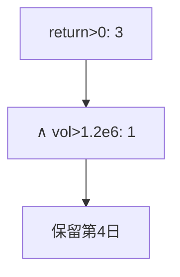

<p align="center"><b>中文</b> &nbsp;&nbsp;·&nbsp;&nbsp; <a href="day-18.en.md">English</a></p>

# 第 18 天 · 涨幅与成交量

[第一阶段 · 模型](README.md) · [排版规范](LESSON_LAYOUT.md) · 可运行

今天的学习要点：五个成交量的中位数是 1200000，只看收益为正有 3 步，再要求成交量高于这个中位数就只剩 1 步，留下的是第 4 日；标签变了是因为多进了一列，不是因为价格被重估。

## 费曼法讲解

> **结论先行**：median volume=1200000；return>0 得 3 步，再加 volume>median 剩 1 步（第 4 日）——**标签随特征列增加而变**，非价格重估。



**双条件标签**：先正收益，再高成交量（相对中位数 1200000）。从 3 步缩到 1 步——支持集改变，**不是** OLS 重跑。

第四日高 vol 高 return 成为唯一保留——典型 **liquidity filter** 改变 event 定义。与第 12 天 threshold 同类：**label 是函数 of 数据**。

sessions kept=4 声明样本量；过滤后统计须 **条件于 filter**。

## 核心知识

### 脚本输出（与下方 `text` 块一致）

[`volume_split.py`](../../days/18-return-volume/volume_split.py)：

```text
median volume = 1200000
up on return alone = 3
up on return and volume = 1
sessions kept = 4
```

正文表与公式只解释 text 块；小数须与块内同行可对齐。

## 拓展领域

**因子**：Amihud、volume 过滤常见。**泄漏**：median 应用 train 算（本课全样本演示，第 33 天 train scale）。

**Closing**：1 步 vs 3 步是 **定义变更**，非 alpha 提升。

**多列过滤.** median volume=1200000；return>0 得 3 步；再加 volume>median 得 1 步—— **标签变因为规则变**，不是价格重估。

**保留第四日.** sessions kept=4 时唯一正 filter 步应对齐 stdout 叙事；volume 列引入 **流动性条件**。

**与第 19 天.** 未标准化 volume 系数 e−06 量级；本课只计数不过回归。

**生产.** 流动性 filter 改变样本域；acc 与 baseline 须在同一 filtered 域重算。

## 实战总结

```bash
python days/18-return-volume/volume_split.py
```

核对：median、三步计数、sessions kept=4。