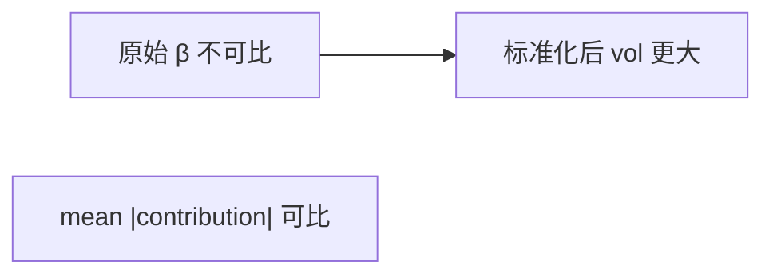

<p align="center"><b>中文</b> &nbsp;&nbsp;·&nbsp;&nbsp; <a href="day-19.en.md">English</a></p>

# 第 19 天 · 未缩放的成交量

[第一阶段 · 模型](README.md) · [排版规范](LESSON_LAYOUT.md) · 可运行

今天的学习要点：原始系数里时间是 1.482253、成交量是 1.731932e-06，两者的平均绝对贡献却是 4.4468 和 4.3645，标准化之后时间是 2.7049、成交量是 4.7815；成交量那个很小的原始系数是股数单位造成的错觉，不是把成交量丢掉的证据。

## 费曼法讲解

> **结论先行**：raw β_time=1.482253、β_vol=1.73e−6，但 mean|贡献|≈4.45 vs 4.36；标准化后 2.7049 vs 4.7815——**单位尺度误导系数大小**，不是 volume 无关。



双因子线性结构：time 与 volume **量纲不同**。原始 β_vol 极小因股数单位；**平均绝对贡献** 4.3645 与 time 4.4468 同量级——应读 contribution 而非 raw β。

标准化后 β_vol=4.7815 > β_time=2.7049——**尺度对齐后排序变**。生产 pipeline 须在 fit 前 declare **scaling policy**（train-only std，第 33 天）。

误用：因 1e−6 丢弃 volume 特征；不做 scaling 比较系数。

## 核心知识

### 脚本输出（与下方 `text` 块一致）

[`unscaled.py`](../../days/19-unscaled-volume/unscaled.py)：

```text
raw beta time = 1.482253
raw beta volume = 1.731932e-06
mean |time contribution| = 4.4468
mean |volume contribution| = 4.3645
standardized beta time = 2.7049
standardized beta volume = 4.7815
```

正文表与公式只解释 text 块；小数须与块内同行可对齐。

## 拓展领域

**Implementation**：sklearn StandardScaler on train。**风险**：用 full-sample std 泄漏。

**Closing**：4.7815 vs 2.7049 是 **标准化合同下** 的结论；raw 行只说明单位。

**单位与贡献.** raw β_time=1.482253，β_volume=1.731932e−06；mean |contribution| 4.4468 vs 4.3645 **同量级**——小系数是 **股数单位**，不是 volume 无关。

**标准化后.** standardized β_time=2.7049，β_volume=4.7815—— **尺度可比后 volume 斜率更大**。第 33 天 train-only scale；本课两点对比 raw vs standardized。

**勿删 volume.** 因 raw β 小就 drop 列是错误推理。代码：`StandardScaler` 在多元回归前必 fit train。

**因子发布.** 对外报告 standardized β 或 SHAP；raw 系数需带单位字符串。

## 实战总结

```bash
python days/19-unscaled-volume/unscaled.py
```

核对：四行 beta/contribution；standardized 两行。