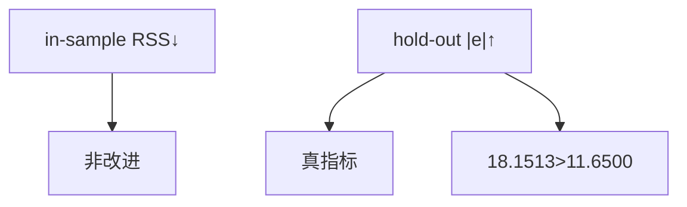
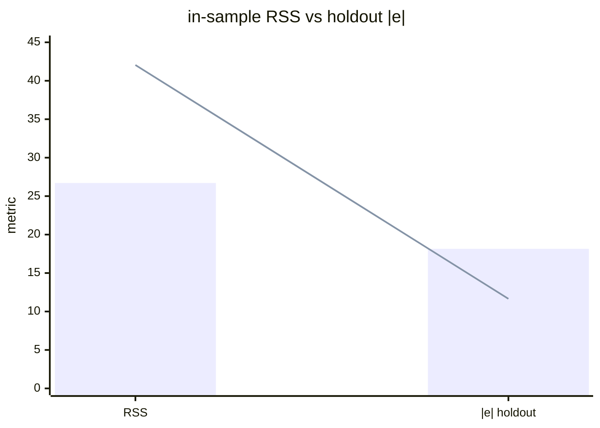

<p align="center"><b>中文</b> &nbsp;&nbsp;·&nbsp;&nbsp; <a href="day-20.en.md">English</a></p>

# 第 20 天 · 噪声列

[第一阶段 · 模型](README.md) · [排版规范](LESSON_LAYOUT.md) · 可运行

今天的学习要点：噪声用事先固定的种子 0，在 t = 1..4 上拟合、在 t = 5 上评分，样本内残差平方和从 42.0500 降到 26.7061，留出绝对误差从 11.6500 升到 18.1513，样本内的下降不是改进。

## 费曼法讲解

> **结论先行**：t=1..4 fit、t=5 score：无噪声 RSS=42.05→有噪声 26.7061，但 hold-out |e| 11.65→18.1513——**in-sample 下降不是改进**。



第 7 天 hold-out 结构：四日 fit、第五日 exam。加 **固定种子噪声列**（脚本）后，in-sample RSS 从 42.0500 降到 26.7061——拟合更贴训练行。但 hold-out 绝对误差 11.6500→18.1513 **恶化**。

经典 **过拟合/泄漏味道**：额外自由度吸收训练噪声，损害 exam。脚本结论句：`the in-sample drop is not an improvement`。

seed 固定保证可复现；换 seed 方向应同类（除非噪声正交巧合）。**特征数↑ 必看 OOS**，单看 train RSS 是 red flag。

## 核心知识

### 脚本输出（与下方 `text` 块一致）

[`noise.py`](../../days/20-noise-column/noise.py)：

```text
fit on t=1..4, score on t=5
in-sample RSS without noise = 42.0500
in-sample RSS with noise = 26.7061
holdout absolute error without noise = 11.6500
holdout absolute error with noise = 18.1513
the in-sample drop is not an improvement
```



正文表与公式只解释 text 块；小数须与块内同行可对齐。

## 拓展领域

**模型选择**：AIC/BIC 惩罚 in-sample；ML 看 validation。**泄漏**：噪声若含 future 会更糟（第 98 天 patch leak）。

**生产**：auto feature gen 必 monitor hold-out；**Closing**：26.7061 与 18.1513 须 **同屏**，42.05 与 11.65 为 without-noise 对照。

**噪声列与留出.** t=1..4 fit，t=5 score；无噪声 in-sample RSS 42.05→有噪声 26.7061，hold-out |e| 11.65→18.1513。脚本结论：`the in-sample drop is not an improvement`。

**过拟合初等图.** 额外自由度吸收训练噪声，损害 exam。seed=0 固定可复现；换 seed 方向应同类。

**与第 7 天同构.** 同一 hold-out 行；本日加 **合法但有害** 的噪声特征。非法 future 列（第 28–29 天）性质更糟。

**模型选择.** 看 hold-out 或 walk-forward，不单看 train RSS。Auto feature gen 必 monitor OOS。

**AIC 思想.** in-sample 下降可伴随参数增；本课无显式参数计数，但 **列数↑ 必看 exam**。

## 实战总结

```bash
python days/20-noise-column/noise.py
```

核对：四行 RSS/|e|；`the in-sample drop is not an improvement`。