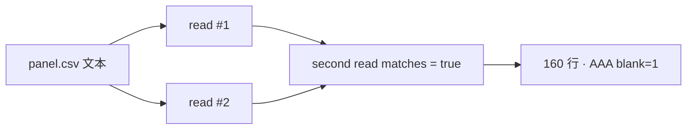

<p align="center"><b>中文</b> &nbsp;&nbsp;·&nbsp;&nbsp; <a href="day-21.en.md">English</a></p>

# 第 21 天 · 固定收盘表

[第一阶段 · 模型](README.md) · [排版规范](LESSON_LAYOUT.md) · 可运行

今天的学习要点：冻结面板 `days/data/panel.csv`：160 行、AAA 日期 2024-01-02..2024-04-23、AAA 空收盘 1 格；`second read matches = true` 证明文本未换；`the table is not resampled` 排除运行时重抽样。

## 费曼法讲解

> **结论先行**：`rows = 160` 与 `AAA blank closes = 1` 是 **数据身份合同**，不是模型分数；`second read matches = true` 比较的是 **文件字节**，不是 parse 后的浮点字典。

第 20 天仍在五点玩具上讨论噪声列与留出；从本日起，所有后续 stdout 都绑定 **同一份** `days/data/panel.csv`。脚本只做两次 `read_text()` 并比较字符串相等，因此 CI 可以把「面板被意外替换」做成 **smoke test**。AAA 与 BBB 各 80 行，日期对齐到 2024-04-23；今天 **不** 做 lag、不填 blank close，只计数 `AAA blank closes = 1`。

NaN 与 NaN 在 Python 里不相等——若把空单元格 parse 成 float 再比 dict，同一路径可能被误报为「变了」。McCrary（2008）强调可复现管道；本课用 **text match** 作为最小 integrity 检查。Wickham（2014）的 tidy 语义要求「变量含义稳定」；这里稳定的是 **path + 行数 + 日期端点**。

`the table is not resampled` 声明运行时 **不** 抽子样本：每次运行读全表 160 行。这与 bootstrap 或 walk-forward 重抽样不同；后者在第 26–27 天讨论 **行掩码**，不是换 CSV。改 Git 里的 panel 文本等于 **改题**，第 22 天的 36/77、第 23 天的 11 events 都会跟着变。

BBB 同行数但本日规则只报 AAA 空位；第 37 天才会 pooled。前 20 天五点 2.1…10.4 仍留在早期公式里，**不得**与 panel 混算。审计时写清：identity 三角（160、2024-04-23、blank=1）+ text match + not resampled。



## 核心知识

### 脚本输出（与下方 `text` 块一致）

[`fixed_table.py`](../../days/21-fixed-table/fixed_table.py)：

```text
path = days/data/panel.csv
rows = 160
second read matches = true
AAA dates 2024-01-02 .. 2024-04-23
AAA blank closes = 1
the table is not resampled
```

| 键 | 值 | 审计含义 |
|:---|:---|:---|
| rows | 160 | 全表行数，非有效差分行 |
| AAA blank closes | 1 | 缺失 close，不本日填充 |
| second read matches | true | 字节级一致 |

Git 修改 `panel.csv` 后须重跑第 21–99 天 verify 中依赖 panel 的脚本。

## 拓展领域

**Frozen artifact 与版本 bump.** 第 21 天不估计任何参数；stdout 是 **数据集身份证**。`path = days/data/panel.csv` 与 `rows = 160` 把后续 22–99 天的分母锁在同一文件上。研究环境若 silently 替换 CSV，36/77、11 events、0.5417 等数字会整体漂移而 commit message 仍写「调参」——这是 quant dev 最昂贵的 silent bug。应像 pin 依赖一样 pin 数据：Git tag、DVC hash，或 internal artifact registry。

**Text match 而非 float dict.** `second read matches = true` 比较的是 **两次 read_text() 的字符串相等**，刻意绕过 parse 后 NaN≠NaN 的伪差异。工程上若只做 `pd.read_csv` 后 `equals()`，可能漏掉 dtype 或空白差异；本课选择最保守的 **字节合同**。扩展至 parquet 时，仍应存 **content hash** 并在 CI smoke 中比对。

**AAA blank closes = 1.** 本日 **不计** 填法、不删行；只声明存在一格空 close（与第 34 天 `blank date = 2024-02-01` 同源）。任何 lag/return 管道必须先 `_complete` 或显式 imputation policy；否则 diff 链在 blank 处断裂，hits 分母会神秘地变成 77 而非 80。

**not resampled 与 bootstrap 的边界.** `the table is not resampled` 声明脚本 **不** 在运行时抽子样本。第 26–27 天的 train mask 是 **行掩码**，不是换表；第 21 天若增删行，属于 **换题** 而非 resample。Walk-forward 研究者应把「换 CSV」与「换 mask」写进 memo 不同小节。

**Senior 交付.** 本课合格交付 = 终端七行零 diff + 三句 estimand（对象=panel 文本、评分=identity 键、泄漏=无模型）。PM 若问 alpha，回答：今日无 alpha，只有 **数据是否被换**。

**数值与复现.** 在仓库根目录运行当日脚本；`panel.csv` 与 `numpy==1.24.4` 为默认合同。正文 ```text``` 块须与终端 stdout **逐行零 diff**；改数据或 `fmt` 时同一 commit 更新 golden 与 md。

**全季衔接.** 第 1–20 天：五点 toy 与 OLS/损失/hold-out 语言；第 21 天起：冻结 panel。两套数字 **不可混表**（例如斜率 3.27 与 accuracy 0.4675 无直接比较关系）。第 41 天起模型复杂度上升；第 51 天 lag-5；第 58 年切；第 71 天 bill/direction 分轨——**信息集合同** 全季不变。

**文献锚（非虚构，只作机制分类）.** Campbell, Lo & MacKinlay (1997)；Harvey, Liu & Zhu (2016)；Lopez de Prado (2018)；Little & Rubin (2002)；Hasbrouck (2007)。不得把教科书结论偷换为「本 panel 显著」——本段多数课 **无** 显著性检验 stdout。

**代码审查五问（panel 段）.** 特征在决策时刻是否可见；标准化是否只用训练段矩；train/test 是否按 date/name 分组；metrics 是否诚实区分 in-sample 与 hold-out；FORBIDDEN 行是否仍打印。缺任一条，spec 不完整。

**手算与 CI.** 任取 stdout 一行在 REPL 复算；`verify_season01_docs.py --day N` 为合并必要条件。改 `panel.csv` 须重跑依赖该面板的 golden 日。

## 实战总结

```bash
python days/21-fixed-table/fixed_table.py
```

核对：将终端 stdout 与上文 ```text``` 块逐行 diff；中文叙述中的小数位与键名空格须与英文输出一致。本课机制见 [`fixed_table.py`](../../days/21-fixed-table/fixed_table.py)；改 panel 或切分参数时同步更新 golden 块并跑 `python3 scripts/verify_season01_docs.py --day 21`。
