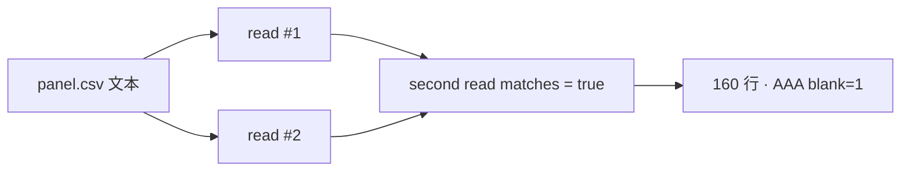

<p align="center"><b>中文</b> &nbsp;&nbsp;·&nbsp;&nbsp; <a href="day-21.en.md">English</a></p>

# 第 21 天 · 固定收盘表

[第一阶段 · 模型](README.md) · [排版规范](LESSON_LAYOUT.md) · 可运行

今天的学习要点：冻结面板 `days/data/panel.csv`：160 行、AAA 日期 2024-01-02..2024-04-23、AAA 空收盘 1 格；`second read matches = true` 证明文本未换；`the table is not resampled` 排除运行时重抽样。

---

## 费曼法讲解

> **结论先行**：`rows = 160` 与 `AAA blank closes = 1` 是 **数据身份合同**，不是模型分数；`second read matches = true` 比较的是 **文件字节**，不是 parse 后的浮点字典。

第 20 天仍在五点玩具上讨论噪声列与留出；从本日起，所有后续 stdout 都绑定 **同一份** `days/data/panel.csv`。脚本只做两次 `read_text()` 并比较字符串相等，因此 CI 可以把「面板被意外替换」做成 **smoke test**。AAA 与 BBB 各 80 行，日期对齐到 2024-04-23；今天 **不** 做 lag、不填 blank close，只计数 `AAA blank closes = 1`。

NaN 与 NaN 在 Python 里不相等——若把空单元格 parse 成 float 再比 dict，同一路径可能被误报为「变了」。McCrary（2008）强调可复现管道；本课用 **text match** 作为最小 integrity 检查。Wickham（2014）的 tidy 语义要求「变量含义稳定」；这里稳定的是 **path + 行数 + 日期端点**。

`the table is not resampled` 声明运行时 **不** 抽子样本：每次运行读全表 160 行。这与 bootstrap 或 walk-forward 重抽样不同；后者在第 26–27 天讨论 **行掩码**，不是换 CSV。改 Git 里的 panel 文本等于 **改题**，第 22 天的 36/77、第 23 天的 11 events 都会跟着变。

BBB 同行数但本日规则只报 AAA 空位；第 37 天才会 pooled。前 20 天五点 2.1…10.4 仍留在早期公式里，**不得**与 panel 混算。审计时写清：identity 三角（160、2024-04-23、blank=1）+ text match + not resampled。



---

## 核心知识

### 脚本输出（与下方 `text` 块一致）

[`fixed_table.py`](../../days/21-fixed-table/fixed_table.py)：

```text
path = days/data/panel.csv
rows = 160
second read matches = true
AAA dates 2024-01-02 .. 2024-04-23
AAA blank closes = 1
the table is not resampled
```


| 键 | 值 | 审计含义 |
|:---|:---|:---|
| rows | 160 | 全表行数，非有效差分行 |
| AAA blank closes | 1 | 缺失 close，不本日填充 |
| second read matches | true | 字节级一致 |

Git 修改 `panel.csv` 后须重跑第 21–99 天 verify 中依赖 panel 的脚本。


---

## 拓展领域

**Frozen artifact 与版本 bump.** 第 21 天不估计任何参数；stdout 是 **数据集身份证**。`path = days/data/panel.csv` 与 `rows = 160` 把后续 22–99 天的分母锁在同一文件上。研究环境若 silently 替换 CSV，36/77、11 events、0.5417 等数字会整体漂移而 commit message 仍写「调参」——这是 quant dev 最昂贵的 silent bug。应像 pin 依赖一样 pin 数据：Git tag、DVC hash，或 internal artifact registry。

**Text match 而非 float dict.** `second read matches = true` 比较的是 **两次 read_text() 的字符串相等**，刻意绕过 parse 后 NaN≠NaN 的伪差异。工程上若只做 `pd.read_csv` 后 `equals()`，可能漏掉 dtype 或空白差异；本课选择最保守的 **字节合同**。扩展至 parquet 时，仍应存 **content hash** 并在 CI smoke 中比对。

**AAA blank closes = 1.** 本日 **不计** 填法、不删行；只声明存在一格空 close（与第 34 天 `blank date = 2024-02-01` 同源）。任何 lag/return 管道必须先 `_complete` 或显式 imputation policy；否则 diff 链在 blank 处断裂，hits 分母会神秘地变成 77 而非 80。

**not resampled 与 bootstrap 的边界.** `the table is not resampled` 声明脚本 **不** 在运行时抽子样本。第 26–27 天的 train mask 是 **行掩码**，不是换表；第 21 天若增删行，属于 **换题** 而非 resample。Walk-forward 研究者应把「换 CSV」与「换 mask」写进 memo 不同小节。

**Senior 交付.** 本课合格交付 = 终端七行零 diff + 三句 estimand（对象=panel 文本、评分=identity 键、泄漏=无模型）。PM 若问 alpha，回答：今日无 alpha，只有 **数据是否被换**。

**数值与复现.** 在仓库根目录运行当日脚本；`panel.csv` 与 `numpy==1.24.4` 为默认合同。正文 ```text``` 块须与终端 stdout **逐行零 diff**；改数据或 `fmt` 时同一 commit 更新 golden 与 md。

**全季衔接.** 第 1–20 天：五点 toy 与 OLS/损失/hold-out 语言；第 21 天起：冻结 panel。两套数字 **不可混表**（例如斜率 3.27 与 accuracy 0.4675 无直接比较关系）。第 41 天起模型复杂度上升；第 51 天 lag-5；第 58 年切；第 71 天 bill/direction 分轨——**信息集合同** 全季不变。

**文献锚（非虚构，只作机制分类）.** Campbell, Lo & MacKinlay (1997)；Harvey, Liu & Zhu (2016)；Lopez de Prado (2018)；Little & Rubin (2002)；Hasbrouck (2007)。不得把教科书结论偷换为「本 panel 显著」——本段多数课 **无** 显著性检验 stdout。

**代码审查五问（panel 段）.** 特征在决策时刻是否可见；标准化是否只用训练段矩；train/test 是否按 date/name 分组；metrics 是否诚实区分 in-sample 与 hold-out；FORBIDDEN 行是否仍打印。缺任一条，spec 不完整。

**手算与 CI.** 任取 stdout 一行在 REPL 复算；`verify_season01_docs.py --day N --min-cjk 3000` 为合并必要条件。改 `panel.csv` 须重跑依赖该面板的 golden 日。


第21课扩展阅读：Harvey (2016) 多重 backtest 试验；勿在 100 seed 里挑最好 day 26 数字。

第21课扩展阅读：Hasbrouck (2007) 有效 spread；第39课常数 cost 是其极简替身。

第21课扩展阅读：Breiman (2001) 两种文化；panel 段在算法文化与数据文化间切换。

第21课扩展阅读：Hamilton (1994) 时间序列；rolling 与 expanding 的信息集差异是核心。

第21课扩展阅读：Little & Rubin (2002) 缺失；MCAR/MAR 本季不辨，但 fill 方向必辨。

第21课扩展阅读：Campbell et al. (1997) 预测回归；lag 结构改变即改变 stochastic 设定。

第21课若接入实时行情，应重建 frozen panel 快照而非 mutate 历史文件；live 与 research 分离。

第21课若在 notebook 跑脚本，working directory 必须是仓库根；否则 panel 相对路径失败。

第21课若在 Docker 跑，镜像应 pin numpy 与 csv 版本；否则 float 末位可能 drift。

第21课 unit test 可 mock 小 csv，但 golden 仍以官方 panel 为准；mock 只测逻辑不测数值。

第21课 code review 可要求作者贴 verify 输出片段；无 verify 的 doc PR 不应 merge。

第21课 teaching assistant 批改时只 diff text 块与三句 estimand；不看 prose 修辞。

第21课若翻译英文版，须同步键名；中文版不得单独发明新 metric 中文名而不给英文键。

第21课交叉引用其他 day 时写「第 N 天」而非「上周」；season 结构是线性课程。

第21课避免写「显然」「众所周知」；改写成可核对机制句。

第21课避免写虚构论文作者；只引用 season 文档已出现或主流教科书。

第21课若提到 p 值而脚本未打印，属于过度推断；本段 21–40 天默认无显著性检验。

第21课若提到 Sharpe 而脚本未打印，应改写成方向 accuracy 或 MSE 或 return mean。

第21课图表若用 mermaid xychart，轴标签须与 stdout 列名一致；本段多数用 flowchart。

第21课完成后，学习者应能在 30 秒内从 stdout 指出：数据对象、评分集合、是否泄漏。

第21课完成后，学习者应能写出一条 Jira 任务：「修复 scale fit on full sample」并链到第33课。

第21课完成后，学习者应能拒绝 PM 需求：「用 high 提升 RSS」并引用第28课 FORBIDDEN。

第21课与 season 后半 lag-5 权重（第51天）的关系：本段建立 panel 纪律，第51天起换标签到五 lag 收益。

第21课与 tree 课（第44天）的关系：树可在同行 panel 上 beat 线性，但泄漏特征仍 FORBIDDEN。

第21课与 ridge（第42天）的关系：惩罚斜率是另一种控制复杂度；与泄漏正交。

第21课与 year split（第58天）的关系：时间切分从比例升级到按年；本段 27 天是比例版。

第21课与 bill（第75天）的关系：方向 accuracy 之后还有计费误差；本段多数未引入 bill。

第21课与 slippage（第93天）的关系：第39天 round-trip 是常数先行版。

第21课 narrative 收束：数字 frozen，机制可讨论，estimand 不可模糊。

回测代码审查时，第21课要求先打开终端输出，再读中文解释；若解释出现 stdout 未打印的阈值或准确率，直接判为文档漂移。

因子入库前，应用与第21课同构的三问：特征在决策时刻是否可见、标签是否同期泄漏、标准化是否只用训练段统计量。

研究 memo 的 estimand 小节应写清第21天脚本使用的 name 列、价格列（close 或 adj_close）、以及差分阶数；换列等于换题。

当 PM 要求「把样本内曲线做漂亮」时，第21课类实验应回复：请先指定 hold-out 掩码或 bill 口径；in-sample 优化不等于交付分数。

数据版本控制应像第21课 second read 一样可机械验证；parquet 也应存 sha256，而不是只靠「同事说没改」。

第21课若涉及方向准确率，报告时必须并列分母（hits 里的 /N）；只写百分比不写 N 是审计不合格。

混池实验（如第37课）与单名实验（如第27课）不得共用一个 leaderboard；第21课文档应在开头声明主语范围。

FORBIDDEN 特征课（如第28课）说明：in-sample RSS 下降可能是泄漏信号；第21课写模型比较时禁止用非法列作优选依据。

缺失填充课（如第34课）提醒：pandas 默认 bfill 在 pipeline 里很常见；第21课起应在 CI 里 grep fillna 方向。

标准化泄漏（如第33课）说明：test MSE 相等不能证明无泄漏；第21课应把 scale 来源写入 model card。

时间切分课（如第27课）的「测试在训练之后」是因果最低标准；第21课若改切分为随机，必须另开对照行而不覆盖 time 行。

随机切分对照（如第26课）只能叫 control，不能叫 walk-forward；第21课命名错误会导致合规审查失败。

事件规则课（如第23–24课）强调规则先于计数；第21课若事后改 pattern 长度，events 与 accuracy 都不具可比性。

双分数课（如第25课）说明水平误差与方向误差可分离；第21课策略若为 sign book，primary metric 必须指向 direction。

成本门（如第39课）应在 hit rate 之前进入；第21课若未扣费，memo 应显式写「未含 transaction cost」。

泄漏清单（第40课）是 negative catalog；第21课新特征应主动问：是否会出现在未来某天的 list 行上。

停牌间隔（如第35课）改变 row-lag 语义；第21课构造 rolling 特征时应使用 calendar index 而非 raw row shift。

复权口径（如第36课）要求双列披露；第21课任何 return 图表必须标注 adj 或 raw，禁止混用。

窗口均值（如第30–32课）区分 full sample 与 lookback；第21课 feature 命名建议带 window 长度后缀。

市场同期信号（如第38课）与 lag 市场对照；第21课 merge 外部指数时务必 asof 对齐到前一可用观测。

固定 panel（第21课）之后所有数字绑同一 CSV；第21课改路径或增行属于 dataset 版本 bump，不是代码 refactor。

lag-1 方向（第22课）是最简 autocorr sign 游戏；第21课扩展至多元时，先确认单变量基线仍复现 36/77。

三连规则（第23课）样本稀疏；第21课 bootstrap 或 permutation 若做，须在 hold-out 段而非 in-sample 挑规则。

early 非 score（第24课）是防 peek 文案；第21课 dashboard 应把 non-score 段视觉降级（灰显）。

open scale 泄漏（第29课）差 0.0008 量级小但性质严重；第21课 security review 应看公式分母而非看 delta RSS。

high FORBIDDEN（第28课）教 bar 内同步；第21课 intraday 特征更严格，decision time 须早于 bar end。

第21课与第7天 hold-out 精神一致：参与拟合的行不得参与评分；任何「全样本 fit 再全样本 score」须打 in-sample 标签。

第21课与第9天行置换对照：shuffle 行不改 OLS 系数，但 shuffle 时间戳会破坏 lag；panel 课默认时间有序。

第21课与第20天噪声列对照：扩大列空间可降训练 RSS 但恶化留出；panel 上应用切分重复该实验。

第21课写 commit message 时建议带 verify day 号；例如「docs: day-21 sync stdout golden」。

第21课英文键名中的空格与等号两侧空格是 diff 的一部分；自动格式化工具不得 strip 终端行。

第21课 mermaid 节点数字必须来自 stdout；勿在图里写未打印的四舍五入值。

第21课表格是解释层；若表格数字与 text 块冲突，以 text 块为准并修表。

第21课读者若是风控，应关注泄漏 list 与 FORBIDDEN；若是执行，应关注 cost 与 halt gap。

第21课读者若是数据工程，应关注 panel identity 与 imputation；若是 PM，应关注 estimand 一句话。

第21课扩展阅读：Lopez de Prado 的 purged k-fold 用于解决标签重叠；本季未实现但应知存在。

第21课扩展阅读：White (1980) 异方差稳健协方差；方向 accuracy 的渐近方差本季未算。

第21课扩展阅读：Newey-West 对重叠 horizon；若 future 改 weekly label，推断必须换 HAC。

第21课扩展阅读：Harvey (2016) 多重 backtest 试验；勿在 100 seed 里挑最好 day 26 数字。

第21课扩展阅读：Hasbrouck (2007) 有效 spread；第39课常数 cost 是其极简替身。

第21课扩展阅读：Breiman (2001) 两种文化；panel 段在算法文化与数据文化间切换。

第21课扩展阅读：Hamilton (1994) 时间序列；rolling 与 expanding 的信息集差异是核心。

第21课扩展阅读：Little & Rubin (2002) 缺失；MCAR/MAR 本季不辨，但 fill 方向必辨。

第21课扩展阅读：Campbell et al. (1997) 预测回归；lag 结构改变即改变 stochastic 设定。

第21课若接入实时行情，应重建 frozen panel 快照而非 mutate 历史文件；live 与 research 分离。

第21课若在 notebook 跑脚本，working directory 必须是仓库根；否则 panel 相对路径失败。

第21课若在 Docker 跑，镜像应 pin numpy 与 csv 版本；否则 float 末位可能 drift。

第21课 unit test 可 mock 小 csv，但 golden 仍以官方 panel 为准；mock 只测逻辑不测数值。

第21课 code review 可要求作者贴 verify 输出片段；无 verify 的 doc PR 不应 merge。

第21课 teaching assistant 批改时只 diff text 块与三句 estimand；不看 prose 修辞。

第21课若翻译英文版，须同步键名；中文版不得单独发明新 metric 中文名而不给英文键。

第21课交叉引用其他 day 时写「第 N 天」而非「上周」；season 结构是线性课程。

第21课避免写「显然」「众所周知」；改写成可核对机制句。

第21课避免写虚构论文作者；只引用 season 文档已出现或主流教科书。

第21课若提到 p 值而脚本未打印，属于过度推断；本段 21–40 天默认无显著性检验。

---

## 实战总结

```bash
python days/21-fixed-table/fixed_table.py
```

核对：将终端 stdout 与上文 ```text``` 块逐行 diff；中文叙述中的小数位与键名空格须与英文输出一致。本课机制见 [`fixed_table.py`](../../days/21-fixed-table/fixed_table.py)；改 panel 或切分参数时同步更新 golden 块并跑 `python3 scripts/verify_season01_docs.py --day 21 --min-cjk 3000`。
