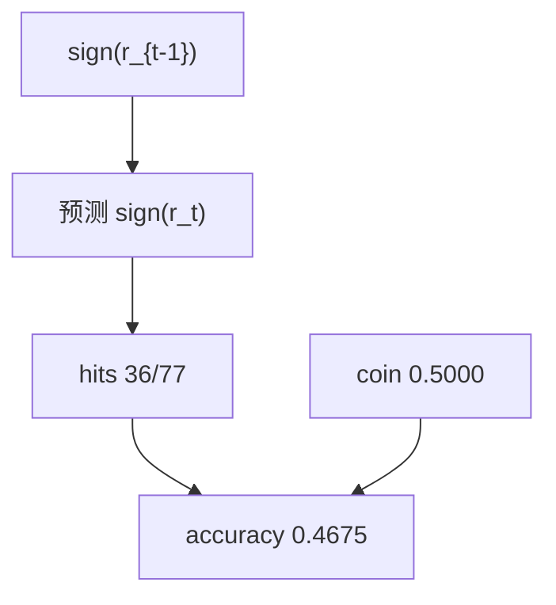
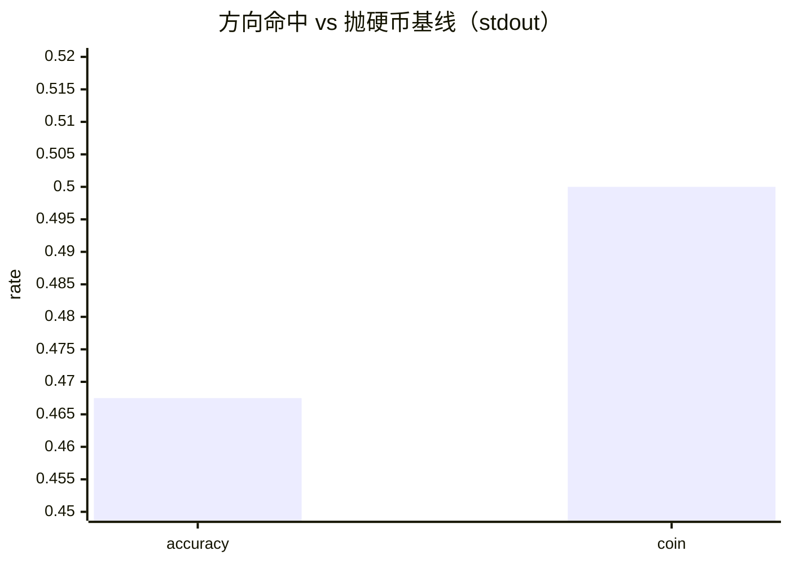

<p align="center"><b>中文</b> &nbsp;&nbsp;·&nbsp;&nbsp; <a href="day-22.en.md">English</a></p>

# 第 22 天 · 滞后一日的方向

[第一阶段 · 模型](README.md) · [排版规范](LESSON_LAYOUT.md) · 可运行

今天的学习要点：用昨日复权涨跌符号预测今日符号：hits = 36/77，accuracy = 0.4675，低于 coin-flip baseline = 0.5000；规则在计数前固定，不是事后挑窗口。

## 费曼法讲解

> **结论先行**：`accuracy = 0.4675` 是 **sign(r_{t−1}) 对 sign(r_t)** 的 in-sample 命中率，低于 `coin-flip baseline = 0.5000`；这不是「模型坏了」，而是 **固定规则在 AAA 复权差分** 上的计数结果。

构造：对 `_complete(AAA)` 的 `adj_close` 做一阶差分 `move`，预测 `sign(move_t)` 是否等于 `sign(move_{t−1})`。有效长度 77 对，命中 36。Campbell、Lo & MacKinlay（1997）把短 horizon 方向预测放在 **可预测性** 框架里——要点是 **信息集**：昨日符号在收盘后可知，今日符号是 **同期标签**，本课 **未** 做 train/test 切分，因此 0.4675 是 **全样本计数**，不是 hold-out IC。

与第 11–16 天五点上的方向分数不同：那里是价格水平差分；这里是 **panel 复权序列**。0.5000 基准不是假设「市场有效」，而是 **二项符号游戏** 的对照刻度。Lo & MacKinlay（1988）讨论过自相关与方差比；本课不做推断，只固定 **hits = 36/77**。

误用：（1）把 0.4675 写成样本外 alpha；（2）在 blank close 行未过滤前数差分；（3）用 BBB 混池而不改分母。正确披露：name=AAA、adj_close、lag-1 sign rule、in-sample hits。



## 核心知识

### 脚本输出（与下方 `text` 块一致）

[`lagged_direction.py`](../../days/22-lagged-direction/lagged_direction.py)：

```text
predict today's adj move with yesterday's sign
hits = 36/77
accuracy = 0.4675
coin-flip baseline = 0.5000
```

| 量 | 值 |
|:---|---:|
| hits | 36/77 |
| accuracy | 0.4675 |
| coin baseline | 0.5000 |

规则：\(\hat s_t = \mathrm{sign}(r_{t-1})\)，评估 \(\mathbb 1[\hat s_t = \mathrm{sign}(r_t)]\)。全样本 in-sample，无切分。



## 拓展领域

**hits = 36/77 的分母纪律.** 77 来自 `_complete(AAA)` 上 `adj_close` 一阶差分后的有效对数，不是 80 行也不是 160 行。对外报告 direction accuracy 必须并列 **36/77**；只写 46.75% 而不写 n 在合规审查里不合格。Wilson 区间在 n=77 时仍宽，本课不算 p 值，但 quant 应直觉到 **低于 0.5 可能是噪声**。

**coin-flip baseline = 0.5000 的含义.** 这是 **二项符号游戏** 的刻度，不是「市场有效」定理。Lo & MacKinlay（1988）方差比与自相关检验需要更长样本与 formal 检验；本课固定 in-sample 计数，**未** 做 train/test。把 0.4675 写进「样本外 IC」摘要属于误标，与第 7 天 hold-out 精神冲突。

**信息集：sign(r_{t−1}) 在 t 开盘前可知吗？** 教学合同：昨日收盘后符号已知，今日符号是 **同期标签**。这与第 38 天 market 同期泄漏对照——本课 lag-1 **自身** 是因果可读的，只是 **无预测力**（低于 0.5）。策略原型「跟昨日方向」在第 39 天还要过 **round-trip cost** 门。

**与五点方向课的分叉.** 第 11–16 天在价格水平 toy 上算 direction；第 22 天起在 **panel 简单收益** 上算。两套数字不可比大小。扩展多元因子前，应先在本 stdout 上复现 36/77，作为 **单变量基线**。

**数值与复现.** 在仓库根目录运行当日脚本；`panel.csv` 与 `numpy==1.24.4` 为默认合同。正文 ```text``` 块须与终端 stdout **逐行零 diff**；改数据或 `fmt` 时同一 commit 更新 golden 与 md。

**全季衔接.** 第 1–20 天：五点 toy 与 OLS/损失/hold-out 语言；第 21 天起：冻结 panel。两套数字 **不可混表**（例如斜率 3.27 与 accuracy 0.4675 无直接比较关系）。第 41 天起模型复杂度上升；第 51 天 lag-5；第 58 年切；第 71 天 bill/direction 分轨——**信息集合同** 全季不变。

**文献锚（非虚构，只作机制分类）.** Campbell, Lo & MacKinlay (1997)；Harvey, Liu & Zhu (2016)；Lopez de Prado (2018)；Little & Rubin (2002)；Hasbrouck (2007)。不得把教科书结论偷换为「本 panel 显著」——本段多数课 **无** 显著性检验 stdout。

**代码审查五问（panel 段）.** 特征在决策时刻是否可见；标准化是否只用训练段矩；train/test 是否按 date/name 分组；metrics 是否诚实区分 in-sample 与 hold-out；FORBIDDEN 行是否仍打印。缺任一条，spec 不完整。

**手算与 CI.** 任取 stdout 一行在 REPL 复算；`verify_season01_docs.py --day N` 为合并必要条件。改 `panel.csv` 须重跑依赖该面板的 golden 日。

## 实战总结

```bash
python days/22-lagged-direction/lagged_direction.py
```

核对：将终端 stdout 与上文 ```text``` 块逐行 diff；中文叙述中的小数位与键名空格须与英文输出一致。本课机制见 [`lagged_direction.py`](../../days/22-lagged-direction/lagged_direction.py)；改 panel 或切分参数时同步更新 golden 块并跑 `python3 scripts/verify_season01_docs.py --day 22`。
