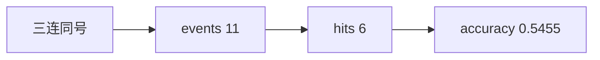

<p align="center"><b>中文</b> &nbsp;&nbsp;·&nbsp;&nbsp; <a href="day-23.en.md">English</a></p>

# 第 23 天 · 连续三日同向

[第一阶段 · 模型](README.md) · [排版规范](LESSON_LAYOUT.md) · 可运行

今天的学习要点：三连同号后押第四日同向：events = 11，hits = 6，accuracy = 0.5455；`the rule is fixed before the count` 锁定规则先于样本量。

## 费曼法讲解

> **结论先行**：`events = 11`、`accuracy = 0.5455` 来自 **固定规则**——三连同号后押第四日同向；`the rule is fixed before the count` 禁止先看 11 再改规则。

扫描 `move` 序列：窗口 `sign(move_{t−3:t−1})` 全相等且非零时，记录 `sign(move_t)` 是否延续。这是 **事件研究** 的最小版本：样本量 11 很小，0.5455 **无** p 值含义。Jegadeesh & Titman（1993）动量与 De Bondt & Thaler（1985）反转在更长样本上讨论；本课只教 **条件触发计数** 与 **规则冻结**。

与第 22 天无条件 lag-1 符号对比：本日 **稀疏触发**（11 次），命中率可高于 0.4675，但 **方差更大**。写 memo 须并列 events 与 accuracy，不能只报 0.5455。规则若改成「两连」或「四连」，events 与分数都变——属于 **estimand 变更**，不是调参。

生产映射：形态识别策略常犯 **multiple testing**；本课 11 事件是提醒 **小 n 下 accuracy 不稳定**。第 24 天把 cut 移到 2024-02-28 后，early 段 8 事件 accuracy 0.5000 **不是 score**，避免 **peek** 后挑段。



## 核心知识

### 脚本输出（与下方 `text` 块一致）

[`three_day_run.py`](../../days/23-three-day-run/three_day_run.py)：

```text
rule = after three equal signs, predict the fourth matches
events = 11
hits = 6
accuracy = 0.5455
the rule is fixed before the count
```

| 量 | 值 |
|:---|---:|
| events | 11 |
| hits | 6 |
| accuracy | 0.5455 |

规则冻结句 `the rule is fixed before the count` 与 events 计数绑定；改 pattern 长度等于换 estimand。

## 拓展领域

**events = 11 的稀疏性.** 三连同号规则在 AAA 全样本只触发 11 次；`accuracy = 0.5455` 的方差极大，不能 star 标注。`the rule is fixed before the count` 是 **legal 句**：禁止先看 11 再改 pattern 长度。Jegadeesh–Titman 动量用月频长窗；本课是 **事件触发计数** 玩具，只教 **规则冻结** 与 **条件样本**。

**与第 22 天无条件 lag-1 对照.** 0.5455 高于 0.4675 但 events≪77；memo 必须 **并列 events**。Multiple testing：若扫描 2/3/4/5 连规则，应多重检验校正——本季不做，但 senior 应知 **挑选规则 = 换 estimand**。

**实现 replay.** 循环从 i=3 起，窗口 `sign(move[i-3:i])` 全等且非零才计数。Code review 应确认 **无 future sign 参与 threshold 选择**。第 24 天在同一规则上切 early/later。
**数值与复现.** 在仓库根目录运行当日脚本；`panel.csv` 与 `numpy==1.24.4` 为默认合同。正文 ```text``` 块须与终端 stdout **逐行零 diff**；改数据或 `fmt` 时同一 commit 更新 golden 与 md。

**全季衔接.** 第 1–20 天：五点 toy 与 OLS/损失/hold-out 语言；第 21 天起：冻结 panel。两套数字 **不可混表**（例如斜率 3.27 与 accuracy 0.4675 无直接比较关系）。第 41 天起模型复杂度上升；第 51 天 lag-5；第 58 年切；第 71 天 bill/direction 分轨——**信息集合同** 全季不变。

**文献锚（非虚构，只作机制分类）.** Campbell, Lo & MacKinlay (1997)；Harvey, Liu & Zhu (2016)；Lopez de Prado (2018)；Little & Rubin (2002)；Hasbrouck (2007)。不得把教科书结论偷换为「本 panel 显著」——本段多数课 **无** 显著性检验 stdout。

**代码审查五问（panel 段）.** 特征在决策时刻是否可见；标准化是否只用训练段矩；train/test 是否按 date/name 分组；metrics 是否诚实区分 in-sample 与 hold-out；FORBIDDEN 行是否仍打印。缺任一条，spec 不完整。

**手算与 CI.** 任取 stdout 一行在 REPL 复算；`verify_season01_docs.py --day N` 为合并必要条件。改 `panel.csv` 须重跑依赖该面板的 golden 日。

## 实战总结

```bash
python days/23-three-day-run/three_day_run.py
```

核对：将终端 stdout 与上文 ```text``` 块逐行 diff；中文叙述中的小数位与键名空格须与英文输出一致。本课机制见 [`three_day_run.py`](../../days/23-three-day-run/three_day_run.py)；改 panel 或切分参数时同步更新 golden 块并跑 `python3 scripts/verify_season01_docs.py --day 23`。
