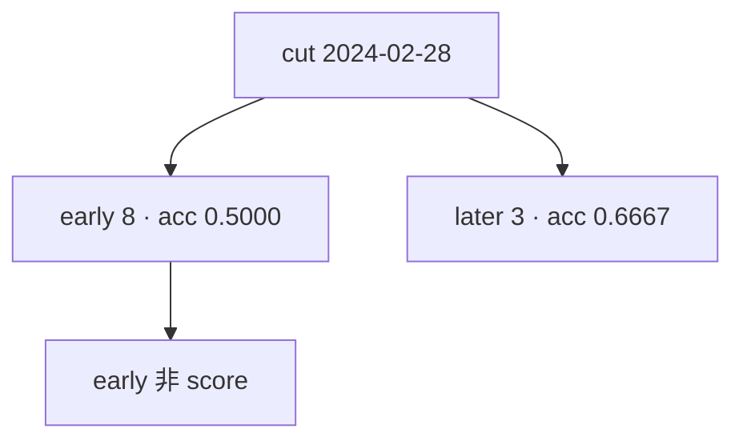

<p align="center"><b>中文</b> &nbsp;&nbsp;·&nbsp;&nbsp; <a href="day-24.en.md">English</a></p>

# 第 24 天 · 规则移到下一段

[第一阶段 · 模型](README.md) · [排版规范](LESSON_LAYOUT.md) · 可运行

今天的学习要点：cut date = 2024-02-28：early events = 8、accuracy = 0.5000 不是成绩；later events = 3、accuracy = 0.6667 才是下一段样本上的计数。

## 费曼法讲解

> **结论先行**：`cut date = 2024-02-28` 把三连规则切成 early / later；`early accuracy is not the score` 明确 **前段 0.5000 不得当成绩**，后段 `later events = 3`、`accuracy = 0.6667` 才是 **下一段** 上的计数。

这是 **时间顺序上的 hold-out 思想** 在事件规则上的最小应用：先在 early 窗口看表现，但 **分数写在 later**。与第 7 天「t=5 不参与 fit」同族： **信息集边界** 决定什么能进分母分子。0.6667 来自 3 次事件中的 2 次命中（由脚本计数），不是整段 80 日 accuracy。

误读：把 early 0.5000 与 later 0.6667 平均成「整体改进」；或把 6667 写成 **显著 beat 50%**。正确做法：分别报告 events、accuracy，并声明 score 标签在 stdout 的 `early accuracy is not the score`。

第 27 天时间切分会在 **回归掩码** 上并排 0.5417 与 0.4583；本日仍是 **规则计数**，但强调 **哪一段算分**。walk-forward 研究里，**先定 cut 再跑** 与 **看完 early 再移 cut** 是不同合同——stdout 用英文句锁定前者。



## 核心知识

### 脚本输出（与下方 `text` 块一致）

[`next_stretch.py`](../../days/24-next-stretch/next_stretch.py)：

```text
cut date = 2024-02-28
early events = 8 accuracy = 0.5000
early accuracy is not the score
later events = 3 accuracy = 0.6667
```

| 段 | events | accuracy | 是否 score |
|:---|---:|---:|:---|
| early（≤ cut） | 8 | 0.5000 | 否 |
| later（> cut） | 3 | 0.6667 | 是（下一段计数） |

`cut date = 2024-02-28`；`early accuracy is not the score` 为 legal 句，dashboard 须灰显 early。

## 拓展领域

**early accuracy is not the score.** `cut date = 2024-02-28` 把事件按 **第四日日期** 分 early/later。early 8 次 accuracy 0.5000 **不得** 进 KPI；later 3 次 0.6667 才是 **下一段** 上的计数（n 极小，仍不推断）。Dashboard 应灰显 early，避免 **peek 后挑段**。

**与第 7 天 hold-out 同族.** 信息集边界决定分子分母；「看过 early 再报 later」若伴随 **改规则** 仍是泄漏。Walk-forward 应 **先定 cut** 再跑；stdout 英文句锁定合同。

**3 events 警告.** later 段 n=3 时 0.6667 无稳健性；教学点是 **段标签** 而非点估计显著。
**数值与复现.** 在仓库根目录运行当日脚本；`panel.csv` 与 `numpy==1.24.4` 为默认合同。正文 ```text``` 块须与终端 stdout **逐行零 diff**；改数据或 `fmt` 时同一 commit 更新 golden 与 md。

**全季衔接.** 第 1–20 天：五点 toy 与 OLS/损失/hold-out 语言；第 21 天起：冻结 panel。两套数字 **不可混表**（例如斜率 3.27 与 accuracy 0.4675 无直接比较关系）。第 41 天起模型复杂度上升；第 51 天 lag-5；第 58 年切；第 71 天 bill/direction 分轨——**信息集合同** 全季不变。

**文献锚（非虚构，只作机制分类）.** Campbell, Lo & MacKinlay (1997)；Harvey, Liu & Zhu (2016)；Lopez de Prado (2018)；Little & Rubin (2002)；Hasbrouck (2007)。不得把教科书结论偷换为「本 panel 显著」——本段多数课 **无** 显著性检验 stdout。

**代码审查五问（panel 段）.** 特征在决策时刻是否可见；标准化是否只用训练段矩；train/test 是否按 date/name 分组；metrics 是否诚实区分 in-sample 与 hold-out；FORBIDDEN 行是否仍打印。缺任一条，spec 不完整。

**手算与 CI.** 任取 stdout 一行在 REPL 复算；`verify_season01_docs.py --day N` 为合并必要条件。改 `panel.csv` 须重跑依赖该面板的 golden 日。

## 实战总结

```bash
python days/24-next-stretch/next_stretch.py
```

核对：将终端 stdout 与上文 ```text``` 块逐行 diff；中文叙述中的小数位与键名空格须与英文输出一致。本课机制见 [`next_stretch.py`](../../days/24-next-stretch/next_stretch.py)；改 panel 或切分参数时同步更新 golden 块并跑 `python3 scripts/verify_season01_docs.py --day 24`。
