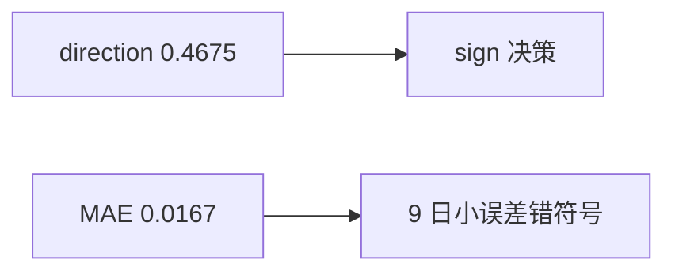

<p align="center"><b>中文</b> &nbsp;&nbsp;·&nbsp;&nbsp; <a href="day-25.en.md">English</a></p>

# 第 25 天 · 方向与价格并报

[第一阶段 · 模型](README.md) · [排版规范](LESSON_LAYOUT.md) · 可运行

今天的学习要点：lag-1 收益预测：direction accuracy = 0.4675，mean absolute return error = 0.0167；`days with a small price error and the wrong sign = 9` 说明水平误差小不等于方向对；sign 决策应信 direction accuracy。

## 费曼法讲解

> **结论先行**：`direction accuracy = 0.4675` 与 `mean absolute return error = 0.0167` 是 **同一 lag-1 线性预测** 的两个评分；`days with a small price error and the wrong sign = 9` 证明 **水平准 ≠ 方向对**；sign 决策应信 direction accuracy。

特征：昨日简单收益；标签：今日简单收益。OLS 给出水平预测，再算 MAE 与 sign 命中。9 天满足「价格误差小但符号错」——对 **多空开关** 策略，这 9 天是 **假安全** 日。Christoffersen & Diebold（1997）区分水平与方向预测；本课用打印数字固定 **estimand 并列**。

0.0167 的 MAE 在百分之一量级收益上看似「贴价」，但 direction 仍低于 0.5。PM 若只看 RMSE/MAE 会误选 **水平优** 模型做方向 trade。代码审查：metrics 模块是否同时 export `direction_accuracy` 与 `mae`？

与第 10–11 天五点方向分数对照：那里无 panel、无 lag 收益。本课起 **双分数合同** 延续到第 71 天 bill 与 direction 分轨。报告时 **for a sign decision, trust the direction accuracy** 是 stdout 给的工程指令，不是修辞。



## 核心知识

### 脚本输出（与下方 `text` 块一致）

[`two_scores.py`](../../days/25-two-scores/two_scores.py)：

```text
lag-1 return forecast
direction accuracy = 0.4675
mean absolute return error = 0.0167
days with a small price error and the wrong sign = 9
for a sign decision, trust the direction accuracy
```

| 指标 | 值 | 决策含义 |
|:---|---:|:---|
| direction accuracy | 0.4675 | sign book 主指标 |
| mean abs return error | 0.0167 | 水平贴价，非方向 |
| small error, wrong sign | 9 | 假安全日计数 |

stdout 末行 `for a sign decision, trust the direction accuracy` 为工程裁决，不是修辞。

## 拓展领域

**双分数合同.** `direction accuracy = 0.4675` 与 `mean absolute return error = 0.0167` 来自 **同一 lag-1 水平预测**。`days with a small price error and the wrong sign = 9` 标识 **水平贴价但符号错** 的交易日——对 sign book 是「假安全」。Christoffersen–Diebold 区分水平与方向；PM 若只看 MAE 会误选模型。

**stdout 末行裁决.** `for a sign decision, trust the direction accuracy` 是 **工程 primary metric** 声明。Metrics 模块应 export 两列，禁止 dashboard 默认 MAE。

**与第 22 天.** 22 无回归；25 有 OLS 水平预测再评 sign。扩展 bill（第 75 天）时仍分轨。
**数值与复现.** 在仓库根目录运行当日脚本；`panel.csv` 与 `numpy==1.24.4` 为默认合同。正文 ```text``` 块须与终端 stdout **逐行零 diff**；改数据或 `fmt` 时同一 commit 更新 golden 与 md。

**全季衔接.** 第 1–20 天：五点 toy 与 OLS/损失/hold-out 语言；第 21 天起：冻结 panel。两套数字 **不可混表**（例如斜率 3.27 与 accuracy 0.4675 无直接比较关系）。第 41 天起模型复杂度上升；第 51 天 lag-5；第 58 年切；第 71 天 bill/direction 分轨——**信息集合同** 全季不变。

**文献锚（非虚构，只作机制分类）.** Campbell, Lo & MacKinlay (1997)；Harvey, Liu & Zhu (2016)；Lopez de Prado (2018)；Little & Rubin (2002)；Hasbrouck (2007)。不得把教科书结论偷换为「本 panel 显著」——本段多数课 **无** 显著性检验 stdout。

**代码审查五问（panel 段）.** 特征在决策时刻是否可见；标准化是否只用训练段矩；train/test 是否按 date/name 分组；metrics 是否诚实区分 in-sample 与 hold-out；FORBIDDEN 行是否仍打印。缺任一条，spec 不完整。

**手算与 CI.** 任取 stdout 一行在 REPL 复算；`verify_season01_docs.py --day N` 为合并必要条件。改 `panel.csv` 须重跑依赖该面板的 golden 日。

## 实战总结

```bash
python days/25-two-scores/two_scores.py
```

核对：将终端 stdout 与上文 ```text``` 块逐行 diff；中文叙述中的小数位与键名空格须与英文输出一致。本课机制见 [`two_scores.py`](../../days/25-two-scores/two_scores.py)；改 panel 或切分参数时同步更新 golden 块并跑 `python3 scripts/verify_season01_docs.py --day 25`。
