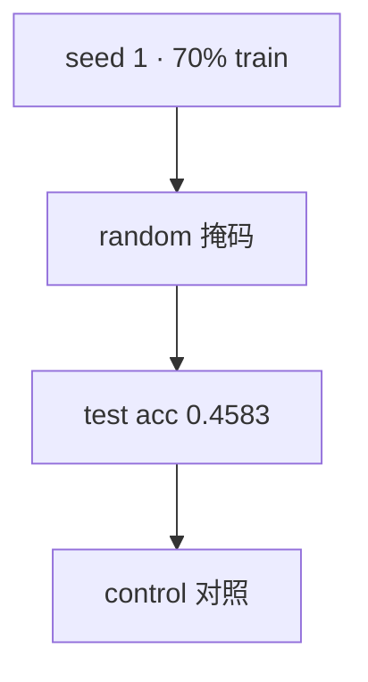

<p align="center"><b>中文</b> &nbsp;&nbsp;·&nbsp;&nbsp; <a href="day-26.en.md">English</a></p>

# 第 26 天 · 随机切分

[第一阶段 · 模型](README.md) · [排版规范](LESSON_LAYOUT.md) · 可运行

今天的学习要点：random split，seed 1，train fraction 0.70：test direction accuracy = 0.4583；`this number is the control`——本日只交付对照，不与时间切分并排。

## 费曼法讲解

> **结论先行**：`test direction accuracy = 0.4583` 在 **random split、seed 1、train 0.70** 下产生；`this number is the control` 声明本日 **只** 交付对照，不与 time split 并排（并排在第 27 天）。

训练掩码随机抽 70% 行估 OLS `r_t ~ r_{t−1}`，测试行上数 sign 命中率。允许 **未来行进训练、过去行进测试**——因此 0.4583 **不能** 叫 walk-forward 成绩。第 27 天会把 time-split 0.5417 放在旁边；今天读者应记住 **0.4583 的身份是对照**。

White（1980）稳健标准误不改点估计；本课尚未做推断。seed 1 是 **复现锚点**，不是最优 seed 搜索。误用：在 100 个 seed 里挑最高 test acc 再报告——那是 **多重检验泄漏**。正确：固定 seed 1，原样引 `this number is the control`。

单名 AAA 上，同一日期只有一行，random 不会把 **同一日历** 拆到两侧；第 37 天 pooled 才会。学习笔记保留两句：单名 random 0.4583；混池 random 可 0.7234—— **主语不同**。



## 核心知识

### 脚本输出（与下方 `text` 块一致）

[`random_split.py`](../../days/26-random-split/random_split.py)：

```text
split = random, seed 1, train fraction 0.70
test direction accuracy = 0.4583
this number is the control
```

| 项 | 值 |
|:---|:---|
| split | random, seed 1, train 0.70 |
| test direction accuracy | 0.4583 |
| 身份 | control（对照） |

本日 **不** 与 time split 并排；`this number is the control` 禁止改写成 walk-forward 成绩。

## 拓展领域

**control 身份.** `this number is the control` 锁定 0.4583 **不是** walk-forward 成绩。random split、seed 1、train 0.70 允许未来行进训练；单名 AAA 不会拆同日历两行，但 **时间逆序** 仍可能。

**与第 27 天关系.** 本日 **不** 并排 time split；并排在 27。Memo 只许引 control 句 + 0.4583。禁止 100 seed 搜最优。

**seed 1.** 复现锚点；换 seed 数字变、机制不变。
**数值与复现.** 在仓库根目录运行当日脚本；`panel.csv` 与 `numpy==1.24.4` 为默认合同。正文 ```text``` 块须与终端 stdout **逐行零 diff**；改数据或 `fmt` 时同一 commit 更新 golden 与 md。

**全季衔接.** 第 1–20 天：五点 toy 与 OLS/损失/hold-out 语言；第 21 天起：冻结 panel。两套数字 **不可混表**（例如斜率 3.27 与 accuracy 0.4675 无直接比较关系）。第 41 天起模型复杂度上升；第 51 天 lag-5；第 58 年切；第 71 天 bill/direction 分轨——**信息集合同** 全季不变。

**文献锚（非虚构，只作机制分类）.** Campbell, Lo & MacKinlay (1997)；Harvey, Liu & Zhu (2016)；Lopez de Prado (2018)；Little & Rubin (2002)；Hasbrouck (2007)。不得把教科书结论偷换为「本 panel 显著」——本段多数课 **无** 显著性检验 stdout。

**代码审查五问（panel 段）.** 特征在决策时刻是否可见；标准化是否只用训练段矩；train/test 是否按 date/name 分组；metrics 是否诚实区分 in-sample 与 hold-out；FORBIDDEN 行是否仍打印。缺任一条，spec 不完整。

**手算与 CI.** 任取 stdout 一行在 REPL 复算；`verify_season01_docs.py --day N` 为合并必要条件。改 `panel.csv` 须重跑依赖该面板的 golden 日。

## 实战总结

```bash
python days/26-random-split/random_split.py
```

核对：将终端 stdout 与上文 ```text``` 块逐行 diff；中文叙述中的小数位与键名空格须与英文输出一致。本课机制见 [`random_split.py`](../../days/26-random-split/random_split.py)；改 panel 或切分参数时同步更新 golden 块并跑 `python3 scripts/verify_season01_docs.py --day 26`。
