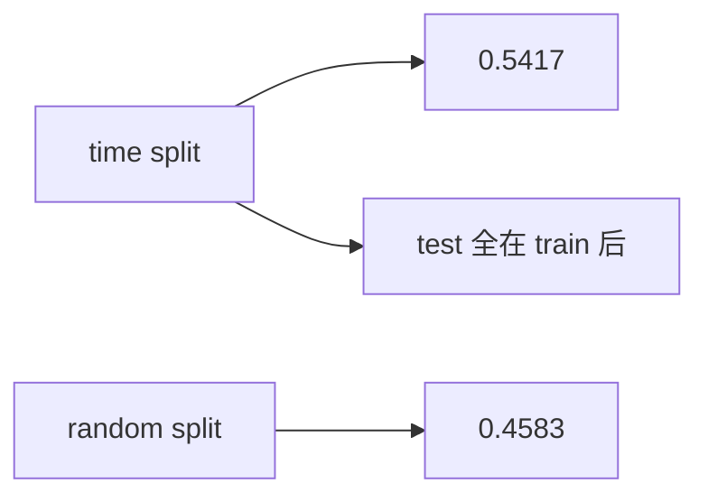
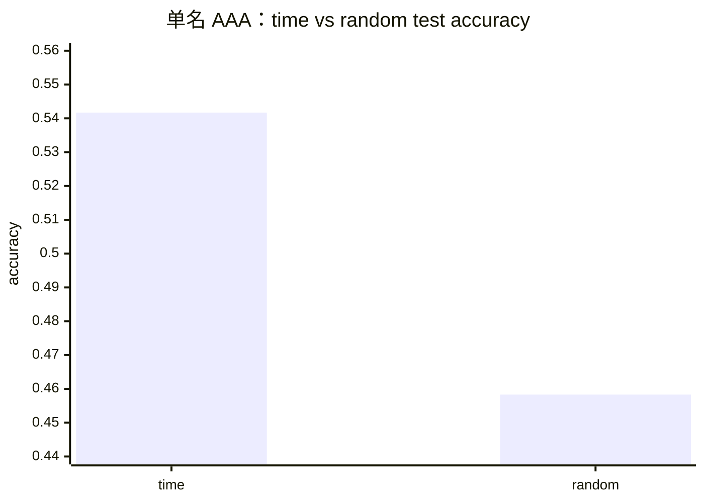

<p align="center"><b>中文</b> &nbsp;&nbsp;·&nbsp;&nbsp; <a href="day-27.en.md">English</a></p>

# 第 27 天 · 按时间切分

[第一阶段 · 模型](README.md) · [排版规范](LESSON_LAYOUT.md) · 可运行

今天的学习要点：time-split test accuracy = 0.5417，random-split test accuracy = 0.4583；`the test of the time split sits entirely after the train` 声明测试块日历上全在训练之后。

## 费曼法讲解

> **结论先行**：`time-split test accuracy = 0.5417` 且 `the test of the time split sits entirely after the train`；同协议 random 为 `0.4583`。在 **AAA 单名、lag-1** 下，random **未** 抬高分数。

时间切分：前 70% 行估系数，后 30% 测试；测试下标全部大于训练下标。random 仍 seed 1、比例 0.70。两个数 **必须并排**，禁止只印 0.5417。差 0.0834 不是 p 值，只是 **两种掩码** 下的符号频率差。

Campbell、Lo & MacKinlay（1997）默认解释变量在 t 前已知；time split 是 **最小因果序实现**。random 0.4583 允许日历逆序进训练——在单名序列上表现为 **更低** test acc，不是「随机总是更差」；第 37 天混池会反转名次。

与第 9 天行置换：今天动 **train/test 掩码**，不是同一 `(X,y)` 上行 shuffle。第 28 天 FORBIDDEN 特征与切分正交。memo 四锚点：0.5417、0.4583、entirely after train 句、单名 AAA。



## 核心知识

### 脚本输出（与下方 `text` 块一致）

[`time_split.py`](../../days/27-time-split/time_split.py)：

```text
time-split test accuracy = 0.5417
random-split test accuracy = 0.4583
the test of the time split sits entirely after the train
```

| 切分 | test direction accuracy |
|:---|---:|
| time | 0.5417 |
| random (seed 1) | 0.4583 |

时间切分测试块 **calendar-after** 训练块；random 允许逆序。



## 拓展领域

**0.5417 与 0.4583 必须并排.** time split 测试块 **全部在训练行之后**（`the test of the time split sits entirely after the train`）。random 同 seed、同比例；差 0.0834 **不是 p 值**。单名 AAA 上 random **未** 抬高分数——与第 37 天 pooled 反转对照。

**因果最低标准.** Campbell–Lo–MacKinlay 默认可预测变量在 t 前已知；time split 是 **最小因果序** 实现。第 9 天行置换不动 OLS 系数但破坏 lag；本日动 **掩码** 非 shuffle 行。

**实施假设.** CSV 已按 date sort；掩码按行序 70%。第 58 天升级按年切分。
**数值与复现.** 在仓库根目录运行当日脚本；`panel.csv` 与 `numpy==1.24.4` 为默认合同。正文 ```text``` 块须与终端 stdout **逐行零 diff**；改数据或 `fmt` 时同一 commit 更新 golden 与 md。

**全季衔接.** 第 1–20 天：五点 toy 与 OLS/损失/hold-out 语言；第 21 天起：冻结 panel。两套数字 **不可混表**（例如斜率 3.27 与 accuracy 0.4675 无直接比较关系）。第 41 天起模型复杂度上升；第 51 天 lag-5；第 58 年切；第 71 天 bill/direction 分轨——**信息集合同** 全季不变。

**文献锚（非虚构，只作机制分类）.** Campbell, Lo & MacKinlay (1997)；Harvey, Liu & Zhu (2016)；Lopez de Prado (2018)；Little & Rubin (2002)；Hasbrouck (2007)。不得把教科书结论偷换为「本 panel 显著」——本段多数课 **无** 显著性检验 stdout。

**代码审查五问（panel 段）.** 特征在决策时刻是否可见；标准化是否只用训练段矩；train/test 是否按 date/name 分组；metrics 是否诚实区分 in-sample 与 hold-out；FORBIDDEN 行是否仍打印。缺任一条，spec 不完整。

**手算与 CI.** 任取 stdout 一行在 REPL 复算；`verify_season01_docs.py --day N` 为合并必要条件。改 `panel.csv` 须重跑依赖该面板的 golden 日。

## 实战总结

```bash
python days/27-time-split/time_split.py
```

核对：将终端 stdout 与上文 ```text``` 块逐行 diff；中文叙述中的小数位与键名空格须与英文输出一致。本课机制见 [`time_split.py`](../../days/27-time-split/time_split.py)；改 panel 或切分参数时同步更新 golden 块并跑 `python3 scripts/verify_season01_docs.py --day 27`。
