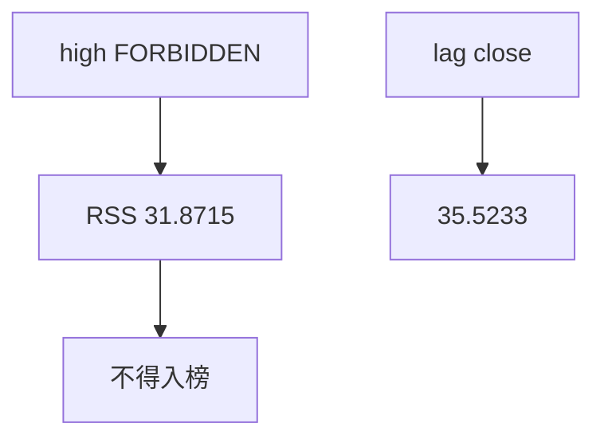
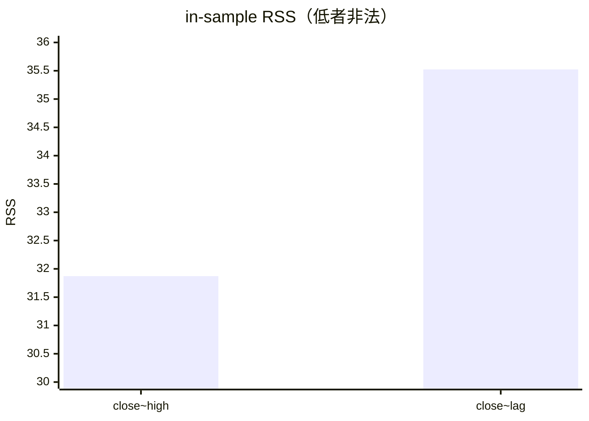

<p align="center"><b>中文</b> &nbsp;&nbsp;·&nbsp;&nbsp; <a href="day-28.en.md">English</a></p>

# 第 28 天 · 当日最高价

[第一阶段 · 模型](README.md) · [排版规范](LESSON_LAYOUT.md) · 可运行

今天的学习要点：column high = FORBIDDEN；in-sample RSS close~high = 31.8715 低于 close~lagged close = 35.5233，但高价列含当日信息，分数不得进入排行榜。

## 费曼法讲解

> **结论先行**：`column high = FORBIDDEN`；尽管 in-sample RSS close~high = 31.8715 **低于** close~lagged close = 35.5233，**任何使用当日 high 解释当日 close 的分数不得入榜**——信息集含 **同期 intraday 上界**。

回归在样本内比较两列特征：lagged close 合法（只用过去），high 非法（含 t 日已知上界于 close 之前？实际上 close 与 high 同日 bar——**同步泄漏**）。RSS 更小是 **泄漏拟合**，不是预测力。第 40 天清单把本日行标 `future=yes`。

Kahn et al.（1997）与后续 microstructure 强调 bar 内路径；本课日频 closing 合同下，high_t 与 close_t **同行**。生产特征工程 grep `high`、`low` 与 label 同日时，应触发 FORBIDDEN 流程。

误用：因为 31.8715 < 35.5233 就选用 high 特征做 alpha 报告。正确：打印 FORBIDDEN，RSS 只作 **反例教学**。第 38 天 market 同期收益同理。



## 核心知识

### 脚本输出（与下方 `text` 块一致）

[`todays_high.py`](../../days/28-todays-high/todays_high.py)：

```text
column high = FORBIDDEN
in-sample RSS close~high = 31.8715
in-sample RSS close~lagged close = 35.5233
```

| 特征 | in-sample RSS | 可否入榜 |
|:---|---:|:---|
| close ~ high（FORBIDDEN） | 31.8715 | 否 |
| close ~ lagged close | 35.5233 | 是（仍 in-sample） |

`column high = FORBIDDEN` 行必须保留在 stdout；RSS 更低不构成选型理由。



## 拓展领域

**FORBIDDEN 优先于 RSS.** `column high = FORBIDDEN` 尽管 RSS 31.8715 < 35.5233。同期 high 含 **当 bar 信息**；解释 close 时泄漏。Feature store 应对 high/low 与 label 同日组合 enum **LEAKY**。

**RSS 只作反例.** 31.8715 证明泄漏可 **in-sample 更贴**；不得 model selection。第 40 天 list future=yes。

**lag close 35.5233.** honest 参照仍 in-sample；样本外需第 27 天掩码。
**数值与复现.** 在仓库根目录运行当日脚本；`panel.csv` 与 `numpy==1.24.4` 为默认合同。正文 ```text``` 块须与终端 stdout **逐行零 diff**；改数据或 `fmt` 时同一 commit 更新 golden 与 md。

**全季衔接.** 第 1–20 天：五点 toy 与 OLS/损失/hold-out 语言；第 21 天起：冻结 panel。两套数字 **不可混表**（例如斜率 3.27 与 accuracy 0.4675 无直接比较关系）。第 41 天起模型复杂度上升；第 51 天 lag-5；第 58 年切；第 71 天 bill/direction 分轨——**信息集合同** 全季不变。

**文献锚（非虚构，只作机制分类）.** Campbell, Lo & MacKinlay (1997)；Harvey, Liu & Zhu (2016)；Lopez de Prado (2018)；Little & Rubin (2002)；Hasbrouck (2007)。不得把教科书结论偷换为「本 panel 显著」——本段多数课 **无** 显著性检验 stdout。

**代码审查五问（panel 段）.** 特征在决策时刻是否可见；标准化是否只用训练段矩；train/test 是否按 date/name 分组；metrics 是否诚实区分 in-sample 与 hold-out；FORBIDDEN 行是否仍打印。缺任一条，spec 不完整。

**手算与 CI.** 任取 stdout 一行在 REPL 复算；`verify_season01_docs.py --day N` 为合并必要条件。改 `panel.csv` 须重跑依赖该面板的 golden 日。

## 实战总结

```bash
python days/28-todays-high/todays_high.py
```

核对：将终端 stdout 与上文 ```text``` 块逐行 diff；中文叙述中的小数位与键名空格须与英文输出一致。本课机制见 [`todays_high.py`](../../days/28-todays-high/todays_high.py)；改 panel 或切分参数时同步更新 golden 块并跑 `python3 scripts/verify_season01_docs.py --day 28`。
