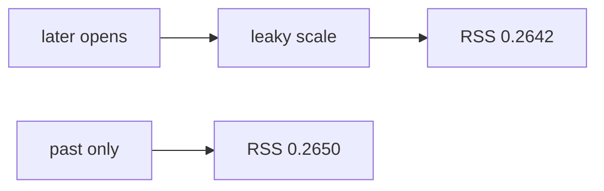

<p align="center"><b>中文</b> &nbsp;&nbsp;·&nbsp;&nbsp; <a href="day-29.en.md">English</a></p>

# 第 29 天 · 用未来开盘标准化

[第一阶段 · 模型](README.md) · [排版规范](LESSON_LAYOUT.md) · 可运行

今天的学习要点：leaky scale 使用含未来 open 的全样本；RSS return on leaky close = 0.2642 略优于 past-only = 0.2650——差值来自信息集，不是模型族胜利。

## 费曼法讲解

> **结论先行**：`RSS of return on leaky close = 0.2642` vs `past-only = 0.2650`；`the leaky scale is a function of later opens`——差 0.0008 来自 **标准化看见未来 open**，不是稳健 alpha。

leaky scale 用 **全样本 open**（含 t 之后）构造分母或尺度；past-only 只用 t 及之前。return 对 scaled close 的 RSS 略优是 **信息集更大** 的算术结果。Harvey et al.（2016）提醒 backtest 过拟合；此处是 **确定性泄漏** 演示。

与第 33 天 whole-sample scale 看见 test stretch 同族：scale 必须是 **train-only 统计量**。代码审查：fit 阶段是否 `fit_transform` 在全表上算 mean/std？本课 RSS 差很小，但 **机制** 必须写清。

第 40 天 list 收录本日。研究 log 应画 **时间轴**：哪些 open 进入 scale。禁止把 0.2642 贴进「样本外 MSE 改善」摘要。



## 核心知识

### 脚本输出（与下方 `text` 块一致）

[`future_open.py`](../../days/29-future-open/future_open.py)：

```text
leaky scale uses every open, including later ones
RSS of return on leaky close = 0.2642
RSS of return on past-only close = 0.2650
the leaky scale is a function of later opens
```

| scale | RSS on return |
|:---|---:|
| leaky close | 0.2642 |
| past-only close | 0.2650 |

差 0.0008 量级小；`the leaky scale is a function of later opens` 说明 **机制** 优先于 delta。

## 拓展领域

**0.0008 差 vs 机制.** leaky RSS 0.2642 vs past-only 0.2650；`the leaky scale is a function of later opens`。Audit 看 **分母是否含未来 open**，不是 delta 大小。

**与第 33 天同族.** scale 必须 train-only；MSE 相等不能洗白。画时间轴：哪些 open 进入 scale。

**return 回归.** 目标为 simple return；特征为 scaled close。禁止把 0.2642 贴进 OOS 改善摘要。
**数值与复现.** 在仓库根目录运行当日脚本；`panel.csv` 与 `numpy==1.24.4` 为默认合同。正文 ```text``` 块须与终端 stdout **逐行零 diff**；改数据或 `fmt` 时同一 commit 更新 golden 与 md。

**全季衔接.** 第 1–20 天：五点 toy 与 OLS/损失/hold-out 语言；第 21 天起：冻结 panel。两套数字 **不可混表**（例如斜率 3.27 与 accuracy 0.4675 无直接比较关系）。第 41 天起模型复杂度上升；第 51 天 lag-5；第 58 年切；第 71 天 bill/direction 分轨——**信息集合同** 全季不变。

**文献锚（非虚构，只作机制分类）.** Campbell, Lo & MacKinlay (1997)；Harvey, Liu & Zhu (2016)；Lopez de Prado (2018)；Little & Rubin (2002)；Hasbrouck (2007)。不得把教科书结论偷换为「本 panel 显著」——本段多数课 **无** 显著性检验 stdout。

**代码审查五问（panel 段）.** 特征在决策时刻是否可见；标准化是否只用训练段矩；train/test 是否按 date/name 分组；metrics 是否诚实区分 in-sample 与 hold-out；FORBIDDEN 行是否仍打印。缺任一条，spec 不完整。

**手算与 CI.** 任取 stdout 一行在 REPL 复算；`verify_season01_docs.py --day N` 为合并必要条件。改 `panel.csv` 须重跑依赖该面板的 golden 日。

## 实战总结

```bash
python days/29-future-open/future_open.py
```

核对：将终端 stdout 与上文 ```text``` 块逐行 diff；中文叙述中的小数位与键名空格须与英文输出一致。本课机制见 [`future_open.py`](../../days/29-future-open/future_open.py)；改 panel 或切分参数时同步更新 golden 块并跑 `python3 scripts/verify_season01_docs.py --day 29`。
