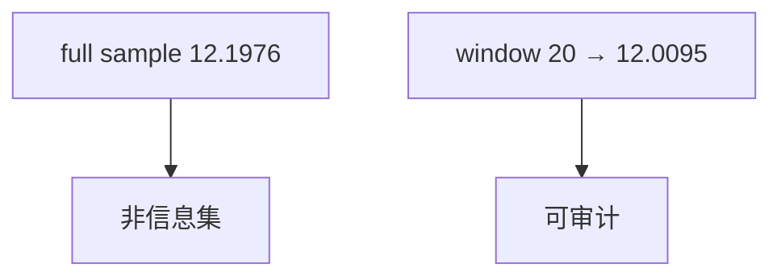

<p align="center"><b>中文</b> &nbsp;&nbsp;·&nbsp;&nbsp; <a href="day-30.en.md">English</a></p>

# 第 30 天 · 固定历史窗口

[第一阶段 · 模型](README.md) · [排版规范](LESSON_LAYOUT.md) · 可运行

今天的学习要点：lookback = 20：末时点 full-sample = 12.1976，window = 12.0095；全样本均值不是可交易信息集，窗口值才是因果可读量。

## 费曼法讲解

> **结论先行**：`full-sample value at last t = 12.1976` vs `window value at last t = 12.0095`（lookback=20）；`the full sample is not the information set`——全样本均值使用 **末点之后的信息**，窗口统计才是 t 时可见。

这是 **因果信息集** 与 **充分统计** 的初等分离：分析师常用「至今均值」作特征，但在回测里若用 **含未来行的样本** 算均值，就违反 **adapted 过程**。本课在末点打印两值差 ~0.19，量级取决于价格水平。

与第 33 天 scale 泄漏对照：一个动 **均值**，一个动 **标准差**；共同点是 **whole sample 看见 test**。Hamilton（1994）滤波与实时估计强调 **truncated sample**。

实现：lookback=20 只用过去 20 会话；full sample 用全部 adj close。报告特征时写清 **window length** 与 **是否包含 t**。第 32 天比较 3/20/60 窗，本课建立 **full ≠ window** 词汇。



## 核心知识

### 脚本输出（与下方 `text` 块一致）

[`lookback.py`](../../days/30-fixed-lookback/lookback.py)：

```text
lookback = 20
full-sample value at last t = 12.1976
window value at last t = 12.0095
the full sample is not the information set
```

| 估计 | last t 拟合值 |
|:---|---:|
| full-sample line | 12.1976 |
| lookback=20 window | 12.0095 |

`the full sample is not the information set`：实时特征只能用 window 行。

## 拓展领域

**12.1976 vs 12.0095.** full-sample 直线在末 t 使用 **含未来行** 的信息；lookback=20 才是 t 时可见。`the full sample is not the information set` 是 adapted 过程语言。

**特征命名.** 避免 `expanding_mean` 无 `closed='left'`。实时 pipeline 只用 rolling/window。

**与 31–32 窗长系列.** 本课建立 full≠window；后续比较 3/20/60 斜率。
**数值与复现.** 在仓库根目录运行当日脚本；`panel.csv` 与 `numpy==1.24.4` 为默认合同。正文 ```text``` 块须与终端 stdout **逐行零 diff**；改数据或 `fmt` 时同一 commit 更新 golden 与 md。

**全季衔接.** 第 1–20 天：五点 toy 与 OLS/损失/hold-out 语言；第 21 天起：冻结 panel。两套数字 **不可混表**（例如斜率 3.27 与 accuracy 0.4675 无直接比较关系）。第 41 天起模型复杂度上升；第 51 天 lag-5；第 58 年切；第 71 天 bill/direction 分轨——**信息集合同** 全季不变。

**文献锚（非虚构，只作机制分类）.** Campbell, Lo & MacKinlay (1997)；Harvey, Liu & Zhu (2016)；Lopez de Prado (2018)；Little & Rubin (2002)；Hasbrouck (2007)。不得把教科书结论偷换为「本 panel 显著」——本段多数课 **无** 显著性检验 stdout。

**代码审查五问（panel 段）.** 特征在决策时刻是否可见；标准化是否只用训练段矩；train/test 是否按 date/name 分组；metrics 是否诚实区分 in-sample 与 hold-out；FORBIDDEN 行是否仍打印。缺任一条，spec 不完整。

**手算与 CI.** 任取 stdout 一行在 REPL 复算；`verify_season01_docs.py --day N` 为合并必要条件。改 `panel.csv` 须重跑依赖该面板的 golden 日。

## 实战总结

```bash
python days/30-fixed-lookback/lookback.py
```

核对：将终端 stdout 与上文 ```text``` 块逐行 diff；中文叙述中的小数位与键名空格须与英文输出一致。本课机制见 [`lookback.py`](../../days/30-fixed-lookback/lookback.py)；改 panel 或切分参数时同步更新 golden 块并跑 `python3 scripts/verify_season01_docs.py --day 30`。
