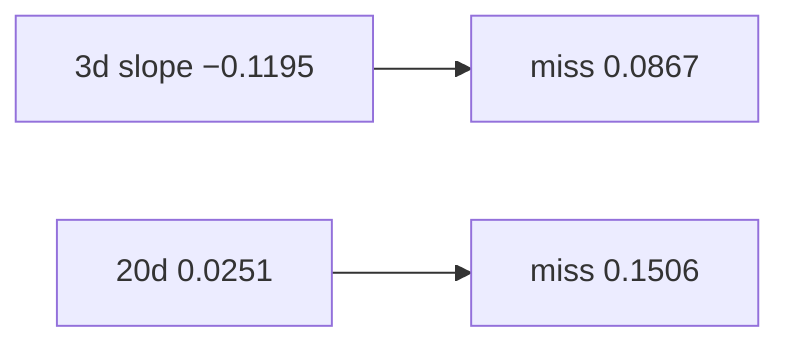

<p align="center"><b>中文</b> &nbsp;&nbsp;·&nbsp;&nbsp; <a href="day-31.en.md">English</a></p>

# 第 31 天 · 三日窗口的噪声

[第一阶段 · 模型](README.md) · [排版规范](LESSON_LAYOUT.md) · 可运行

今天的学习要点：三日斜率 −0.1195 vs 二十日 0.0251；三日 absolute miss 0.0867 小于二十日 0.1506——短窗 in-sample 更贴，不等于样本外更稳。

## 费曼法讲解

> **结论先行**：`three-day slope = -0.1195`、`twenty-day slope = 0.0251`；`three-day absolute miss = 0.0867` **小于** `twenty-day = 0.1506`——短窗 in-sample 更贴 **末点**，不是样本外更优。

对 adj close 滚动 OLS 斜率，在 **最后一日** 比较预测 miss。短窗跟近期噪声，长窗平滑旧趋势；末点处短窗 miss 更小是 **局部过贴** 的典型图。Breiman（2001）两种文化：本课是 **同一标签、不同窗口** 的 miss 对照。

与第 32 天 sixty-day 对照：窗口越长，末点 miss 可越大（0.4426 vs 0.0867）。忌把 **in-sample 末点 miss** 写成 walk-forward RMSE。第 55 天 pick-model 会在 hold-out 上比模型；本课无 hold-out。

写策略 doc 时：**window 是超参**，应用 **验证集** 选，不是看末点 miss 最小就选 3 日。



## 核心知识

### 脚本输出（与下方 `text` 块一致）

[`three_day_noise.py`](../../days/31-three-day-noise/three_day_noise.py)：

```text
three-day slope = -0.1195
twenty-day slope = 0.0251
three-day absolute miss = 0.0867
twenty-day absolute miss = 0.1506
```

| 窗口 | slope | last-t abs miss |
|:---|---:|---:|
| 3 日 | −0.1195 | 0.0867 |
| 20 日 | 0.0251 | 0.1506 |

末点 miss 更小 ≠ 样本外更优；只是 in-sample 局部过贴。

## 拓展领域

**短窗 in-sample 更贴末点.** 三日 miss 0.0867 < 二十日 0.1506；斜率符号可反（−0.1195 vs 0.0251）。忌把 **末点 miss 最小** 写成 OOS 最优窗。

**选窗须 validation.** 第 55 天 hold-out 比模型；本课无切分。

**OLS on time index.** 对 adj close 回归 t；非 return 空间。
**数值与复现.** 在仓库根目录运行当日脚本；`panel.csv` 与 `numpy==1.24.4` 为默认合同。正文 ```text``` 块须与终端 stdout **逐行零 diff**；改数据或 `fmt` 时同一 commit 更新 golden 与 md。

**全季衔接.** 第 1–20 天：五点 toy 与 OLS/损失/hold-out 语言；第 21 天起：冻结 panel。两套数字 **不可混表**（例如斜率 3.27 与 accuracy 0.4675 无直接比较关系）。第 41 天起模型复杂度上升；第 51 天 lag-5；第 58 年切；第 71 天 bill/direction 分轨——**信息集合同** 全季不变。

**文献锚（非虚构，只作机制分类）.** Campbell, Lo & MacKinlay (1997)；Harvey, Liu & Zhu (2016)；Lopez de Prado (2018)；Little & Rubin (2002)；Hasbrouck (2007)。不得把教科书结论偷换为「本 panel 显著」——本段多数课 **无** 显著性检验 stdout。

**代码审查五问（panel 段）.** 特征在决策时刻是否可见；标准化是否只用训练段矩；train/test 是否按 date/name 分组；metrics 是否诚实区分 in-sample 与 hold-out；FORBIDDEN 行是否仍打印。缺任一条，spec 不完整。

**手算与 CI.** 任取 stdout 一行在 REPL 复算；`verify_season01_docs.py --day N` 为合并必要条件。改 `panel.csv` 须重跑依赖该面板的 golden 日。

## 实战总结

```bash
python days/31-three-day-noise/three_day_noise.py
```

核对：将终端 stdout 与上文 ```text``` 块逐行 diff；中文叙述中的小数位与键名空格须与英文输出一致。本课机制见 [`three_day_noise.py`](../../days/31-three-day-noise/three_day_noise.py)；改 panel 或切分参数时同步更新 golden 块并跑 `python3 scripts/verify_season01_docs.py --day 31`。
