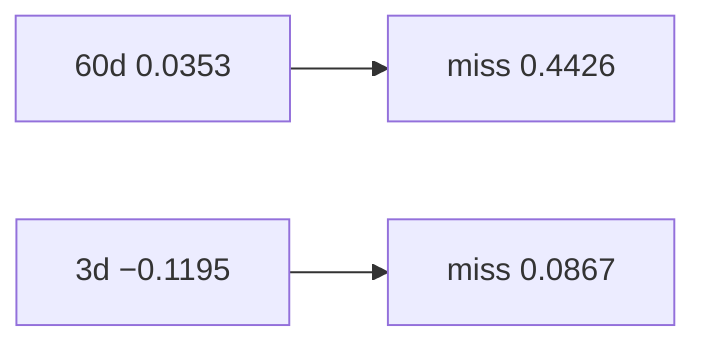

<p align="center"><b>中文</b> &nbsp;&nbsp;·&nbsp;&nbsp; <a href="day-32.en.md">English</a></p>

# 第 32 天 · 六十日窗口

[第一阶段 · 模型](README.md) · [排版规范](LESSON_LAYOUT.md) · 可运行

今天的学习要点：六十日斜率 0.0353 vs 三日 −0.1195；六十日 absolute miss 0.4426 大于三日 0.0867——长窗平滑训练点，末点误差可更大。

## 费曼法讲解

> **结论先行**：`sixty-day slope = 0.0353` vs `three-day = -0.1195`；`sixty-day absolute miss = 0.4426` **大于** `three-day = 0.0867`——长窗在末点 **欠贴近期**，短窗 **过贴噪声**。

本日与第 31 天共用 **末点 absolute miss** 协议，加入 60 日窗口。0.4426 说明用两个月斜率外推 **下一日** 在末点误差大；0.0867 是 3 日线的 tight fit。两者都不是 **test MSE**——无切分。

生产：动量因子常用 60/120 日 lookback；本课提醒 **拟合窗口与评分点** 要分开披露。Fama & French（2012）重述因子构造；此处是 **单名价格斜率** 玩具。

图表阅读：若只报 0.0867 会选 3 日；若关心 **稳定性** 需另加 hold-out（第 27 天）或 bill（第 75 天）。本课数字只服务 **窗口对比** 机制。



## 核心知识

### 脚本输出（与下方 `text` 块一致）

[`sixty_day.py`](../../days/32-sixty-day-window/sixty_day.py)：

```text
sixty-day slope = 0.0353
three-day slope = -0.1195
sixty-day absolute miss = 0.4426
three-day absolute miss = 0.0867
```

| 窗口 | slope | last-t abs miss |
|:---|---:|---:|
| 60 日 | 0.0353 | 0.4426 |
| 3 日 | −0.1195 | 0.0867 |

长窗末点 miss 更大，教 **bias–variance 直觉**；无 hold-out 不得选窗。

## 拓展领域

**长窗末点 miss 更大.** 六十日 miss 0.4426 vs 三日 0.0867；长窗平滑旧趋势，对 **下一日** 末点可欠贴。Fama–French 因子窗与本课 toy 不同；机制是 **窗口长度改变偏差**。

**三窗 recap.** 与第 31 天联读 3/20/60；禁止只报 0.0867 选窗。
**数值与复现.** 在仓库根目录运行当日脚本；`panel.csv` 与 `numpy==1.24.4` 为默认合同。正文 ```text``` 块须与终端 stdout **逐行零 diff**；改数据或 `fmt` 时同一 commit 更新 golden 与 md。

**全季衔接.** 第 1–20 天：五点 toy 与 OLS/损失/hold-out 语言；第 21 天起：冻结 panel。两套数字 **不可混表**（例如斜率 3.27 与 accuracy 0.4675 无直接比较关系）。第 41 天起模型复杂度上升；第 51 天 lag-5；第 58 年切；第 71 天 bill/direction 分轨——**信息集合同** 全季不变。

**文献锚（非虚构，只作机制分类）.** Campbell, Lo & MacKinlay (1997)；Harvey, Liu & Zhu (2016)；Lopez de Prado (2018)；Little & Rubin (2002)；Hasbrouck (2007)。不得把教科书结论偷换为「本 panel 显著」——本段多数课 **无** 显著性检验 stdout。

**代码审查五问（panel 段）.** 特征在决策时刻是否可见；标准化是否只用训练段矩；train/test 是否按 date/name 分组；metrics 是否诚实区分 in-sample 与 hold-out；FORBIDDEN 行是否仍打印。缺任一条，spec 不完整。

**手算与 CI.** 任取 stdout 一行在 REPL 复算；`verify_season01_docs.py --day N` 为合并必要条件。改 `panel.csv` 须重跑依赖该面板的 golden 日。

## 实战总结

```bash
python days/32-sixty-day-window/sixty_day.py
```

核对：将终端 stdout 与上文 ```text``` 块逐行 diff；中文叙述中的小数位与键名空格须与英文输出一致。本课机制见 [`sixty_day.py`](../../days/32-sixty-day-window/sixty_day.py)；改 panel 或切分参数时同步更新 golden 块并跑 `python3 scripts/verify_season01_docs.py --day 32`。
