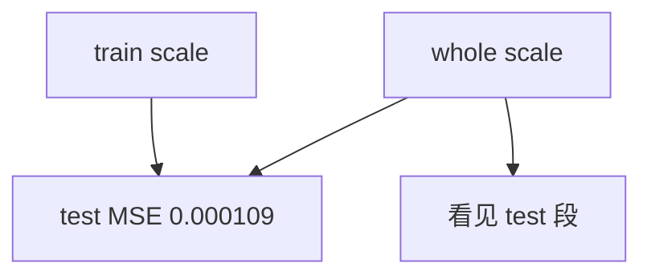

<p align="center"><b>中文</b> &nbsp;&nbsp;·&nbsp;&nbsp; <a href="day-33.en.md">English</a></p>

# 第 33 天 · 训练集标准化

[第一阶段 · 模型](README.md) · [排版规范](LESSON_LAYOUT.md) · 可运行

今天的学习要点：train mean/std = 0.003241 / 0.022132，whole-sample = 0.002470 / 0.019265；两种 scale 下 test MSE 同为 0.000109，但 whole-sample scale 看见测试段。

## 费曼法讲解

> **结论先行**：`test MSE` 在 train scale 与 whole-sample scale 下 **同为 0.000109**，但 `the whole-sample scale sees the test stretch`——数值相等 **不** 证明 whole scale 合法。

标准化：用 train 段 mean/std vs 全表 mean/std 变换特征后，在 **同一 test 段** 算 MSE。泄漏 scale 有时 **恰好** 不改变 test 上的 MSE（尤其 test 短、分布接近），但 **合同仍违规**。第 40 天 list 标 future=yes。

 sklearn `StandardScaler` 若 `fit` 在全表，pipeline review 应 fail。本课打印两组 mean/std 不同：train 0.003241/0.022132，whole 0.002470/0.019265——说明 **test 段拉偏了全样本矩**。

正确 pipeline：`scaler.fit(X_train)` only。报告 MSE 时并列 **scale 来源**。与第 29 天 leaky open scale 同族不同列，但 **信息集** 问题一致。



## 核心知识

### 脚本输出（与下方 `text` 块一致）

[`train_scale.py`](../../days/33-train-scale/train_scale.py)：

```text
train mean/std = 0.003241 0.022132
whole-sample mean/std = 0.002470 0.019265
test MSE, scale from the training stretch = 0.000109
test MSE, scale from the whole sample = 0.000109
the whole-sample scale sees the test stretch
```

| scale 来源 | train μ/σ | test MSE |
|:---|:---|---:|
| training stretch | 0.003241 / 0.022132 | 0.000109 |
| whole sample | 0.002470 / 0.019265 | 0.000109 |

MSE 相等 **不** 洗白 whole-sample scale；`the whole-sample scale sees the test stretch`。

## 拓展领域

**MSE 相等反例.** 两种 scale 下 test MSE 均为 0.000109，但 whole-sample scale **看见 test stretch**。Model card 必须写 **scale fit 范围**；sklearn Pipeline 仅 fit train。

**四矩打印.** train vs whole mean/std 不同，证明 test 拉偏全样本矩。与第 29 天 leaky open 不同列、同 **信息集** 问题。

**grep 审查.** `StandardScaler().fit(X)` 在全表是 fail。
**数值与复现.** 在仓库根目录运行当日脚本；`panel.csv` 与 `numpy==1.24.4` 为默认合同。正文 ```text``` 块须与终端 stdout **逐行零 diff**；改数据或 `fmt` 时同一 commit 更新 golden 与 md。

**全季衔接.** 第 1–20 天：五点 toy 与 OLS/损失/hold-out 语言；第 21 天起：冻结 panel。两套数字 **不可混表**（例如斜率 3.27 与 accuracy 0.4675 无直接比较关系）。第 41 天起模型复杂度上升；第 51 天 lag-5；第 58 年切；第 71 天 bill/direction 分轨——**信息集合同** 全季不变。

**文献锚（非虚构，只作机制分类）.** Campbell, Lo & MacKinlay (1997)；Harvey, Liu & Zhu (2016)；Lopez de Prado (2018)；Little & Rubin (2002)；Hasbrouck (2007)。不得把教科书结论偷换为「本 panel 显著」——本段多数课 **无** 显著性检验 stdout。

**代码审查五问（panel 段）.** 特征在决策时刻是否可见；标准化是否只用训练段矩；train/test 是否按 date/name 分组；metrics 是否诚实区分 in-sample 与 hold-out；FORBIDDEN 行是否仍打印。缺任一条，spec 不完整。

**手算与 CI.** 任取 stdout 一行在 REPL 复算；`verify_season01_docs.py --day N` 为合并必要条件。改 `panel.csv` 须重跑依赖该面板的 golden 日。

## 实战总结

```bash
python days/33-train-scale/train_scale.py
```

核对：将终端 stdout 与上文 ```text``` 块逐行 diff；中文叙述中的小数位与键名空格须与英文输出一致。本课机制见 [`train_scale.py`](../../days/33-train-scale/train_scale.py)；改 panel 或切分参数时同步更新 golden 块并跑 `python3 scripts/verify_season01_docs.py --day 33`。
