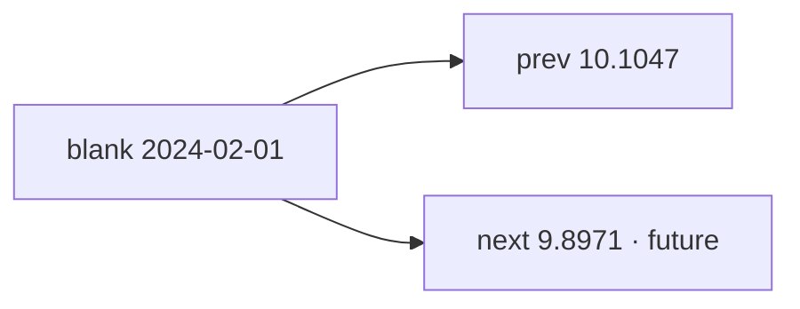

<p align="center"><b>中文</b> &nbsp;&nbsp;·&nbsp;&nbsp; <a href="day-34.en.md">English</a></p>

# 第 34 天 · 缺失的两种填法

[第一阶段 · 模型](README.md) · [排版规范](LESSON_LAYOUT.md) · 可运行

今天的学习要点：blank date = 2024-02-01：previous fill = 10.1047，next fill = 9.8971；next close 看见未来，不得用于因果链。

## 费曼法讲解

> **结论先行**：`blank date = 2024-02-01`；`fill from the previous close = 10.1047` vs `next close = 9.8971`；`the next close sees the future`——前向填 **因果**，后向填 **泄漏**。

缺失 close 在 AAA 上出现 1 次（第 21 天空位）。两种 imputation 改变 **收益链**：prev fill 只用 t−1 信息；next fill 用 t+1 close，在 t 决策时不可见。Little & Rubin（2002）缺失机制；本课 **不** 讨论 MCAR，只固定两种 fill 的 **时间方向**。

0.10 vs 9.90 差异会传播到 lag 与 sign 规则（第 22–23 天）。研究若默认 `bfill` 在 pandas pipeline 里，应 grep 并禁止于特征列。第 40 天 list 收录 next fill。

审计：imputation 必须在 **文档与代码** 同名；stdout 两数都要交，不得只报 prev「因为更合理」。



## 核心知识

### 脚本输出（与下方 `text` 块一致）

[`two_fills.py`](../../days/34-two-fills/two_fills.py)：

```text
blank date = 2024-02-01
fill from the previous close = 10.1047
fill from the next close = 9.8971
the next close sees the future
```

| fill | 值 | 信息集 |
|:---|---:|:---|
| previous close | 10.1047 | t 可见 |
| next close | 9.8971 | 含 future |

`the next close sees the future`；pipeline 禁止 silent bfill 于特征列。

## 拓展领域

**prev vs next fill.** 10.1047 因果；9.8971 含 future。`the next close sees the future`；pandas bfill 在特征列禁止 silent 使用。

**blank 2024-02-01.** 与第 21 天 blank=1 一致。Imputation 改变 return 链，影响 22–23 方向计数。

**敏感分析.** 两种 fill 应并列报告，不得只报 prev「更合理」。
**数值与复现.** 在仓库根目录运行当日脚本；`panel.csv` 与 `numpy==1.24.4` 为默认合同。正文 ```text``` 块须与终端 stdout **逐行零 diff**；改数据或 `fmt` 时同一 commit 更新 golden 与 md。

**全季衔接.** 第 1–20 天：五点 toy 与 OLS/损失/hold-out 语言；第 21 天起：冻结 panel。两套数字 **不可混表**（例如斜率 3.27 与 accuracy 0.4675 无直接比较关系）。第 41 天起模型复杂度上升；第 51 天 lag-5；第 58 年切；第 71 天 bill/direction 分轨——**信息集合同** 全季不变。

**文献锚（非虚构，只作机制分类）.** Campbell, Lo & MacKinlay (1997)；Harvey, Liu & Zhu (2016)；Lopez de Prado (2018)；Little & Rubin (2002)；Hasbrouck (2007)。不得把教科书结论偷换为「本 panel 显著」——本段多数课 **无** 显著性检验 stdout。

**代码审查五问（panel 段）.** 特征在决策时刻是否可见；标准化是否只用训练段矩；train/test 是否按 date/name 分组；metrics 是否诚实区分 in-sample 与 hold-out；FORBIDDEN 行是否仍打印。缺任一条，spec 不完整。

**手算与 CI.** 任取 stdout 一行在 REPL 复算；`verify_season01_docs.py --day N` 为合并必要条件。改 `panel.csv` 须重跑依赖该面板的 golden 日。

## 实战总结

```bash
python days/34-two-fills/two_fills.py
```

核对：将终端 stdout 与上文 ```text``` 块逐行 diff；中文叙述中的小数位与键名空格须与英文输出一致。本课机制见 [`two_fills.py`](../../days/34-two-fills/two_fills.py)；改 panel 或切分参数时同步更新 golden 块并跑 `python3 scripts/verify_season01_docs.py --day 34`。
