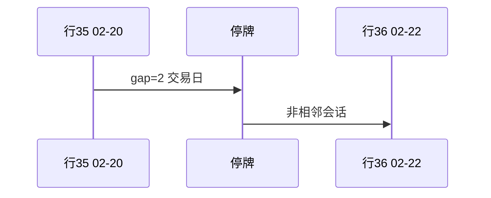

<p align="center"><b>中文</b> &nbsp;&nbsp;·&nbsp;&nbsp; <a href="day-35.en.md">English</a></p>

# 第 35 天 · 停牌后的间隔

[第一阶段 · 模型](README.md) · [排版规范](LESSON_LAYOUT.md) · 可运行

今天的学习要点：行号 35–36 对应 2024-02-20 与 2024-02-22，business-day gap = 2；相邻行不是相邻会话，差分与 lag 须按日历理解。

## 费曼法讲解

> **结论先行**：`row numbers 35 36`、`dates 2024-02-20 2024-02-22`、`business-day gap = 2`；`adjacent rows are not adjacent sessions`——CSV 相邻 ≠ 日历相邻。

停牌或缺失交易日使 **行号 lag** 与 **calendar lag** 分叉。用 `diff(close)` 时，跨 gap 的差分覆盖 **多个日历日** 的价格变化。Campbell et al. 收益定义应明确 **holding period**。

本课打印 gap=2（business days between dates）。特征若写 `lag-1 row` 实际可能是 **lag-3 calendar**——sign 规则解读会变。生产数据 **halt** 标志应进入特征或过滤。

与第 34 天 blank fill 不同：这里是 **行仍在但日期跳变**。回测合并 corporate action 与 halt 表是 senior 工程师 checklist 项。



## 核心知识

### 脚本输出（与下方 `text` 块一致）

[`halt_gap.py`](../../days/35-halt-gap/halt_gap.py)：

```text
row numbers 35 36
dates 2024-02-20 2024-02-22
business-day gap = 2
adjacent rows are not adjacent sessions
```

| 项 | 值 |
|:---|:---|
| row numbers | 35, 36 |
| dates | 2024-02-20, 2024-02-22 |
| business-day gap | 2 |

`adjacent rows are not adjacent sessions`：row lag ≠ calendar lag。

## 拓展领域

**行相邻 ≠ 会话相邻.** gap=2 business days between 2024-02-20 and 2024-02-22。Row lag-1 diff 覆盖 **多日历日** 价格变化。

**halt 表.** 生产 merge 停牌标志；rolling 用 calendar index。

**与第 34 天.** blank 是缺失；本课是 **日期跳变** 仍有行。
**数值与复现.** 在仓库根目录运行当日脚本；`panel.csv` 与 `numpy==1.24.4` 为默认合同。正文 ```text``` 块须与终端 stdout **逐行零 diff**；改数据或 `fmt` 时同一 commit 更新 golden 与 md。

**全季衔接.** 第 1–20 天：五点 toy 与 OLS/损失/hold-out 语言；第 21 天起：冻结 panel。两套数字 **不可混表**（例如斜率 3.27 与 accuracy 0.4675 无直接比较关系）。第 41 天起模型复杂度上升；第 51 天 lag-5；第 58 年切；第 71 天 bill/direction 分轨——**信息集合同** 全季不变。

**文献锚（非虚构，只作机制分类）.** Campbell, Lo & MacKinlay (1997)；Harvey, Liu & Zhu (2016)；Lopez de Prado (2018)；Little & Rubin (2002)；Hasbrouck (2007)。不得把教科书结论偷换为「本 panel 显著」——本段多数课 **无** 显著性检验 stdout。

**代码审查五问（panel 段）.** 特征在决策时刻是否可见；标准化是否只用训练段矩；train/test 是否按 date/name 分组；metrics 是否诚实区分 in-sample 与 hold-out；FORBIDDEN 行是否仍打印。缺任一条，spec 不完整。

**手算与 CI.** 任取 stdout 一行在 REPL 复算；`verify_season01_docs.py --day N` 为合并必要条件。改 `panel.csv` 须重跑依赖该面板的 golden 日。

## 实战总结

```bash
python days/35-halt-gap/halt_gap.py
```

核对：将终端 stdout 与上文 ```text``` 块逐行 diff；中文叙述中的小数位与键名空格须与英文输出一致。本课机制见 [`halt_gap.py`](../../days/35-halt-gap/halt_gap.py)；改 panel 或切分参数时同步更新 golden 块并跑 `python3 scripts/verify_season01_docs.py --day 35`。
