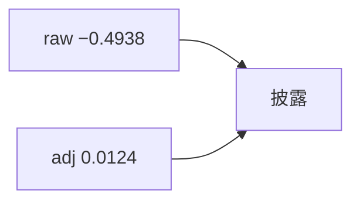

<p align="center"><b>中文</b> &nbsp;&nbsp;·&nbsp;&nbsp; <a href="day-36.en.md">English</a></p>

# 第 36 天 · 复权与未复权

[第一阶段 · 模型](README.md) · [排版规范](LESSON_LAYOUT.md) · 可运行

今天的学习要点：2024-03-11：unadjusted return = −0.4938，adjusted return = 0.0124；两个数都要交，禁止只报未复权 dramatize。

## 费曼法讲解

> **结论先行**：`date = 2024-03-11`；`unadjusted return = -0.4938` vs `adjusted return = 0.0124`；`both numbers are due`——公司行动日 **必须双报**，禁止只 dramatize 未复权 −49%。

未复权序列在拆股/分红日可出现 **伪暴跌**；adj_close 修正份额与现金 dividend。两者 **同时** 进入 stdout 是为强制 **披露复权口径**。研究 alpha 默认应基于 adj；risk 展示有时用 raw——须 label。

与第 21 天 adj_close 列同源 panel。差分规则：后续 lag 收益用 adj。误用：用 raw return 训练、adj label 评分—— **口径混用**。

Shumway & Warther（1999）与 corporate action 处理；本课是 **单日锚点** 数字。代码：`returns(adj_close)` vs `returns(close)` 分支要 unit test。



## 核心知识

### 脚本输出（与下方 `text` 块一致）

[`adjusted.py`](../../days/36-adjusted-close/adjusted.py)：

```text
date = 2024-03-11
unadjusted return = -0.4938
adjusted return = 0.0124
both numbers are due
```

| 序列 | 2024-03-11 return |
|:---|---:|
| unadjusted | −0.4938 |
| adjusted | 0.0124 |

`both numbers are due`：公司行动日禁止只 dramatize 未复权。

## 拓展领域

**双报 return.** raw −0.4938 vs adj 0.0124 on 2024-03-11；`both numbers are due`。Chart 禁止只 dramatize 未复权暴跌。

**研究默认 adj.** risk 展示 raw 须 label。禁止 train raw / label adj 混用。

**returns() 分支.** 读 course.py；unit test 双列。
**数值与复现.** 在仓库根目录运行当日脚本；`panel.csv` 与 `numpy==1.24.4` 为默认合同。正文 ```text``` 块须与终端 stdout **逐行零 diff**；改数据或 `fmt` 时同一 commit 更新 golden 与 md。

**全季衔接.** 第 1–20 天：五点 toy 与 OLS/损失/hold-out 语言；第 21 天起：冻结 panel。两套数字 **不可混表**（例如斜率 3.27 与 accuracy 0.4675 无直接比较关系）。第 41 天起模型复杂度上升；第 51 天 lag-5；第 58 年切；第 71 天 bill/direction 分轨——**信息集合同** 全季不变。

**文献锚（非虚构，只作机制分类）.** Campbell, Lo & MacKinlay (1997)；Harvey, Liu & Zhu (2016)；Lopez de Prado (2018)；Little & Rubin (2002)；Hasbrouck (2007)。不得把教科书结论偷换为「本 panel 显著」——本段多数课 **无** 显著性检验 stdout。

**代码审查五问（panel 段）.** 特征在决策时刻是否可见；标准化是否只用训练段矩；train/test 是否按 date/name 分组；metrics 是否诚实区分 in-sample 与 hold-out；FORBIDDEN 行是否仍打印。缺任一条，spec 不完整。

**手算与 CI.** 任取 stdout 一行在 REPL 复算；`verify_season01_docs.py --day N` 为合并必要条件。改 `panel.csv` 须重跑依赖该面板的 golden 日。

## 实战总结

```bash
python days/36-adjusted-close/adjusted.py
```

核对：将终端 stdout 与上文 ```text``` 块逐行 diff；中文叙述中的小数位与键名空格须与英文输出一致。本课机制见 [`adjusted.py`](../../days/36-adjusted-close/adjusted.py)；改 panel 或切分参数时同步更新 golden 块并跑 `python3 scripts/verify_season01_docs.py --day 36`。
