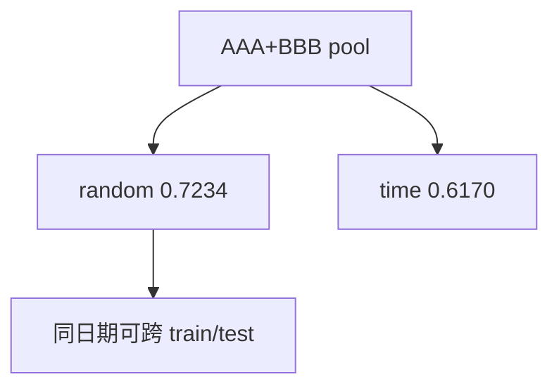

<p align="center"><b>中文</b> &nbsp;&nbsp;·&nbsp;&nbsp; <a href="day-37.en.md">English</a></p>

# 第 37 天 · 多标的混切

[第一阶段 · 模型](README.md) · [排版规范](LESSON_LAYOUT.md) · 可运行

今天的学习要点：pooled AAA+BBB：random-split test accuracy = 0.7234，time-split = 0.6170；random 可在同名日期上同时训练与测试。

## 费曼法讲解

> **结论先行**：pooled AAA+BBB 下 `random-split test accuracy = 0.7234` **高于** `time-split = 0.6170`；`the random split can train and test on the same date`—— **同名日历跨股票** 进入两侧，random 可 **虚高**。

单名第 27 天 random 0.4583 < time 0.5417；混池后 **反转**。机制：AAA 与 BBB 共享日期，random 掩码按 **行** 抽，可把 **同一天** 一条进 train、另一条进 test—— **泄漏通道** 不同于 feature 泄漏，是 **切分设计** 泄漏。

第 40 天 list 标 future=yes（共享日期）。正确实践：**按 date 切分** 或 **按 name 分组切分**（Purged CV, Lopez de Prado 2018）。本课只打印数字教 **主语变更则名次变更**。

报告 pooled 结果时写清：**是否 group by date**。0.7234 **不得** 与单名 0.4583 直接比「random 更好」——池不同。



## 核心知识

### 脚本输出（与下方 `text` 块一致）

[`mixed_names.py`](../../days/37-mixed-names/mixed_names.py)：

```text
pooled AAA and BBB
random-split test accuracy = 0.7234
time-split test accuracy = 0.6170
the random split can train and test on the same date
```

| 切分 | pooled test direction accuracy |
|:---|---:|
| random | 0.7234 |
| time | 0.6170 |

`the random split can train and test on the same date`；与单名第 27 天名次 **可反转**。

## 拓展领域

**pooled 反转名次.** random 0.7234 > time 0.6170；`the random split can train and test on the same date`——AAA/BBB 同行日历可 split 到两侧。

**vs 单名第 27 天.** 0.4583<0.5417 仍成立；**不得** 混 leaderboard。Fix：group by date 或 purged CV（Lopez de Prado 2018）。

**主语变更.** 报告 pooled 必须声明 **混池 + random**。
**数值与复现.** 在仓库根目录运行当日脚本；`panel.csv` 与 `numpy==1.24.4` 为默认合同。正文 ```text``` 块须与终端 stdout **逐行零 diff**；改数据或 `fmt` 时同一 commit 更新 golden 与 md。

**全季衔接.** 第 1–20 天：五点 toy 与 OLS/损失/hold-out 语言；第 21 天起：冻结 panel。两套数字 **不可混表**（例如斜率 3.27 与 accuracy 0.4675 无直接比较关系）。第 41 天起模型复杂度上升；第 51 天 lag-5；第 58 年切；第 71 天 bill/direction 分轨——**信息集合同** 全季不变。

**文献锚（非虚构，只作机制分类）.** Campbell, Lo & MacKinlay (1997)；Harvey, Liu & Zhu (2016)；Lopez de Prado (2018)；Little & Rubin (2002)；Hasbrouck (2007)。不得把教科书结论偷换为「本 panel 显著」——本段多数课 **无** 显著性检验 stdout。

**代码审查五问（panel 段）.** 特征在决策时刻是否可见；标准化是否只用训练段矩；train/test 是否按 date/name 分组；metrics 是否诚实区分 in-sample 与 hold-out；FORBIDDEN 行是否仍打印。缺任一条，spec 不完整。

**手算与 CI.** 任取 stdout 一行在 REPL 复算；`verify_season01_docs.py --day N` 为合并必要条件。改 `panel.csv` 须重跑依赖该面板的 golden 日。

## 实战总结

```bash
python days/37-mixed-names/mixed_names.py
```

核对：将终端 stdout 与上文 ```text``` 块逐行 diff；中文叙述中的小数位与键名空格须与英文输出一致。本课机制见 [`mixed_names.py`](../../days/37-mixed-names/mixed_names.py)；改 panel 或切分参数时同步更新 golden 块并跑 `python3 scripts/verify_season01_docs.py --day 37`。
