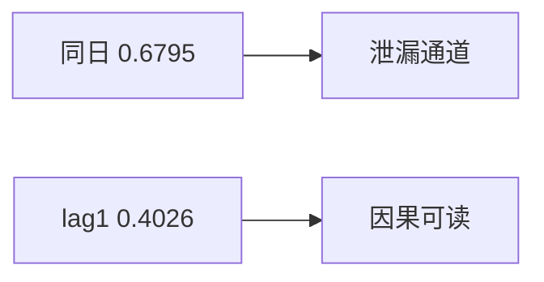

<p align="center"><b>中文</b> &nbsp;&nbsp;·&nbsp;&nbsp; <a href="day-38.en.md">English</a></p>

# 第 38 天 · 信号滞后一日

[第一阶段 · 模型](README.md) · [排版规范](LESSON_LAYOUT.md) · 可运行

今天的学习要点：same-day market sign accuracy = 0.6795，lagged-one-day = 0.4026；消失的是 simultaneity，不是「市场无效」。

## 费曼法讲解

> **结论先行**：`same-day market sign accuracy = 0.6795` vs `lagged-one-day = 0.4026`；`what disappeared was simultaneous`——高命中来自 **同期 market return**，lag 后只剩 **可交易信息集**。

market 列与 AAA 同行；用 **同日** market 收益符号预测 AAA 方向，命中 0.6795。改用 **lag-1 market** 符号，降至 0.4026。差 ~0.28 是 ** simultaneity premium**，不是因子 alpha。第 40 天 list 标 same-day market。

与第 28 天 high 同期列同族： **bar 内/同行** 信息。多因子模型应用 **lagged market beta**；回归残差用 contemporaneous market 仅 **解释**，不作 **信号**。

生产：merge asof 时 market 字段 timestamp 必须 **≤ decision time**。本课两数并排是 **因果 vs 泄漏** 的最小对照。



## 核心知识

### 脚本输出（与下方 `text` 块一致）

[`lag_signal.py`](../../days/38-lag-signal/lag_signal.py)：

```text
same-day market sign accuracy = 0.6795
lagged-one-day market sign accuracy = 0.4026
what disappeared was simultaneous
```

| 信号 | sign accuracy |
|:---|---:|
| same-day market | 0.6795 |
| lagged-one-day market | 0.4026 |

`what disappeared was simultaneous`：~0.28 是 simultaneity，不是 alpha。

## 拓展领域

**0.6795 不是 alpha，是 simultaneity ledger.** 用 **同日** market 收益符号预测 AAA 方向，命中 0.6795。该特征在 decision time 通常 **不可见**（market 与 AAA 同期收盘），属于 **标签侧信息倒流进特征**。研究 log 应把 0.6795 记入 **泄漏 premium 归档**，而不是 factor zoo 入库。

**0.4026 才是可交易对照.** `lagged-one-day market sign accuracy = 0.4026` 使用 **滞后一日** 的市场符号，信息集与第 22 天 lag-1 自方向类似：特征在 t 前已知。两数差 ~0.28 几乎全部来自 **同步性**；stdout 用 `what disappeared was simultaneous` 锁定机制，禁止改写成「市场无效」叙事。

**与第 28 天 FORBIDDEN 同族.** `column high = FORBIDDEN` 教 **bar 内同步**；本课教 **指数/市场列同步**。多因子回归里 contemporaneous market 可用于 **解释方差**（beta 估计），但 **不能** 作为 trading signal 进入回测。Residual 分析与 alpha 信号必须 **分文件** 维护。

**生产 merge 纪律.** 外部 index 字段 merge 进 panel 时，应 `merge_asof` 且 timestamp **严格 ≤ 决策时刻**。Code review grep：`market_return` 无 lag 后缀却进入 `features.parquet` 是 red flag。第 40 天清单行 `same-day market return` 应出现在 onboarding 幻灯 **负例** 页。

**数值与复现.** 在仓库根目录运行当日脚本；`panel.csv` 与 `numpy==1.24.4` 为默认合同。正文 ```text``` 块须与终端 stdout **逐行零 diff**；改数据或 `fmt` 时同一 commit 更新 golden 与 md。

**全季衔接.** 第 1–20 天：五点 toy 与 OLS/损失/hold-out 语言；第 21 天起：冻结 panel。两套数字 **不可混表**（例如斜率 3.27 与 accuracy 0.4675 无直接比较关系）。第 41 天起模型复杂度上升；第 51 天 lag-5；第 58 年切；第 71 天 bill/direction 分轨——**信息集合同** 全季不变。

**文献锚（非虚构，只作机制分类）.** Campbell, Lo & MacKinlay (1997)；Harvey, Liu & Zhu (2016)；Lopez de Prado (2018)；Little & Rubin (2002)；Hasbrouck (2007)。不得把教科书结论偷换为「本 panel 显著」——本段多数课 **无** 显著性检验 stdout。

**代码审查五问（panel 段）.** 特征在决策时刻是否可见；标准化是否只用训练段矩；train/test 是否按 date/name 分组；metrics 是否诚实区分 in-sample 与 hold-out；FORBIDDEN 行是否仍打印。缺任一条，spec 不完整。

**手算与 CI.** 任取 stdout 一行在 REPL 复算；`verify_season01_docs.py --day N` 为合并必要条件。改 `panel.csv` 须重跑依赖该面板的 golden 日。

## 实战总结

```bash
python days/38-lag-signal/lag_signal.py
```

核对：将终端 stdout 与上文 ```text``` 块逐行 diff；中文叙述中的小数位与键名空格须与英文输出一致。本课机制见 [`lag_signal.py`](../../days/38-lag-signal/lag_signal.py)；改 panel 或切分参数时同步更新 golden 块并跑 `python3 scripts/verify_season01_docs.py --day 38`。
