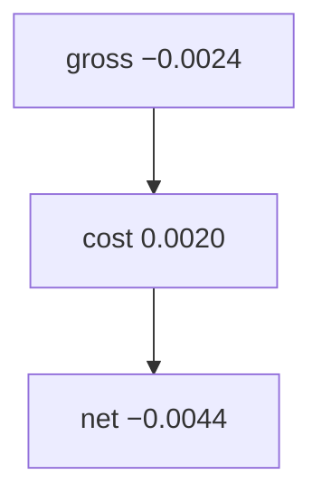
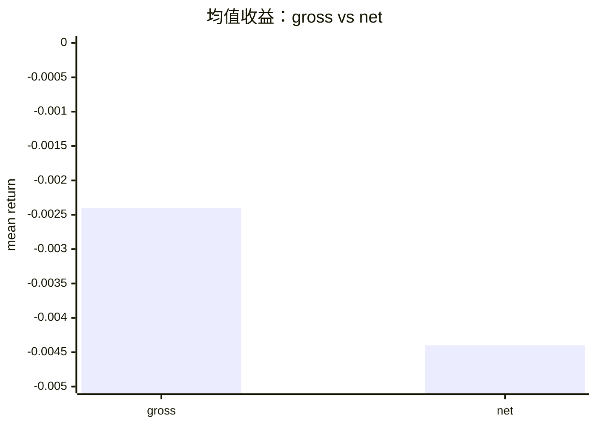

<p align="center"><b>中文</b> &nbsp;&nbsp;·&nbsp;&nbsp; <a href="day-39.en.md">English</a></p>

# 第 39 天 · 最小往返成本

[第一阶段 · 模型](README.md) · [排版规范](LESSON_LAYOUT.md) · 可运行

今天的学习要点：gross mean return = −0.0024，round-trip cost = 0.0020，net = −0.0044；扣费后均值更负，方向策略须先过成本门。

## 费曼法讲解

> **结论先行**：`gross mean return = -0.0024`、`round-trip cost = 0.0020`、`net mean return = -0.0044`—— **扣费后均值更负**；方向策略须先过 **成本门** 再谈 hit rate。

本课用 **固定 round-trip 0.0020**（20 bps 量级）从 gross 均值扣除，得 net −0.0044。与第 22–27 天 **无成本** direction accuracy 对照：0.47 命中在 **net 负均值** 下可能仍不可交易。Hasbrouck（2007）交易成本；Almgren & Chriss（2000）执行成本。

gross 已略负 −0.24% 均值；加费后 −0.44%。 **break-even hit rate** 需联合 spread 与 payoff asymmetry——本课不算，只固定三行 stdout。第 93 天 slippage tick 会细化。

PM 报告：并列 gross/net 与 **assumed cost**；禁止只报 direction accuracy。research log 写清 **cost 是否含 borrow/funding**——本课仅 round-trip 常数。



## 核心知识

### 脚本输出（与下方 `text` 块一致）

[`round_trip.py`](../../days/39-round-trip/round_trip.py)：

```text
gross mean return = -0.0024
round-trip cost = 0.0020
net mean return = -0.0044
```

| 项 | mean return |
|:---|---:|
| gross | −0.0024 |
| round-trip cost | 0.0020（常数） |
| net | −0.0044 |

扣费后更负；hit rate 须与 cost 门联读（第 22–27 天无费）。



## 拓展领域

**成本门.** gross −0.0024，round-trip 0.0020，net −0.0044。Hit rate 0.47 级 **不** 自动 cover 20bp；Hasbrouck 成本框架的极简版。

**与 22–27.** 那些课无费；本课起 P&L 语言。Break-even hit 扩展练习不写 stdout。

**PM 披露.** 并列 gross/net 与 assumed cost；borrow/funding 本课不含。
**数值与复现.** 在仓库根目录运行当日脚本；`panel.csv` 与 `numpy==1.24.4` 为默认合同。正文 ```text``` 块须与终端 stdout **逐行零 diff**；改数据或 `fmt` 时同一 commit 更新 golden 与 md。

**全季衔接.** 第 1–20 天：五点 toy 与 OLS/损失/hold-out 语言；第 21 天起：冻结 panel。两套数字 **不可混表**（例如斜率 3.27 与 accuracy 0.4675 无直接比较关系）。第 41 天起模型复杂度上升；第 51 天 lag-5；第 58 年切；第 71 天 bill/direction 分轨——**信息集合同** 全季不变。

**文献锚（非虚构，只作机制分类）.** Campbell, Lo & MacKinlay (1997)；Harvey, Liu & Zhu (2016)；Lopez de Prado (2018)；Little & Rubin (2002)；Hasbrouck (2007)。不得把教科书结论偷换为「本 panel 显著」——本段多数课 **无** 显著性检验 stdout。

**代码审查五问（panel 段）.** 特征在决策时刻是否可见；标准化是否只用训练段矩；train/test 是否按 date/name 分组；metrics 是否诚实区分 in-sample 与 hold-out；FORBIDDEN 行是否仍打印。缺任一条，spec 不完整。

**手算与 CI.** 任取 stdout 一行在 REPL 复算；`verify_season01_docs.py --day N` 为合并必要条件。改 `panel.csv` 须重跑依赖该面板的 golden 日。

## 实战总结

```bash
python days/39-round-trip/round_trip.py
```

核对：将终端 stdout 与上文 ```text``` 块逐行 diff；中文叙述中的小数位与键名空格须与英文输出一致。本课机制见 [`round_trip.py`](../../days/39-round-trip/round_trip.py)；改 panel 或切分参数时同步更新 golden 块并跑 `python3 scripts/verify_season01_docs.py --day 39`。
