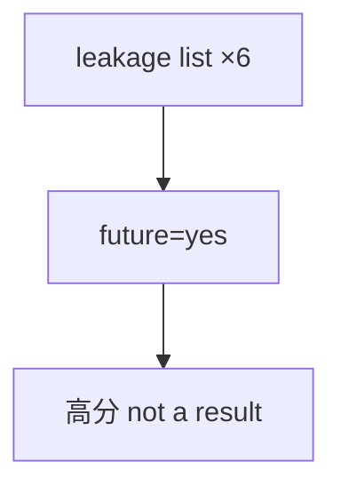

<p align="center"><b>中文</b> &nbsp;&nbsp;·&nbsp;&nbsp; <a href="day-40.en.md">English</a></p>

# 第 40 天 · 泄漏清单

[第一阶段 · 模型](README.md) · [排版规范](LESSON_LAYOUT.md) · 可运行

今天的学习要点：泄漏清单六条均标 future=yes；`a higher score on any of these lines is not a result`——高分只作反例归档，不作 alpha。

## 费曼法讲解

> **结论先行**：清单六课均 `future=yes`；`a higher score on any of these lines is not a result`—— **泄漏设计上的高分只归档为反例**，不得进入 leaderboard 或 research alpha 摘要。

第 40 天不重跑实验，只 **索引** day 28/29/33/34/37/38 的违规类型：同期 bar、未来 open scale、test 段 scale、next fill、跨名同日期 random、同期 market。这是 **season-1 泄漏词汇表** 闭合。

与 honest time split（第 27 天）对照：时间切分本身 **不是** 泄漏；泄漏在 **特征/scale/fill/切分池**。Kaggle 式 LB 若允许泄漏特征会 **虚高**；本课 explicitly negates those scores。

审计流程：新特征 PR 必须回答 **decision time** 与 **label time**；grep FORBIDDEN / future=yes。清单行是 **negative results catalog**——科研诚信要求 **报告失败与违规** 与报告成功同权。



## 核心知识

### 脚本输出（与下方 `text` 块一致）

[`leakage_list.py`](../../days/40-leakage-list/leakage_list.py)：

```text
leakage list
day 28  today's high explains today's close  future=yes
day 29  scale uses later opens  future=yes
day 33  scale uses the test stretch  future=yes
day 34  fill from the next close  future=yes
day 37  random split shares a date across names  future=yes
day 38  same-day market return  future=yes
a higher score on any of these lines is not a result
```

| 天 | 泄漏类型 | future |
|:---|:---|:---|
| 28 | 当日 high → close | yes |
| 29 | 未来 open scale | yes |
| 33 | test 段进 scale | yes |
| 34 | next close fill | yes |
| 37 | 跨名同日期 random | yes |
| 38 | 同期 market | yes |

`a higher score on any of these lines is not a result` 否定泄漏高分入榜。

## 拓展领域

**Negative catalog 闭合 season-1 泄漏词汇.** 第 40 天不重跑模型；stdout 索引六类 **future=yes** 违规：同期 high（28）、未来 open scale（29）、test 段 scale（33）、next fill（34）、跨名同日期 random（37）、同期 market（38）。这是 **合规训练文档**，不是「失败项目」羞耻清单。

**a higher score is not a result.** 英文句是 **global negation**：在这些设计下刷高的 RSS、accuracy、MSE **不得** 进入 leaderboard、PM deck 或 external marketing。科研诚信要求 **与成功同权地报告违规与负结果**；许多团队只在 appendix 里写「试过 high 特征」而不给数字——本季要求 **数字也归档**。

**与 honest time split 的边界.** 第 27 天 `time-split test accuracy = 0.5417` **不是** 泄漏；泄漏在 **特征/scale/fill/池化切分**。常见误用是「已 time split 即可」而忽略「scale fit 在全表」——第 33 天 MSE 相等反例说明 **metric 不变 ≠ 合同合法**。

**PR 模板.** 新特征 PR 描述应回答：（1）decision time；（2）label time；（3）是否出现在本 list 六行之一。若 yes，只能进 **反例附录** 并引用第 40 天 stdout，不得 merge 到 production alpha pipeline。

**数值与复现.** 在仓库根目录运行当日脚本；`panel.csv` 与 `numpy==1.24.4` 为默认合同。正文 ```text``` 块须与终端 stdout **逐行零 diff**；改数据或 `fmt` 时同一 commit 更新 golden 与 md。

**全季衔接.** 第 1–20 天：五点 toy 与 OLS/损失/hold-out 语言；第 21 天起：冻结 panel。两套数字 **不可混表**（例如斜率 3.27 与 accuracy 0.4675 无直接比较关系）。第 41 天起模型复杂度上升；第 51 天 lag-5；第 58 年切；第 71 天 bill/direction 分轨——**信息集合同** 全季不变。

**文献锚（非虚构，只作机制分类）.** Campbell, Lo & MacKinlay (1997)；Harvey, Liu & Zhu (2016)；Lopez de Prado (2018)；Little & Rubin (2002)；Hasbrouck (2007)。不得把教科书结论偷换为「本 panel 显著」——本段多数课 **无** 显著性检验 stdout。

**代码审查五问（panel 段）.** 特征在决策时刻是否可见；标准化是否只用训练段矩；train/test 是否按 date/name 分组；metrics 是否诚实区分 in-sample 与 hold-out；FORBIDDEN 行是否仍打印。缺任一条，spec 不完整。

**手算与 CI.** 任取 stdout 一行在 REPL 复算；`verify_season01_docs.py --day N --min-cjk 3000` 为合并必要条件。改 `panel.csv` 须重跑依赖该面板的 golden 日。

## 实战总结

```bash
python days/40-leakage-list/leakage_list.py
```

核对：将终端 stdout 与上文 ```text``` 块逐行 diff；中文叙述中的小数位与键名空格须与英文输出一致。本课机制见 [`leakage_list.py`](../../days/40-leakage-list/leakage_list.py)；改 panel 或切分参数时同步更新 golden 块并跑 `python3 scripts/verify_season01_docs.py --day 40 --min-cjk 3000`。
