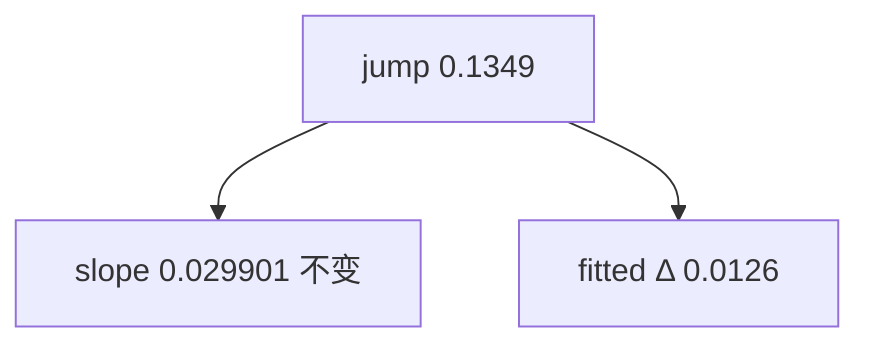

<p align="center"><b>中文</b> &nbsp;&nbsp;·&nbsp;&nbsp; <a href="day-41.en.md">English</a></p>

# 第 41 天 · 更长样本上的直线

[第一阶段 · 模型](README.md) · [排版规范](LESSON_LAYOUT.md) · 可运行

今天的学习要点：AAA 复权收盘 79 会话；2024-02-28 复权收益 0.1349；删该日 refit 后斜率仍 0.029901，截距与 jump 拟合各移 0.0126。

## 费曼法讲解

> **结论先行**：删 |adj return| 最大日 2024-02-28（0.1349）后，斜率六位仍为 0.029901；截距与 jump 拟合各移 0.0126——杠杆体现在 **水平**，不是「该日无影响」。

79 点会话序 OLS 与第 5 天五点点阵同构但 **样本长度改变 influence 分配**；长样本稀释单日对斜率的 six-decimal 份额。这是 ex-post 删点诊断，不是 hold-out（第 27、51 天）。

Huber（1981）区分收益幅度与回归杠杆；0.1349 与 0.029901 不变是两句话。第 42 天 ridge 不删点改斜率；第 49 天同 jump 比较三模型水平残差。

> **误用**：把 0.0126 写进 OOS RMSE；用第 5 天 1.1729 外推「删 jump 必动斜率」。



## 核心知识

### 脚本输出（与下方 `text` 块一致）

[`longer_line.py`](../../days/41-longer-line/longer_line.py)：

```text
jump date = 2024-02-28
adjusted return that day = 0.1349
slope with the jump = 0.029901
slope without the jump = 0.029901
intercept with the jump = 9.8654
intercept without the jump = 9.8528
fitted at the jump, with = 11.0315
fitted at the jump, without = 11.0189
```

| 量 | with jump | without | Δ |
|:---|---:|---:|---:|
| slope | 0.029901 | 0.029901 | 0 |
| intercept | 9.8654 | 9.8528 | 0.0126 |
| fitted@jump | 11.0315 | 11.0189 | 0.0126 |

## 拓展领域

**与第 5 天。** 短样本删点动斜率 1.1729；79 点不动。influence 分配随 n 变。

**与第 49 天。** 同 jump 不删点比三模型残差。

**价格段 vs 收益段。** 第 41–50 天 adj_close **水平** 与 SSE；第 51 天起 **lag-5 简单收益** 与 test MSE 0.000081 标尺。禁止混表。

**复现。** 仓库根目录、`numpy==1.24.4`、`days/data/panel.csv`；```text``` 与终端逐行 diff；`verify_season01_docs.py --day N`。

**泄漏。** 第 40 天清单；第 56–57 天 OHLC；第 67 天 market（后段）。feature 时间 ≤ 决策时刻。

**文献（非虚构）。** Breiman（2001）；Hoerl & Kennard（1970）；Hamilton（1994）；Campbell, Lo & MacKinlay（1997）；Harvey et al.（2016）；Lopez de Prado（2018）。

## 实战总结

```bash
python days/41-longer-line/longer_line.py
```

核对：将终端 stdout 与上文 ```text``` 块逐行 diff；键名与空格计入合同。改 panel 后重跑 `python3 scripts/verify_season01_docs.py --day 41`。
