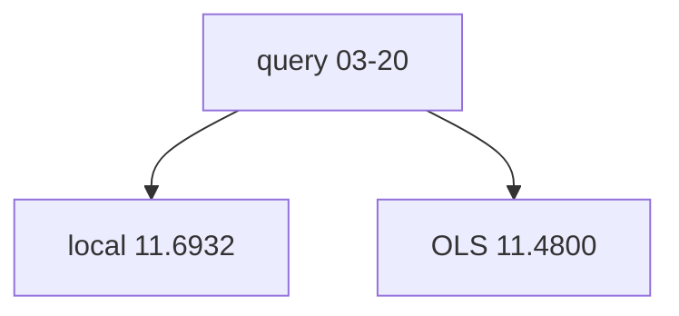

<p align="center"><b>中文</b> &nbsp;&nbsp;·&nbsp;&nbsp; <a href="day-43.en.md">English</a></p>

# 第 43 天 · 局部平均

[第一阶段 · 模型](README.md) · [排版规范](LESSON_LAYOUT.md) · 可运行

今天的学习要点：query 2024-03-20；五近邻 local mean 11.6932，全局 OLS 11.4800；jump 不在邻居集。

## 费曼法讲解

> **结论先行**：query 2024-03-20 上 **五近邻 adj_close 均值 11.6932** 高于 **全局时间趋势 OLS 11.4800**——局部水平与全局斜率线在同一横坐标可 **分号比较**，不是样本外 contest。

邻居按 |t−t_query| 取五会话；jump 2024-02-28 **不在** 邻居集（false）。这是 k=5 的 **坐标近邻**，不是收益空间相似日；Cover & Hart（1967）NN 理论针对一般 metric，本课固定 index 距离。

局部均值无斜率外推项；OLS 携带全样本 trend。生产「相似 K 线」若用错误度量，in-sample 可极低误差但 estimand 不明。

> **误用**：把 local mean 当 OOS forecast 上报；用 jump 日 neighbor 叙事而不读 false 键。



## 核心知识

### 脚本输出（与下方 `text` 块一致）

[`local_mean.py`](../../days/43-local-mean/local_mean.py)：

```text
query date = 2024-03-20
neighbor dates = 2024-03-20 2024-03-19 2024-03-21 2024-03-18 2024-03-22
jump date in the neighbors = false
local mean = 11.6932
ols at the query = 11.4800
```

## 拓展领域

**相似日。** 生产应用因果特征度量；index NN 只是玩具。

**jump 不在邻居。** 读 false 键。

**价格段 vs 收益段。** 第 41–50 天 adj_close **水平** 与 SSE；第 51 天起 **lag-5 简单收益** 与 test MSE 0.000081 标尺。禁止混表。

**复现。** 仓库根目录、`numpy==1.24.4`、`days/data/panel.csv`；```text``` 与终端逐行 diff；`verify_season01_docs.py --day N`。

**泄漏。** 第 40 天清单；第 56–57 天 OHLC；第 67 天 market（后段）。feature 时间 ≤ 决策时刻。

**文献（非虚构）。** Breiman（2001）；Hoerl & Kennard（1970）；Hamilton（1994）；Campbell, Lo & MacKinlay（1997）；Harvey et al.（2016）；Lopez de Prado（2018）。

## 实战总结

```bash
python days/43-local-mean/local_mean.py
```

核对：将终端 stdout 与上文 ```text``` 块逐行 diff；键名与空格计入合同。改 panel 后重跑 `python3 scripts/verify_season01_docs.py --day 43`。
