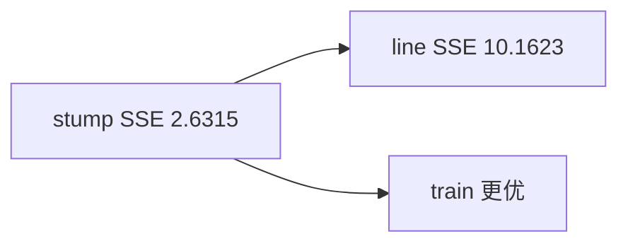

<p align="center"><b>中文</b> &nbsp;&nbsp;·&nbsp;&nbsp; <a href="day-44.en.md">English</a></p>

# 第 44 天 · 浅层树

[第一阶段 · 模型](README.md) · [排版规范](LESSON_LAYOUT.md) · 可运行

今天的学习要点：train 59 行；stump t>38.50，左均值 10.2690、右 11.7467；train SSE stump 2.6315 < line 10.1623。

## 费曼法讲解

> **结论先行**：前 59 行 train 上 **depth-1 stump**（t>38.50，左 10.2690 / 右 11.7467）train SSE **2.6315**，低于 **line 10.1623**——**分段常数在 train 内更贴**，不承诺 later 段（第 45–46 天）。

Breiman et al.（1984）CART；split 在 session index，不是 lag 特征。train sessions=59 来自 75% 切 `_train_test()`，与全 79 点 day41–43 不同信息集。

浅树 win train SSE 是 **in-sample 结构选择**；第 52 天同 lag 面板 tree test MSE 0.000174 仍劣 line。披露：object=price level，split=59/20。

> **误用**：把 train SSE 当部署分数；与 lag-5 test MSE 0.000081 混标题。



## 核心知识

### 脚本输出（与下方 `text` 块一致）

[`shallow_tree.py`](../../days/44-shallow-tree/shallow_tree.py)：

```text
train sessions = 59
split when t > 38.50
left mean = 10.2690 right mean = 11.7467
train SSE stump = 2.6315
train SSE line = 10.1623
```

| 模型 | train SSE |
|:---|---:|
| stump | 2.6315 |
| line | 10.1623 |

## 拓展领域

**train only SSE。** later 见 45–46。stump 阈值 t>38.50。

**价格段 vs 收益段。** 第 41–50 天 adj_close **水平** 与 SSE；第 51 天起 **lag-5 简单收益** 与 test MSE 0.000081 标尺。禁止混表。

**复现。** 仓库根目录、`numpy==1.24.4`、`days/data/panel.csv`；```text``` 与终端逐行 diff；`verify_season01_docs.py --day N`。

**泄漏。** 第 40 天清单；第 56–57 天 OHLC；第 67 天 market（后段）。feature 时间 ≤ 决策时刻。

**文献（非虚构）。** Breiman（2001）；Hoerl & Kennard（1970）；Hamilton（1994）；Campbell, Lo & MacKinlay（1997）；Harvey et al.（2016）；Lopez de Prado（2018）。

## 实战总结

```bash
python days/44-shallow-tree/shallow_tree.py
```

核对：将终端 stdout 与上文 ```text``` 块逐行 diff；键名与空格计入合同。改 panel 后重跑 `python3 scripts/verify_season01_docs.py --day 44`。
