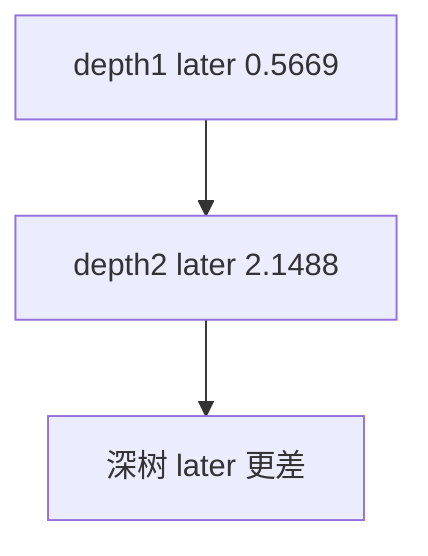

<p align="center"><b>中文</b> &nbsp;&nbsp;·&nbsp;&nbsp; <a href="day-45.en.md">English</a></p>

# 第 45 天 · 更深的树

[第一阶段 · 模型](README.md) · [排版规范](LESSON_LAYOUT.md) · 可运行

今天的学习要点：depth1 train SSE 2.6315、later 0.5669；depth2 train 1.3953、later 2.1488——深树 later 更差。

## 费曼法讲解

> **结论先行**：depth1 later SSE **0.5669** 优于 depth2 的 **2.1488**——**更深树在 later 段 SSE 更差**；train 上 depth2 更贴（1.3953 vs 2.6315），典型 **过拟合形状**。

同一 59/20 切分，两深度 frozen 预测 later 20 行价格。depth2 多一次 split 吸收 train 噪声，later 泛化恶化。ESL（Hastie et al., 2009）bias-variance；本课只报 SSE 不对 t 检验。

第 46 天三模型 later 最低 tree 2.1488 与本日 depth2 later 一致口径。return 标签 arc（51+）另表。

> **误用**：默认「树越深越好」；只报 train SSE 1.3953 不报 later 2.1488。



## 核心知识

### 脚本输出（与下方 `text` 块一致）

[`deeper_tree.py`](../../days/45-deeper-tree/deeper_tree.py)：

```text
train SSE depth1 = 2.6315
later SSE depth1 = 0.5669
train SSE depth2 = 1.3953
later SSE depth2 = 2.1488
```

## 拓展领域

**depth 选择。** train 深优 later 深劣；hold-out 选深度。

**价格段 vs 收益段。** 第 41–50 天 adj_close **水平** 与 SSE；第 51 天起 **lag-5 简单收益** 与 test MSE 0.000081 标尺。禁止混表。

**复现。** 仓库根目录、`numpy==1.24.4`、`days/data/panel.csv`；```text``` 与终端逐行 diff；`verify_season01_docs.py --day N`。

**泄漏。** 第 40 天清单；第 56–57 天 OHLC；第 67 天 market（后段）。feature 时间 ≤ 决策时刻。

**文献（非虚构）。** Breiman（2001）；Hoerl & Kennard（1970）；Hamilton（1994）；Campbell, Lo & MacKinlay（1997）；Harvey et al.（2016）；Lopez de Prado（2018）。

## 实战总结

```bash
python days/45-deeper-tree/deeper_tree.py
```

核对：将终端 stdout 与上文 ```text``` 块逐行 diff；键名与空格计入合同。改 panel 后重跑 `python3 scripts/verify_season01_docs.py --day 45`。
